.. _Hilfreiche Zusatzprogramme:
.. _Hilfreiche GUI-Programme:

Hilfreiche GUI-Programme
========================

Im folgenden Abschnitt sind einige Programme mit graphischer Bedienoberfläche
("Graphical User Interface", kurz: GUI) vorgestellt, die bereits installiert
sind oder einfach mittels :ref:`apt <apt>`  nachinstalliert werden können.

.. index:: Datei-Manager
.. _Datei-Manager:

Datei-Manager
-------------
.. {{{

.. index:: Datei-Manager; caja, caja (Programm)
.. _caja:

``caja``
^^^^^^^^
.. {{{

Der Standard-Dateimanager der Mate-Bedienoberfläche heißt ``caja``. Er ist
bereits vorinstalliert und wird automatisch geöffnet, wenn man beispielsweise
über das Startmenü einzelne Orte wie beispielsweise das Home-Verzeichnis
anwählt. [#]_

Caja wird überwiegend mit der Maus bedient, hat allerdings auch ein paar
nützliche Tastenkombinationen: 

* Mit ``Ctrl 1``, ``Ctrl 2`` und ``Ctrl 3`` kann zwischen einer Symbol-, Listen-
  oder Kompakt-Ansicht der einzelnen Verzeichnisse umgeschaltet werden.

  Die Symbol-Ansicht kann beispielsweise nützlich sein, um sich eine schnelle
  Übersicht über ein Bilder-Verzeichnis zu verschaffen. In den meisten Fällen
  ist allerdings die Listen-Ansicht hilfreicher, da hierbei auch die Dateigröße
  und das Datum der letzten Änderung angezeigt wird. Klickt man auf eine dieser
  Spaltenbezeichnungen, so werden die Dateien gemäß diesen Kriteriums sortiert
  aufgelistet (bei zweimaligem Anklicken in umgekehrter Reihenfolge. 

  Über das Menü ``Bearbeiten -> Einstellungen`` kann unter der Rubrik
  ``Ansichten`` festgelegt werden, welche der Ansichten standardmäßig gewählt
  werden soll ("Neue Ordner anzeigen mit").

* Mit ``Ctrl t`` kann man, wie bei einem Webbrowser, einen neuen Tab öffnen. Auf
  diese Weise ist es möglich, mehrere Tabs beziehungsweise verschiedene
  Verzeichnisse gleichzeitig geöffnet zu haben.

* Mit ``Ctrl c`` können ausgewählte Dateien kopiert, mit ``Ctrl v`` wieder im
  gewählten Tab/Verzeichnis wieder eingefügt werden.

.. Todo: Tabbing..

.. }}}

``gnome-commander``
^^^^^^^^^^^^^^^^^^^
.. {{{

Möchte man nicht nur mit lokalen Verzeichnissen arbeiten, sondern Daten auch auf
andere Rechner im Netzwerk/Internet übertragen, so bieten sich Datei-Manager an,
die standardmäßig in zwei Fenster-Hälften aufgeteilt sind. Man kann somit
beispielsweise in der linken Fensterhälfte ein lokales Verzeichnis ausgewählt
haben, und in der rechten Fensterhälfte ein Verzeichnis eines entfernten
Rechners öffnen; als Daten-Übertragungs-Protokolle sind dabei sowohl :ref:`SSH
<SSH>` wie auch FTP üblich.

Ein "klassischer" derartiger Datei-Manager ist der so genannte :ref:`Midnight
Commander <Midnight Commander>`, der allerdings nur innerhalb eines
Shell-Fensters aufgerufen werden kann (was Linux-Einsteiger leider zunächst oft
abschreckt). Obwohl ich den Midnight Commander nur allzu sehr empfehlen kann,
gibt es auch Programme mit einer graphischen Bedienoberfläche, die ähnliche
Funktionen bieten -- die wohl simpelste Variante ist eben der Gnome Commander.
Er kann folgendermaßen installiert werden:

.. code-block:: sh

    sudo aptitude install gnome-commander

Anschließend kann dieser Datei-Manager aus einer Shell heraus mittels
``gnome-commander`` oder über das Startmenü (meist Rubrik ``Zubehör``) gestartet
werden.

Die Navigation innerhalb der einzelnen Fensterhälften kann mittels der Maus oder
über die Cursor-Tasten erfolgen, mit der ``Tab``-Taste kann zwischen den beiden
Fensterhälften gewechselt werden. Weitere nützliche Tasten-Kombinationen sind:

.. }}}

.. }}}

.. index:: Internet-Anwendungen
.. _Internet-Anwendungen:

Internet-Anwendungen
--------------------
.. {{{

.. index:: Firefox, Internet-Anwendungen; firefox 
.. index:: Web-Browser, Web-Browser; Firefox

.. _firefox:

``firefox``
^^^^^^^^^^^
.. {{{

Bei `firefox <https://wiki.ubuntuusers.de/Firefox>`__ handelt es sich um einen
Standard-Webbrowser, der bei Debian/Ubuntu/LinuxMint bereits vorinstalliert ist.

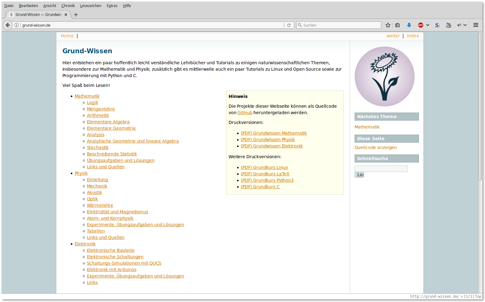

Firefox kann daher bei einer neuen Installation unmittelbar genutzt werden; es
ist allerdings empfehlenswert, noch einige Plugins nachzuinstallieren, welche
den Browser um zusätzliche Features erweitern. Öffnet man über das Menü ``Extras
-> Add-ons`` die Rubrik ``Erweiterungen`` und gibt im Suchfenster einen
Suchbegriff oder den Namen des gewünschten Plugins ein, so werden die
entsprechenden Ergebnisse aufgelistet. Die Plugins können dann durch einen
simplen Mausklick installiert werden. 

Persönlich benutze ich als Plugins den Werbeblocker Adblock Plus, den
Skript-Blocker NoScript, den YouTube Video and Audio Downloader, das
Entwickler-Tool Firebug sowie die Erweiterung Vimperator für eine :ref:`Vim
<Vim>`-artige Bedienung des Browsers.

.. index:: Internet-Anwendungen; pidgin
.. index:: Chat-Programme, Chat-Programme; pidgin 
.. index:: pidgin (Programm), XMPP
.. _pidgin:

.. }}}

``pidgin``
^^^^^^^^^^
.. {{{

Bei `pidgin <https://wiki.ubuntuusers.de/Pidgin>`__ handelt es um ein
Chat-Programm, das mehrere Protokolle unterstützt -- unter anderem auch XMPP
(ehemals: "Jabber") und IRC. Dank des Zusatz-Plugins ``pidgin-otr`` ist beim
Chatten auch eine verschlüsselte Kommunikation möglich. Das Programm kann
folgendermaßen installiert werden:

.. code-block:: sh

    sudo aptitude install pidgin pidgin-otr

Anschließend kann ``pidgin`` mittels der gleichnamigen Anweisung über eine Shell
oder mittels ``Alt F2`` gestartet werden; es erscheint zudem ein Eintrag im
Programm-Menü unter der Rubrik "Internet".

Startet man Pidgin, so bekommt man eine Übersicht mit Chat-Kontakten angezeigt;
beim erstmaligen Start ist diese Liste leer. Über das Menü ``Konten -> Konten
verwalten`` kann man ein neues Chat-Konto hinzufügen:

* IRC wird für Gruppen-Chats verwendet. Ein neues Konto kann man sich
  (kostenlos) beispielsweise bei ``irc.freenode.net`` einrichten, wobei man
  einen noch nicht bereits vergebenen Benutzernamen und ein Passwort
  angeben muss; setzt man das Häkchen bei "Passwort speichern", so muss man den
  Benutzernamen beziehungsweise das Passwort bei einem erneuten Start von Pidgin
  nicht erneut eingeben. [#]_

  Anschließend kann man über das Menü ``Buddys -> Einen Chat betreten`` einen
  Chat-Kanal auswählen. Die meisten Gruppen-Chats sind offen zugänglich, so dass
  man kein Passwort angegeben muss. Über den Button ``Raumliste`` bekommt man
  eine Übersicht über alle "Chat-Rooms" angezeigt, inklusive der Anzahl der
  jeweils teilnehmenden Benutzer. Hat man einen Chat ausgewählt (beispielsweise
  ``#vim``), so kann man diesen durch Anklicken des jeweiligen Buttons wahlweise
  betreten oder diesen mittels ``Chat hinzufügen`` in die Buddy-Liste aufnehmen.
  Um einen in der Buddy-Liste gespeicherten IRC-Chat zu betreten, genügt ein
  Doppelklick auf den jeweiligen Eintrag.

  .. image:: ../pics/pidgin-chat-fenster.png
      :align: center
      :width: 50%

* XMPP wird meist für Chats mit einzelnen Freunden ("Buddies") verwendet. [#]_
  Für einen solchen Chat brauchen beide Kommunikationspartner ein XMPP-Konto.
  Ein solches lässt sich beispielsweise (kostenlos) bei ``jabber.ccc.de``
  einrichten, wobei wiederum ein noch nicht existierender Benutzername und ein
  Passwort angegeben werden muss (eine ausführliche Übersicht über freie
  XMPP-Server gibt es `hier <https://wiki.ubuntuusers.de/XMPP/Server/>`__).
  Pidgin kann wiederum die Konten-Daten speichern, so dass diese bei einem
  Neustart von Pidgin nicht erneut eingegeben werden müssen.

  Anschließend kann man über das Menü ``Buddys -> Buddy hinzufügen`` das
  XMPP-Konto eines Bekannten in die eigene Buddy-Liste speichern; haben sich
  beide Nutzer gegenseitig in ihrer Buddy-Liste gespeichert, so wird gegenseitig
  der Status des anderen Benutzers eingeblendet (online, abwesend, offline, oder
  eine benutzerdefinierte Nachricht). Um mit der jeweiligen Person zu chatten,
  genügt ein Doppelklick auf den jeweiligen Eintrag in der Buddy-Liste.

  Haben beide Benutzer (unabhängig davon, welches Chat-Programm sie benutzen)
  einen OTR-Support installiert, so kann die Kommunikation verschlüsselt werden.
  In Pidgin kann das OTR-Plugin über das Menü ``Werkzeuge -> Plugins`` aktiviert
  werden, indem man in der Liste ein Häkchen bei ``Off-the-Record
  Nachrichtenversand`` setzt. In einem Chat-Fenster erscheint dann ein eigener
  Menü-Eintrag namens ``OTR``, über den eine verschlüsselte Unterhaltung
  begonnen beziehungsweise beendet werden kann.

.. index:: Internet-Anwendungen; thunderbird
.. index:: Email-Verwaltung, Email-Verwaltung; thunderbird
.. index:: Thunderbird (Programm)
.. _thunderbird:

.. }}}

``thunderbird``
^^^^^^^^^^^^^^^
.. {{{

Bei `thunderbird <https://wiki.ubuntuusers.de/Thunderbird>`__ handelt es sich um
einen Standard-Email-Cient, der bei Debian/Ubuntu/LinuxMint üblicherweise bereits
vorinstalliert ist; ist dies nicht der Fall, so kann er mittels ``sudo aptitude
install thunderbird`` nachinstalliert werden.

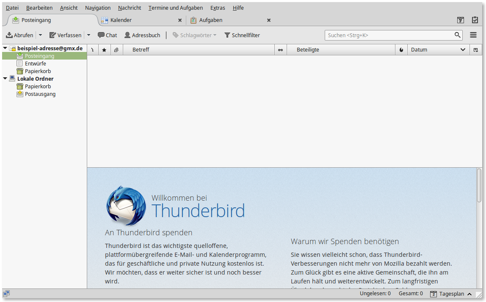

Startet man Thunderbird zum ersten Mal, so erscheint ein
Einrichtungs-Assistenz-Fenster, über das ein Email-, RSS-Newsreader- oder auch
Chat-Konto eingerichtet werden kann. Möchte man keine neue Email-Adresse
einrichten, sondern ein bestehendes Email-Konto (beispielsweise bei www.gmx.de,
www.web.de, o.ä) nutzen, so kann man in der Thunderbird-Startseite auf und
anschließend auf ``Bestehende Email-Adresse verwenden`` klicken. Anschließend
genügt es, den Benutzer-Namen, die Emailadresse und das Passwort anzugeben, den
Rest übernimmt der Einrichtungs-Assistent von alleine. [#]_

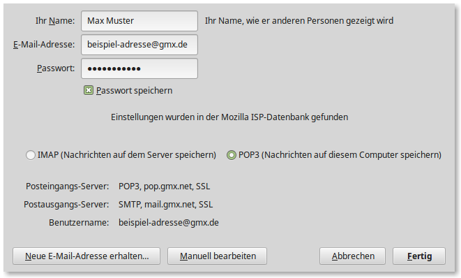

In der Haupt-Ansicht können die Emails wahlweise nach Eingangsdatum, nach
Absender oder nach Betreff sortiert werden; durch Drücken der Tasten ``1`` bis
``5`` kann einer Email auch ein Prioritäts-Schlagwort zugewiesen werden, wodurch
wichtige Emails automatisch farblich hervorgehoben werden (durch ein nochmaliges
Drücken der jeweiligen Ziffer wird die Markierung wieder aufgehoben. Klickt man
im Posteinang auf eine Email, so wird deren Inhalt automatisch in der unteren
Fensterhälfte angezeigt. Thunderbird bietet von sich aus auch ein Adressbuch zum
Verwalten von Kontakt-Emailadressen.

Ähnlich wie bei :ref:`Firefox <Firefox>` kann man auch bei Thunderbird durch
Add-ons erweitert werden. Klickt man auf das Menü ``Extras -> Addons``, so kann
man unter der Rubrik ``Erweiterungen`` gezielt nach verfügbaren Erweiterungen
suchen. Eine empfehlenswerte Erweiterung ist ``Lightning``: Dieses Add-on
erweitert Thunderbird um einen Kalender und Aufgabenplaner.

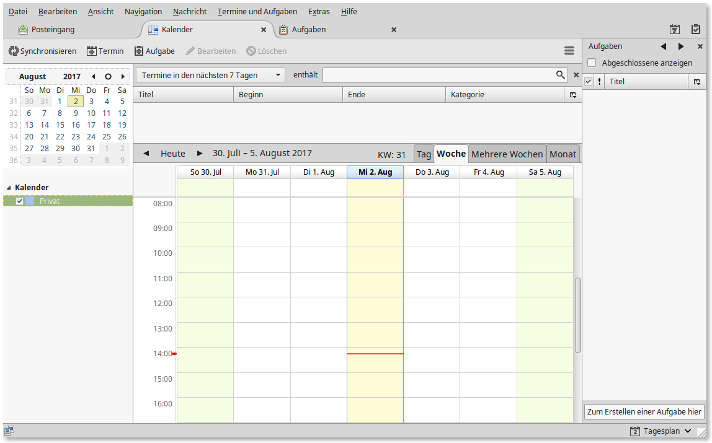

*Links:* 

* `Thunderbird-Dokumentation (en.)
  <https://support.mozilla.org/en-US/products/thunderbird>`__
* `Tasten-Kombinationen in Thunderbird (en.)
  <https://support.mozilla.org/en-US/kb/keyboard-shortcuts>`__

.. }}}

.. }}}

.. index:: Büro-Programme
.. _Büroprogramme:
.. _Büro-Programme:

Büro-Programme
--------------

.. index:: Büro-Programme; abiword
.. index:: abiword (Programm), Textverarbeitung; abiword
.. _abiword:

``abiword``
^^^^^^^^^^^
.. {{{

Bei `abiword <https://wiki.ubuntuusers.de/Abiword>`__ handelt es sich um eine
schlanke Alternative zum standardmäßig installierten Textverarbeitungs-Programm
LibreOffice-Writer. Im Vergleich zu letzterem benötigt ``abiword`` wesentlich
weniger Festplattenspeicher, es lädt wesentlich schneller und verursacht im
laufenden Betrieb eine geringere CPU- und Arbeitsspeicher-Auslastung.

``abiword`` kann folgendermaßen installiert werden:

.. code-block:: sh

    sudo aptitude install abiword

Die Bedienung von ``abiword`` ist einfach und intuitiv; viele Icons und
Arbeits-Routinen orientieren sich an LibreOffice beziehungsweise Microsoft
Office. Abiword ist zudem mittels in Python oder C++ geschriebenen Plugins
erweiterbar.

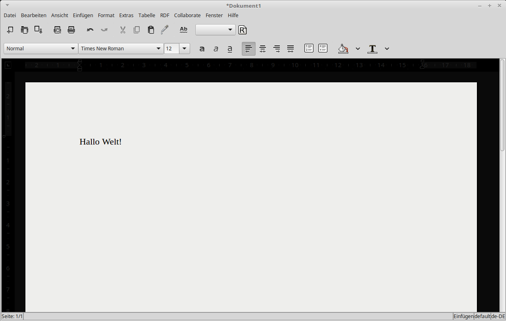

Nachteilig bei der Verwendung von ``abiword`` ist lediglich, dass die
Formatierung von ursprünglich mit Microsoft Word erstellten Dokumenten teilweise
nicht richtig wiedergegeben wird. Das Programm bietet also nicht den gesamten
Funktionsumfang von LibreOffice, aber ist für ein schnelles Verfassen eigener
Dokumente in den meisten Fällen ausreichend.

.. index:: PDF-Betrachter, PDF-Betrachter; Atril, atril
.. _atril:
.. _evince:

.. }}}

``atril``
^^^^^^^^^
.. {{{

Bei `atril <https://wiki.ubuntuusers.de/MATE/#Standardanwendungen>`__
handelt es sich um einen PDF-Betrachter, mit dem ebenso mehrseitige ``.ps``-,
``.djvu``, ``.tiff`` und ``.dvi``-Dateien angezeigt werden können. 

.. Das Programm ist im Wesentlichen mit ``evince`` indentisch.

Sofern das Programm nicht bereits standardmäßig installiert ist, kann es über
das gleichnamige Paket nachinstalliert werden:

.. code-block:: sh

    sudo aptitude install atril

Sofern man lieber mit der Maus als mit der Tastatur navigiert, ist es
empfehlenswert, diesen Betrachter über ``Menü -> Steuerzentrale -> Persönlich ->
Bevorzugte Anwendungen -> Büro`` als Standard-Dokumenten-Betrachter festzulegen. 

Hat man ``atril`` gestartet, so kann man optional über ``Bearbeiten ->
Werkzeugleiste`` die Symbolleiste noch etwas anpassen beziehungsweise um
zusätzliche Icons ergänzen. Beispielsweise ist es so möglich, zwischen
verschiedenen Ansichts-Optionen (Ganzzeitig/Zweiseitig/Fließend, Zoom,
Links-/Rechtsdrehung des Dokument um :math:`90 \degree`, usw.) durch Anklicken
des entsprechenden Icons zu wechseln. Über ``Bearbeiten -> Momentane
Einstellungen speichern`` können diese Anpassungen dauerhaft gespeichert werden.

Für viele Ansichts-Optionen gibt es auch Tasten-Kombinationen, die im jeweiligen
Menü angezeigt werden. Beispielsweise kann ein Dokument somit wahlweise durch
Anklicken eines Icons, über das ``Bearbeiten``-Menü, oder durch Drücken von
``Ctrl Links`` beziehungsweise ``Ctrl Rechts`` um :math:`90 \degree` drehen.

.. index:: gEdit, Text-Editor, Text-Editor; gedit
.. _gedit:

.. }}}

``ding``
^^^^^^^^^
.. {{{

Bei `ding <https://wiki.ubuntuusers.de/Wörterbücher#Ding>`__ handelt es sich um
ein ein deutsch-englisch-sprachiges Wörterbuch. Das Programm und das zugehörige
Wörterbuch kann folgendermaßen installiert werden:

.. code-block:: sh

    sudo aptitude install ding trans-de-en

Anschließend kann ``ding`` mittels der gleichnamigen Anweisung über eine Shell
oder mittels ``Alt F2`` gestartet werden; es erscheint zudem (zumindest bei
Debian/Ubuntu/LinuxMint mit Mate-Desktop) ein Eintrag im Programm-Menü unter
der Rubrik "Büro".

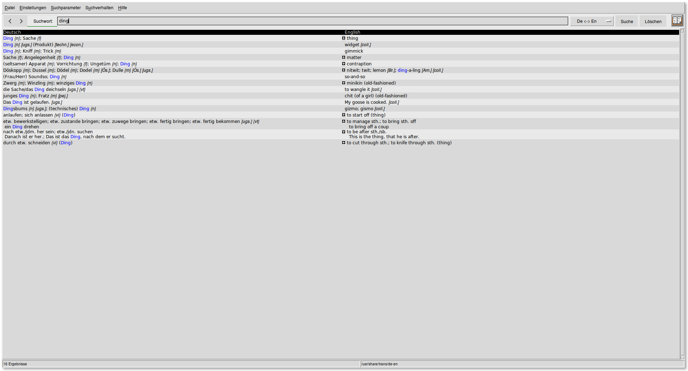

Das Wörterbuch ist intuitiv bedienbar: Gibt man in der Eingabezeile einen
Begriff ein und drückt ``Enter``, so werden die entsprechenden Ergebnisse
angezeigt. Gibt man dann erneut Text ein, so wird der Inhalt der Eingabezeile
in der Regel automatisch überschrieben; notfalls kann diese mittels ``Ctrl U``
auch ohne ein Markieren des Textes mittels der Maus gelöscht werden. Klickt man
auf die Pfeiltasten neben dem Eingabefeld, so können die vorherigen
Übersetzungen wieder angezeigt werden.

Als Ergänzung zu ``ding`` kann im Bedarfsfall die Shell-Anwendung ``espeak``
genutzt werden, die über das gleichnamige Paket mittels :ref:`apt <apt>`
installiert werden kann. Gibt man in einem Shell-Fenster beispielsweise ``espeak
"hello world"`` ein, so wird der angegebene Text in gesprochener Form über die
Lautsprecher ausgegeben.

.. Unter LinuxMint 17 beziehungsweise Ubuntu 14.04 startet ``ding`` nach der Installation
.. nicht, sondern gibt stattdessen die Fehlermeldung ``wish not found`` aus. Um
.. dieses Problem zu beheben, öffnet man die Datei ``/usr/bin/ding`` mit
.. Superuser-Rechten und ersetzt in der dritten Zeile ``exec wish "$0" "$@"`` durch
.. ``exec wish8.4 "$0" "$@"``; danach startet ``ding`` wie gewohnt.
.. Inzwischen ist dieser Bug behoben!

.. index:: Taschenrechner, Taschenrechner; gnome-calculator
.. _gnome-calculator:

.. }}}

``gedit``
^^^^^^^^^
.. {{{

Bei `gedit <https://wiki.ubuntuusers.de/gedit>`__ handelt es sich um einen
einfachen, dafür allerdings leicht zu bedienenden Text-Editor. Unter
Debian/Ubuntu/LinuxMint kann ``gedit`` folgendermaßen installiert werden:

.. code-block:: sh

    sudo aptitude install gedit gedit-latex-plugin gedit-plugins

Anschließend kann der Editor aus einer Shell heraus mittels ``gedit`` oder über
den gleichnamigen Eintrag im Startmenü (üblicherweise unter der Rubrik
``Zubehör``) gestartet werden.

.. todo PIC

Aktiviert man über das Menü ``Bearbeiten -> Einstellungen`` die entsprechenden
Plugins, so bietet ``gedit`` unter anderem ein Syntax-Highlighting für
verschiedene Datei-Typen, eine Rechtschreibprüfung, sowie die Möglichkeit eigene
"Snippets" zu definieren. Damit sind beliebig umfangreiche "Eingabe-Templates"
gemeint, die durch Eingabe eines zugehörigen Kurzwortes und ein Drücken der
``Tab``-Taste in das aktuelle Dokument eingefügt werden können. Da die
Snippet-Syntax der von :ref:`Vim-Ultisnips <Snippets>` ähnlich ist, ist
``gedit`` als "einfaches" Programm für Einsteiger und gelegentliche Nutzer
durchaus empfehlenswert; an den Funktionsumfang von :ref:`Vim <Vim>` kommt der
Editor allerdings bei weitem nicht heran.. ;-)

*Links:*

* `gedit Manual (en.)
  <https://help.gnome.org/users/gedit/stable/index.html.en>`__
* `gedit Snippets Howto (en.)
  <https://help.gnome.org/users/gedit/stable/gedit-plugins-snippets.html.en>`__

.. index:: Büro-Programme; gnumeric
.. index:: gnumeric (Programm), Tabellenkalkulation; gnumeric
.. _gnumeric:

.. }}}

``gnumeric``
^^^^^^^^^^^^
.. {{{

Bei `gnumeric <https://wiki.ubuntuusers.de/Gnumeric>`__ handelt es sich um eine
schlanke Alternative zum standardmäßig installierten Tabellen-Programm
LibreOffice-Calc. Im Vergleich zu letzterem benötigt ``gnumeric`` wesentlich
weniger Festplattenspeicher, es lädt wesentlich schneller und verursacht im
laufenden Betrieb eine geringere CPU- und Arbeitsspeicher-Auslastung.

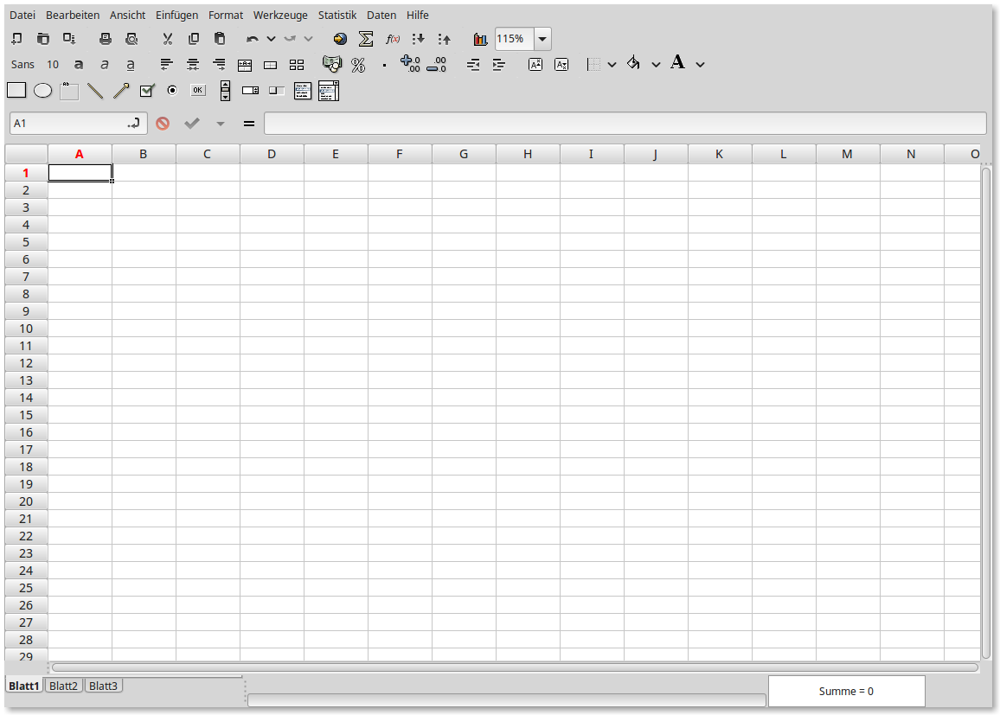

``gnumeric`` kann folgendermaßen installiert werden:

.. code-block:: sh

    sudo aptitude install gnumeric gnumeric-plugins-extra

Die Bedienung von ``abiword`` ist einfach und intuitiv. Viele Icons und
Arbeits-Routinen orientieren sich an LibreOffice beziehungsweise Microsoft
Office; da das Programm bezüglich des Grundumfangs jedoch eher 'schlicht'
gehalten ist, findet man die 'wichtigen' Funktionen bei nur gelegentlicher
Nutzung meist schneller.

Gnumeric kann zudem mit benutzerdefinierten, in :ref:`Python <gwip:Python>`
geschriebenen Funktionen erweitert werden; hierzu muss man über das Menü
``Werkzeuge -> Plugins`` und im erscheinenden Auswahlfenster einen Haken bei
``Python-Funktionen`` setzen; anschließend kann beispielsweise über das Menü
``Werkzeuge -> Python-Eingabefenster`` aus Gnumeric heraus ein
Python-Interpreter gestartet werden. Gibt man dort ``import Gnumeric`` ein, so
wird das zu Gnumeric gehörende Python-Modul geladen (das allerdings nur
verfügbar ist, wenn Python aus Gnumeric heraus gestartet wird).

*Links:*

* `The Gnumeric Manual (en.) <https://help.gnome.org/users/gnumeric/stable/gnumeric.html>`__
* `Programming Gnumeric using Python (en.)
  <https://help.gnome.org/users/gnumeric/stable/sect-extending-python.html.en>`__

.. gnumeric Funktionen: http://www.gnumeric.org/functions.shtml

.. index:: Büro-Programme; libreoffice
.. index:: LibreOffice
.. index:: Textverarbeitung, Textverarbeitung; libreoffice writer
.. index:: Tabellenkalkulation, Tabellenkalkulation; libreoffice calc
.. _libreoffice:

.. }}}

``libreoffice``
^^^^^^^^^^^^^^^
.. {{{

Die `LibreOffice <https://wiki.ubuntuusers.de/LibreOffice>`__-Suite ist ein mit
Microsoft Office vergleichbares Programm-Paket. Es umfasst folgende
Teilprogramme:

* ``Libreoffice Calc`` ist ein mit Microsoft Excel vergleichbares
  Tabellen-Kalkulations-Programm.

* ``Libreoffice Writer`` ist ein mit Microsoft Word vergleichbares
  Programm zum Schreiben von Briefen oder anderen Texten.

* ``Libreoffice Impress`` ist ein mit Microsoft PowerPoint vergleichbares
  Programm zum Erstellen von Präsentationen.

* ``Libreoffice Base`` ist ein mit Microsoft Access vergleichbares
  Programm zum Verwalten von Datenbanken.

Die übrigen Programme ``Libreoffice Draw`` zum Erstellen von Zeichnungen sowie
``Libreoffice Math`` zum Setzen von mathematischen Formeln sind bei mir bislang
noch nie zum Einsatz gekommen; anstelle ``Draw`` verwende ich wesentlich lieber
:ref:`Inkscape <Inkscape>`, und zum Setzen von Texten (insbesondere mit
mathematischen Formeln) nutze ich bevorzugt :ref:`LaTeX <gwil:LaTeX>`.

Die LibreOffice-Programme können neben den alten ``.doc``- und ``.xls``-Dateien
auch die neueren ``.docx``- und ``.xlsx``-Dateien sowohl lesen wie auch
schreiben; selbst integrierte Makros oder Formulare werden meist korrekt
interpretiert und angezeigt. LibreOffice kann aus meiner Sicht damit, sofern man
keine ausufernden Visual-Basic-Skripte nutzen möchte, Mircrosoft Office
vollständig ersetzen.

.. }}}

.. .. _xpdf:

.. ``xpdf``
.. --------

.. Bei `xpdf <http://www.foolabs.com/xpdf/>`__ handelt es sich um einen
.. schlanken, schnellen PDF-Betrachter, der weitgehend auch mittels der Tastatur
.. gesteuert werden kann. Das Programm kann folgendermaßen installiert werden:

.. .. code-block:: sh

..     sudo aptitude install xpdf gsfonts-x11

.. Das letztere Paket sollte installiert werden, damit ``xpdf`` beim Öffnen
.. einer PDF-Datei keine Fehlermeldung der Art ``Warning: Cannot convert string
.. "-*-courier-medium-r-normal--12-*-*-*-*-*-iso8859-1" to type FontStruct``
.. anzeigt; dies erfordert allerdings einen Neustart wahlweise des X-Servers oder
.. des ganzen Rechners.

.. Inzwischen benutze ich persönlich ``xpdf`` aufgrund des geringen
.. Speicher- und CPU-Bedarfs nur noch auf alten Rechnern; im Alltag verwende ich
.. bevorzugt :ref:`zathura <zathura>` als PDF-Betrachter.

.. index:: Büro-Programme; zathura
.. index:: Zathura (Programm), PDF-Betrachter; Zathura
.. _zathura:

``zathura``
^^^^^^^^^^^

Bei `zathura <https://wiki.ubuntuusers.de/zathura>`__ handelt es sich um einen
schlanken und schnellen PDF-Betrachter; er kann mit einer :ref:`Vim <Vim>`
-artigen Steuerung bedient werden.

.. code-block:: sh

    sudo aptitude install zathura

Zathura kann wahlweise auch mit einem `dunklen Farbschema
<https://github.com/esn89/base16-zathura/blob/master/zathurarc-dark>`_ genutzt
werden, das in der Datei ``~/.config/zathura/zathurarc`` festgelegt wird.

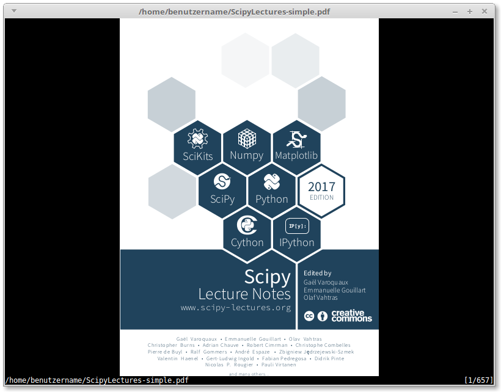

Zathura kann weitgehend mit der Tastatur bedient werden. Dabei gibt es folgende
hilfreiche Hotkeys:

    +--------------------------+--------------------------------------------------+
    | Taste                    | Bedeutung                                        |
    +--------------------------+--------------------------------------------------+
    | ``Tab``                  | Inhaltsverzeichnis anzeigen (sofern vorhanden)   |
    +--------------------------+--------------------------------------------------+
    | ``PageDown``, ``PageUp`` | Seitenweise vor-/zurückblättern                  |
    +--------------------------+--------------------------------------------------+
    | ``J``, ``K``             | Seitenweise vor-/zurückblättern                  |
    +--------------------------+--------------------------------------------------+
    | ``j``, ``k``             | Zeilenweise vor-/zurückblättern                  |
    +--------------------------+--------------------------------------------------+
    | ``/``, ``?``             | Suche nach Text  (vor- beziehungsweise rückwärts |
    +--------------------------+--------------------------------------------------+
    | ``n``, ``N``             | Nächstes/Vorheriges Ergebnis der Textsuche       |
    +--------------------------+--------------------------------------------------+
    | ``f``                    | Links auf der aktuellen Seite anzeigen;          |
    |                          | mit ``Zahl Enter`` gelangt man dorthin           |
    +--------------------------+--------------------------------------------------+
    | ``gg``, ``G``            | Erste beziehungsweise Letzte Seite öffnen        |
    +--------------------------+--------------------------------------------------+
    | ``Zahl G``               | Seite mit angegebener Seitenzahl öffnen          |
    +---+----------------------+--------------------------------------------------+
    | ``+``, ``-``             | PDF-Datei vergrößert/verkleinert darstellen      |
    +--------------------------+--------------------------------------------------+
    | ``a``                    | PDF-Datei auf Bildschirmhöhe einpassen           |
    +--------------------------+--------------------------------------------------+
    | ``s``                    | PDF-Datei auf Bildschirmbreite einpassen         |
    +--------------------------+--------------------------------------------------+
    | ``d``                    | Zwei Seiten nebeneinander darstellen (Buchmodus) |
    +--------------------------+--------------------------------------------------+
    | ``r``                    | Seite um 90 Grad nach rechts drehen              |
    +--------------------------+--------------------------------------------------+
    | ``Ctrl r``               | Zwischen "Light"- und "Dark"-Modus wechseln      |
    +--------------------------+--------------------------------------------------+

Eine PDF-Datei kann zudem mit ``R`` neu geladen werden; dies ist allerdings
kaum nötig, denn Zathura liest die Datei automatisch neu, wenn sie verändert
wurde.

.. index:: Bildbearbeitungs-Programme
.. _Bildbearbeitungs-Programme:

Bildbearbeitungs-Programme
--------------------------

.. index:: Bildbearbeitungs-Programme; gimp
.. index:: Gimp (Programm)
.. _gimp:

``gimp``
^^^^^^^^^

Bei `gimp <https://wiki.ubuntuusers.de/GIMP>`__ handelt es sich um ein Programm
zur Bearbeitung von PNG-, JPG- und anderen Bilddateien. Gimp gehört zum Standard
von Debian/Ubuntu/LinuxMint und ist somit üblicherweise bereits vorinstalliert;
falls dies nicht der Fall ist, so kann es mittels ``sudo aptitude install gimp``
nachinstalliert werden.

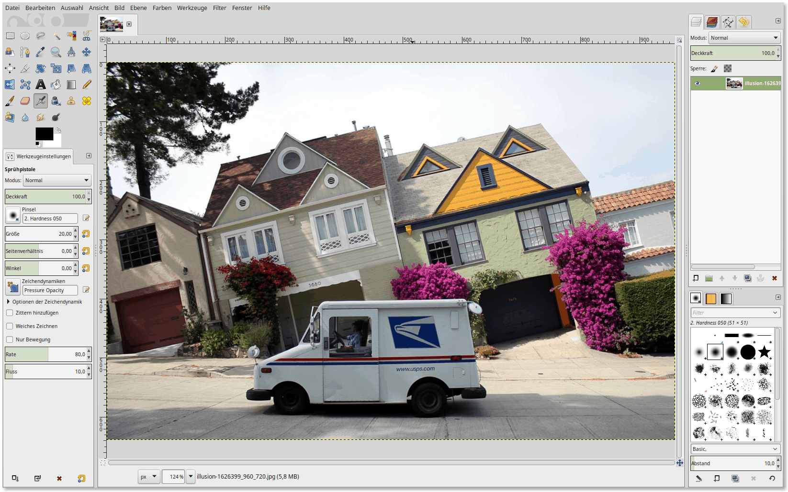

Beim ersten Start von Gimp über ``Menü -> Grafik -> GIMP`` oder durch Eingabe
von ``gimp`` in einer Shell sollte zunächst über das Menü ``Fenster`` der so
genannte Einzelfenster-Modus aktiviert werden; in diesem seit der
Programm-Version 2.8 verfügbaren Modus verhält sich das Programm bezüglich des
Fenster-Managements ebenso wie andere Graphik-Programme (beispielsweise
:ref:`Inkscape <Inkscape>` für SVG-Graphiken).

Gimp eignet sich gut zum Zuschneiden von Bildern, zum Anpassen der Farbsättigung
und des Kontrasts, sowie zum Retuschieren von Photos bezüglich roter Augen, o.ä.
Gimp kann auch als Malprogramm verwendet werden, allerdings empfiehlt sich
hierfür dann auch die Verwendung eines Graphik-Tablets.

*Links:*

* `Gimp Scripting with Python (en.)
  <https://www.makeuseof.com/tag/automating-gimp-scripts/>`__

.. index:: Bildbearbeitungs-Programme; inkscape

``inkscape``
^^^^^^^^^^^^

Bei `inkscape <https://wiki.ubuntuusers.de/Inkscape>`__ handelt es sich um ein
Programm zur Erstellung von Vektor-Graphiken ("Scaleable Vector Graphics", SVG).
Dieses Programm wird im eigenen Abschnitt :ref:`Inkscape <Inkscape>` näher
beschrieben.

.. index:: Multimedia-Programme
.. _Multimedia-Programme:

Multimedia-Programme
--------------------

.. index:: Multimedia-Programme; audacious
.. index:: audacious (Programm), Audio-Player
.. _audacious:

``audacious``
^^^^^^^^^^^^^
.. {{{

Bei `audacious <https://wiki.ubuntuusers.de/Audacious>`__ handelt es sich um
einen ebenso kleinen wie vielseitigen Audio-Player.
Das Programm kann folgendermaßen installiert werden:

.. code-block:: sh

    sudo aptitude install audacious

Gestartet werden kann ``audacious`` anschließend über ``Startmenü -> Multimedia
-> audacious`` oder über die gleichnamige Shell-Anweisung.

Audacious bietet mehrere "Themes", die das Aussehen der Bedienoberfläche
maßgeblich beeinflussen:

* Mit dem als Standard eingestellten "GTK-Interface" sieht ``audacious`` fast
  aus wie ein Browser, wobei die einzelnen Tabs den einzelnen Wiedergabelisten
  entsprechen; die obere Zeile beinhaltet gewöhnliche Icons zur Wiedergabe,
  Lautstärke-Regulierung, Zufallswiedergabe, sowie zum Öffnen von Dateien.

  .. image:: ../pics/audacious-gnome-style.png
      :align: center
      :width: 60%

  Durch einen Klick auf das ``a``-Icon links oben im Fenster kann man über den
  Menü-Eintrag ``Datei -> Einstellungen`` das Erscheinungsbild und weitere
  Eigenschaften anpassen.

* Mit dem "Winamp-Interface" erscheint ``audacious`` mit einer Bedien-Oberfläche
  mit minimaler Größe; die aktuelle Playliste kann optional durch einen Klick
  auf den ``Pl``-Button eingeblendet werden.

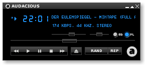

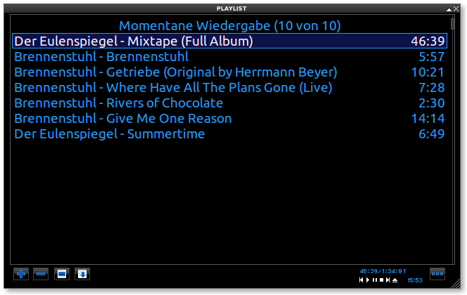

Die Wahl des Interfaces ist Geschmacksache: Das GTK-Interface bietet eine
übersichtliche und mit der Maus gut bedienbare Darstellung (optional mit
zusätzlichen Informationen), das Winamp-Interface hingegen bietet auf sehr
kleinen (Touch-)Displays Vorteile. [#]_

.. index:: easytag (Programm), ID3-Tags
.. _easytag:

.. }}}

``easytag``
^^^^^^^^^^^
.. {{{

Bei `easytag <https://wiki.ubuntuusers.de/EasyTAG>`__ handelt es sich um ein
Programm zur schnellen und einfachen Bearbeitung von Audio-Metadaten
("ID3-Tags").

.. code-block:: sh

    sudo aptitude install easytag

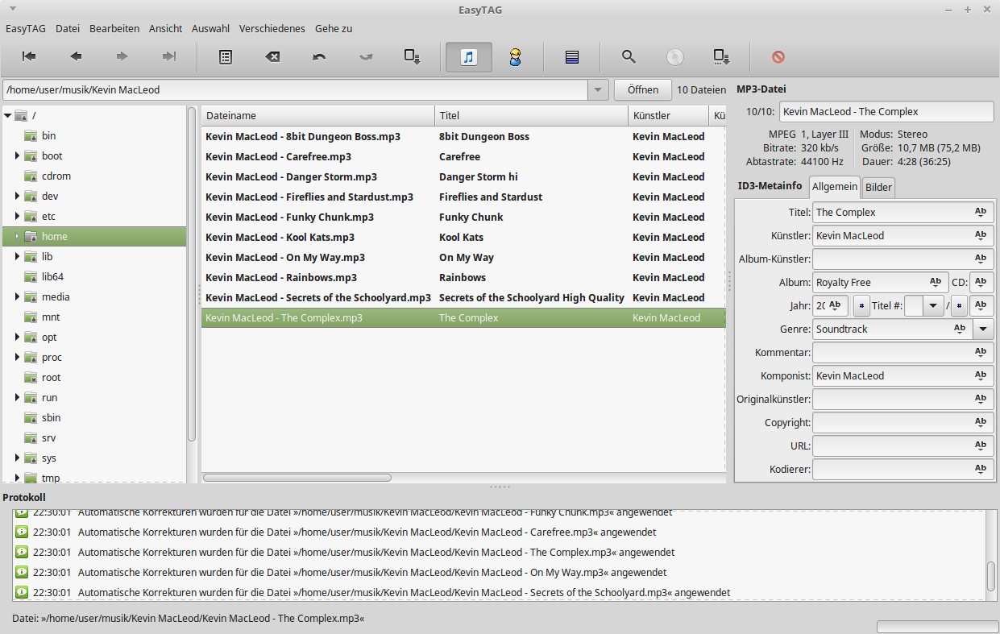

Das Programm bietet, wie in der obigen Abbildung zu sehen, Eingabe-Formulare für
die einzelnen ID3-Tag-Felder einer Audio-Datei; man kann im mittleren
Auswahl-Fenster auch mehrere Dateien auswählen, um beispielsweise in allen
Dateien auf einmal das Künstler- oder Album-Feld auszufüllen.

Easytag bietet bei Bedarf über ``Ansicht -> Scanner anzeigen`` eine einfache
Möglichkeit, ID3-Tags automatisch anhand des jeweiligen Datei- beziehungsweise
Verzeichnisnamens auszufüllen.

.. ``musescore``
.. -------------
.. `musescore <https://wiki.ubuntuusers.de/MuseScore>`__
.. ein umfangreiches Notensatz-Programm

.. index:: soundconverter (Programm), Multimedia-Programme; soundconverter
.. _soundconverter:

.. }}}

``soundconverter``
^^^^^^^^^^^^^^^^^^
.. {{{

Bei `soundconverter <https://wiki.ubuntuusers.de/Soundconverter>`__ handelt es
sich um ein Programm, das Audiodateien in beliebige andere Audio-Formate
umwandeln kann. Das Programm unterstützt neben MP3 auch OGG, WAC, FLAC, MPC; es
können wahlweise einzelne Dateien oder auch ganze Verzeichnisse umgewandelt
werden.

Das Programm kann folgendermaßen installiert werden:

.. code-block:: sh

    sudo aptitude install soundconverter lame gstreamer1.0-plugins-ugly

Das letzte Paket ist nur erforderlich, sofern auch MP3-Dateien konvertiert
werden sollen.

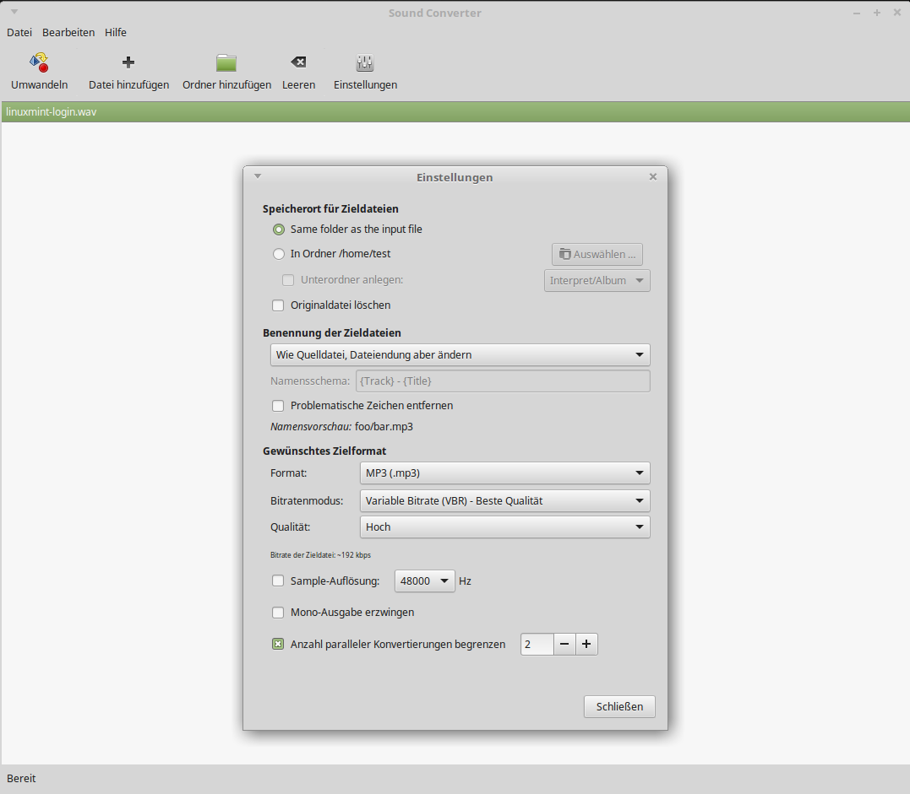

Die Bedienung ist denkbar einfach:

* Man klickt zunächst in der Symbolleiste auf den "Einstellungen"-Button einen
  Zielpfad für die neuen Audiodateien (Standard: Das gleiche Verzeichnis wie die
  Original-Dateien) sowie das gewünschte Ausgabe-Format aus.

* Anschließend klickt man auf "Datei hinzufügen" beziehungsweise "Ordner
  hinzufügen", wodurch die zu konvertierenden Dateien im Hauptfenster
  aufgelistet werden.

* Durch einen Klick auf "Umwandeln" wird die Konvertierung gestartet. Der
  Fortschritt wird dabei anhand eines "Ladebalkens" links neben der jeweiligen
  Datei angezeigt.

Der Soundconverter kann übrigens mit der gleichen Vorgehensweise genutzt werden,
um Audio-Spuren aus beispielsweise ``.flv``- oder ``.mp4``-Videos zu
extrahieren.

.. index:: vlc (Programm), Video-Player, Multimedia-Programme; vlc
.. _vlc:
.. _VLC-Player:

.. }}}

``vlc``
^^^^^^^
.. {{{

Bei `vlc <https://wiki.ubuntuusers.de/VLC>`__ handelt es sich um einen weithin
bekannten und vielseitigen Audio- und Videoplayer, der eine Vielzahl an gängigen
Dateitypen unterstützt (MPG, AVI, FLV, MP3, OGG, usw). Das Programm kann
folgendermaßen installiert werden:

.. code-block:: sh

    sudo aptitude install vlc vlc-nox

Das Paket ``vlc-nox`` ist nicht zwingend nötig, bringt allerdings den Vorteil
mit sich, dass damit der VLC-Player in einer Shell mittels ``nvlc Datei`` auch
im Text-Modus starten lässt.

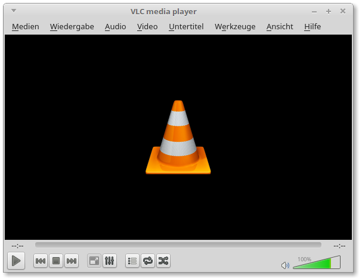

VLC lässt sich auch zum Abspielen von DVDs und CDs nutzen. Während unter neueren
Versionen von Ubuntu/LinuxMint bereits alle dafür nötigen Codecs
vorinstalliert sind, müssen auf Debian-Systemen folgende Pakete manuell
nachinstalliert werden:

.. code-block:: sh

    sudo aptitude install libc6 w32codecs libdvdcss2

Der VLC-Player lässt sich intuitiv über mittels der graphischen Bedienoberfläche
bedienen; zudem gibt es folgende bisweilen nützliche Tastenkürzel:

.. list-table::
    :name: tab-vlc-hotkeys
    :widths: 50 50

    * - Taste
      - Bedeutung
    * - ``Leertaste``
      - Pause/Fortsetzen
    * - ``Ctrl`` :math:`\uparrow`, ``Ctrl`` :math:`\downarrow`
      - Lautstärke erhöhen beziehungsweise verringern
    * - ``Alt`` :math:`\rightarrow`, ``Alt`` :math:`\leftarrow`
      - Video um :math:`\unit[10]{s}` vor- beziehungsweise zurückspulen
    * - ``Ctrl`` :math:`\rightarrow`, ``Ctrl`` :math:`\leftarrow`
      - Video um :math:`\unit[1]{min}` vor- beziehungsweise zurückspulen
    * - ``-``, ``+``, ``=``
      - Video langsamer, schneller beziehungsweise mit normaler Geschwindigkeit
        abspielen

Obwohl der VLC-Player auch Audio-Dateien abspielen kann, nutze ich ihn
persönlich fast ausschließlich zum Abspielen von Video-Dateien; für
Audio-Dateien nutze ich hingegen bevorzugt :ref:`audacious <audacious>`.

.. }}}

.. _Hilfsprogramme:

Hilfsprogramme
--------------

.. index:: alarm-clock-applet (Programm), Wecker-Dienst, Stoppuhr, Erinnerungs-Dienst
.. _alarm-clock-applet:

``alarm-clock-applet``
^^^^^^^^^^^^^^^^^^^^^^
.. {{{

Bei `alarm-clock-applet <https://wiki.ubuntuusers.de/Alarm_Clock/>`__ handelt es
sich um einen schlichten Erinnerungsdienst mit Stoppuhr- und Uhrzeit-Funktion.
Das Programm kann folgendermaßen installiert werden:

.. code-block:: sh

    sudo aptitude install alarm-clock-applet

Anschließend kann ``alarm-clock-applet`` mittels der gleichnamigen Anweisung
über eine Shell oder mittels ``Alt F2`` gestartet werden; zusätzlich wird das
Programm automatisch in die Liste der beim Start automatisch geladenen Programme
aufgenommen, was über ``Startmenü -> Steuerzentrale -> Persönlich ->
Startprogramme`` geändert werden kann. Ist das Programm aktiv, so erscheint in
im Symbol-Abschnitt der Taskleiste ein kleines Wecker-Symbol.

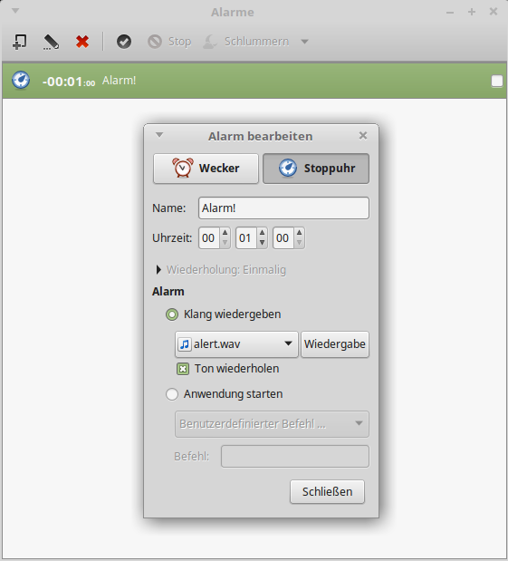

Das Programm ist sehr einfach bedienbar: Klickt man mit einem Doppelklick auf
das Wecker-Icon, so werden die Alarme angezeigt. Durch einen Klick auf das
entsprechende Icon (oben links) wird ein neuer Alarm definiert, wobei man
zwischen der Wecker- und der Stoppuhr-Funktion wählen kann:

* Bei der Wecker-Funktion wird die angegebene Zeit (Stunden: Minuten: Sekunden)
  als Uhrzeit interpretiert.
* Bei der Stoppuhr-Funktion wird die angegebene Zeit (Stunden: Minuten:
  Sekunden) als Countdown-Timer interpretiert.

Zusätzlich ist es empfehlenswert, eine Audio-Datei anzugeben, die abgespielt
werden soll, wenn der Alarm ausgelöst wird; persönlich finde ich die
standardmäßig bereits vorhandene Datei ``/usr/share/sounds/purple/alert.wav``
zwar nicht besonders klangvoll, aber durchaus als Wecker-Signal geeignet. [#]_
Lässt man das Feld frei, so wird beim Auslösen des Alarms nur ein
Hinweis-Fenster am oberen rechten Rand des Bildschirms geöffnet.

Nach dem neuen Erstellen eines Alarms wird dieser automatisch aktiviert und in
die Alarm-Liste aufgenommen; dort kann er ausgewählt und über die Icons in der
Symbolleiste wahlweise bearbeitet, gestoppt oder auch wieder gelöscht werden.
Nach dem Auslösen beziehungsweise Stoppen eines Alarms bleibt dieser dennoch in
der Liste erhalten und kann somit als Vorlage für ein neues Alarm-Event
verwendet werden.

.. index:: Büro-Programme; ding
.. index:: ding (Programm), Wörterbuch
.. _ding:

.. }}}

``gnome-calculator``
^^^^^^^^^^^^^^^^^^^^
.. {{{

Bei `gnome-calculator <https://wiki.ubuntuusers.de/Taschenrechner/>`__ handelt
es sich um ein unter Debian/Ubuntu/LinuxMint standardmäßig bereits installiertes
Taschenrechner-Programm; es kann aus einer Shell heraus mittels
``gnome-calculator`` oder über das Startmenü aufgerufen werden (meist ist es in
der Rubrik ``Zubehör`` zu finden).

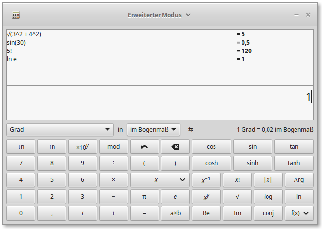

Die Bedienung des Programms kann wahlweise über die Tastatur oder mittels der
Maus erfolgen; bleibt man mit dem Maus-Cursor eine Weile über den einzelnen
Buttons, so bekommt man eine kurze Beschreibung der jeweiligen Funktionen als
Hilfe eingeblendet. Drückt man die ``Enter``-Taste, so wird der eingegebene Term
ausgewertet und das Ergebnis sowohl im oberen Fensterabschnitt (der
Eingabe-History) sowie als Vorlage für weitere Rechnungen in der Eingabezeile
angezeigt; auf diese Weise kann schnell mit den (Teil-)Ergebnissen weiter
gerechnet werden. Drückt man hingegen die ``Esc``-Taste, so wird der Inhalt der
Eingabe-Zeile gelöscht.

.. index:: guake (Programm)
.. _guake:

.. }}}

``guake``
^^^^^^^^^
.. {{{

Bei `guake <https://wiki.ubuntuusers.de/Guake>`__ handelt es sich um eine Shell,
die auf Tastendruck am oberen Bildschirmrand ein- und ausgeblendet werden kann.

``guake`` kann folgendermaßen installiert werden:

.. code-block:: sh

    sudo aptitude install guake

Anschließend kann ``guake`` mittels der gleichnamigen Anweisung aus einer Shell
heraus oder mittels ``Alt F2`` gestartet werden. Ist ``guake`` aktiv, so kann
mit den Standard-Einstellungen durch Drücken der Taste ``F12`` ein Shell-Fenster
am oberen Rand des Bildschirms eingeblendet werden; dieses kann wie jedes
gewöhnliche Shell-Fenster genutzt werden. Klickt man allerdings mit der rechten
Maustaste in dieses Fenster, so können die über den Menü-Eintrag ``Einstellungen``
unter anderem die Tastenkombinationen für ``guake`` geändert werden.

Das wichtigste Tastenkürzel betrifft das An- und Ausblenden des
``guake``-Fensters; ich habe hierfür die Taste ``F1`` ausgewählt, da diese bei
Debian/Ubuntu/LinuxMint gewöhnlich Hilfe-Seiten zum aktuellen Programm öffnet.
Dies kann auch störend sein, wenn man gelegentlich aus Versehen auf diese Taste
drückt. Wird die Taste hingegen von ``guake`` belegt, so wird die ursprüngliche
Funktion dieser Taste dadurch überlagert.

Mit ``guake`` können, ähnlich wie bei einem Webbrowser, auch mehrere
Shell-Sitzungen als Tabs nebeneinander geöffnet sein. Ich nutze dafür allerdings
lieber :ref:`tmux <tmux>`, so dass bei mir die entsprechende von ``guake``
voreingestellte Funktion ungenutzt bleibt.

.. index:: keepassx (Programm), Passwort-Manager
.. _keepassx:

.. }}}

``keepassx``
^^^^^^^^^^^^
.. {{{

Bei `keepassx <https://wiki.ubuntuusers.de/KeePassX>`__ handelt es sich um ein
Programm zur sicheren Verwaltung von Passwörtern. Der Grundgedanke hierbei ist,
dass man sich künftig nur *ein* gutes Passwort (oder den Namen einer selbst
gewählten Schlüsseldatei) merken muss und dafür alle weitere Passwörter in
verschlüsselter Form zentral verwaltet werden.

KeepassX kann folgendermaßen installiert werden:

.. code-block:: sh

    sudo aptitude install keepassx

Anschließend kann ``keepassx`` mittels der gleichnamigen Anweisung über eine
Shell oder mittels ``Alt F2`` gestartet werden; es erscheint zudem ein Eintrag
im Programm-Menü unter der Rubrik "Sonstiges".

Beim ersten Start von KeepassX wird man unmittelbar durch ein Eingabe-Formular
aufgefordert eine neue Datenbank für Passwörter anzulegen; dazu muss man
angeben, in welcher Datei beziehungsweise in welchem Pfad die Datenbank
gespeichert werden soll. Zudem muss wahlweise ein Passwort für diese Datenbank
angegeben werden oder eine beliebige Datei aus dem Dateisystem ausgewählt
werden, die als "Schlüsseldatei" fungieren soll. Wählt man die letztere
Variante, so muss zum Freischalten der Datenbank kein Passwort angegeben werden,
sondern stattdessen die korrekte Datei ausgewählt werden.

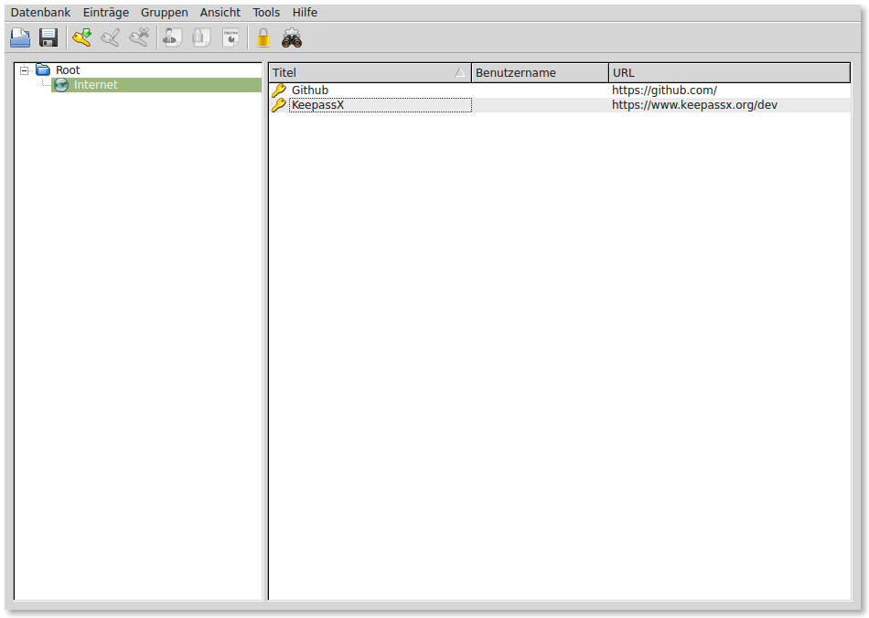

Einträge in die Passwort-Datenbank können zur besseren Übersichtlichkeit in
verschiedene Gruppen unterteilt werden; diese werden im linken Fenster-Abschnitt
von KeepassX angezeigt.

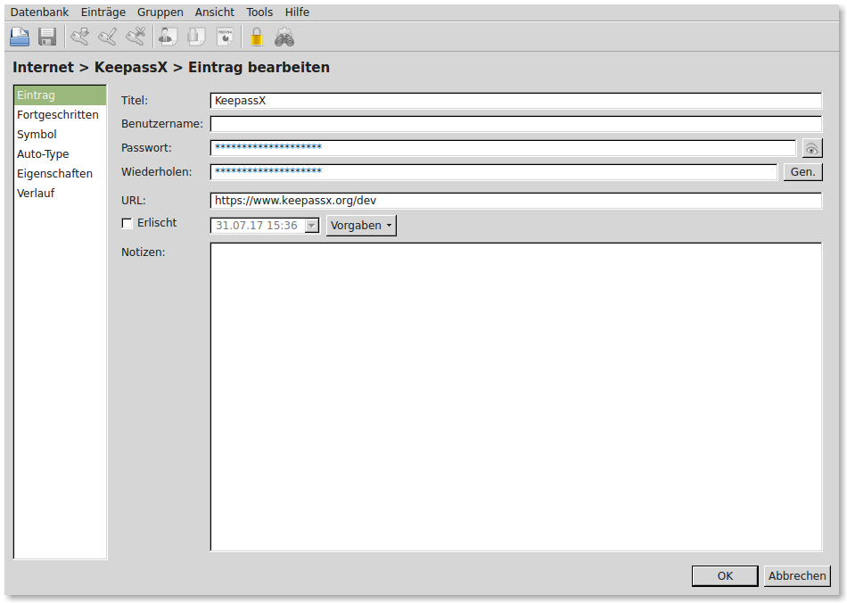

Wer ``keepassx`` häufiger nutzt, wird sich vermutlich freuen, dass es für einige
Funktionen auch Tastenkombinationen gibt: Den im aktuell ausgewählten Eintrag
hinterlegten Benutzernamen kann man beispielsweise mit ``Ctrl b`` in die
Zwischenablage kopieren, das zugehörige Passwort mit ``Ctrl c``. Nach einer
bestimmten Zeit, die über das Menü ``Tools -> Einstellungen`` festgelegt werden
kann, wird die Zwischenablage automatisch wieder gelöscht, damit das Passwort
nicht aus Versehen an anderer Stelle im Klartext eingefügt wird.

Eine gute Alternative zu ``keepassx`` ist die text-basierte Shell-Anwendung
:ref:`pass <pass>`.

.. index:: Redshift (Programm), Bildschirmfarbe
.. _redshift:

.. }}}

``redshift``
^^^^^^^^^^^^
.. {{{

Bei `redshift <https://wiki.ubuntuusers.de/Redshift>`__ handelt es sich um ein
Programm, das den Bildschirm je nach Tageszeit und geographischer Lage rötlich
einfärbt -- dies wirkt auf die Augen definitiv entspannend. [#]_ Das Programm kann
folgendermaßen installiert werden:

.. code-block:: sh

    sudo aptitude install gtk-redshift

Anschließend kann Redshift über ``Programm-Menü -> Steuerzentrale -> Persönlich
-> Startprogramme`` in die Liste der beim Start automatisch aufgerufenen
Programme aufgenommen werden. Hierzu erstellt man einen neuen Eintrag, wobei der
Programmaufruf folgende Syntax aufweisen sollte:

.. code-block:: sh

    # Allgemeine Syntax:
    gtk-redshift -l breitengrad:längengrad

    # Beispiel für Augsburg (50 Grad Nord, 10 Grad Ost):
    gtk-redshift -l 50:-10

Den Breiten- und Längengrad eines Ortes kann man beispielsweise über
Wikipedia-Einträge ausfindig machen; alternativ kann der Ort auf
`OpenRouteService <https://openrouteservice.org/>`_ gesucht werden; dort wird der
Breiten- und Längengrad automatisch oben rechts eingeblendet.

Mit den Ortsangaben kann das Programm beispielsweise errechnen, zu welchen
Tageszeiten die Sonne am höchsten steht oder die Dämmerung einsetzt. Tagsüber
wird der Bildschirm kaum eingefärbt, in den dunklen Stunden wird der Blau-Anteil
reduziert beziehungsweise der Rot-Anteil erhöht.

Möchte man, beispielsweise bei der Gestaltung eines Flyers, gelegentlich auch
die "echten" Farben angezeigt bekommen, so kann ``redshift`` jederzeit über das
Icon im Symbolfeld der Taskleiste an- beziehungsweise ausgeschaltet werden.

.. index:: wine
.. _Wine:
.. _Emulieren von Windows-Programmen:

.. }}}

``wine``
^^^^^^^^
.. {{{

Auch wenn es unter Linux für die meisten Zwecke eigene, auf dem
Open-Source-Prinzip basierende Programme gibt, lassen sich bei Bedarf --
allerdings ohne Garantie -- kommerzielle Windows-Programme auch mittels des
Windows-Emulators `Wine <https://wiki.ubuntuusers.de/Wine>`__ installieren
beziehungsweise bedienen. Um Wine unter Ubuntu/LinuxMint zu installieren, sollte
man folgendermaßen vorgehen:

.. code-block:: bash

    sudo add-apt-repository ppa:ubuntu-wine/ppa
    sudo apt-get update
    sudo apt-get install wine1.8

.. `Original-Anleitung
.. <http://www.upubuntu.com/2012/06/how-to-install-wine-157-on-ubuntu.html>`_

Nach der Installation von Wine können Windows-Programme (auch
Installations-Programme) mittels ``wine programm.exe`` aufgerufen werden.
Mittels ``winecfg`` beziehungsweise des entsprechenden Eintrags im Programm-Menü
kann eine graphische Konfigurations-Oberfläche gestartet werden.

Das Emulieren von Programmen mit Wine hat allerdings Nachteile: Einerseits kann
es (insbesondere bei alten Geräten) zu einer erheblichen Prozessor- und
Speicherlast führen, andererseits sind Windows-Programme in der Regel nicht auf
Linux-Systeme abgestimmt und stellen letztlich Sicherheitslücken dar. Wine
sollte daher nur dann genutzt werden, wenn es unbedingt erforderlich ist, man
dem Software-Hersteller vertrauen kann und (noch) kein entsprechendes
Linux-Programm existiert.

.. }}}

.. _Systemverwaltungs-Programme:

Systemverwaltungs-Programme
---------------------------

.. index:: Partitions-Manager, gparted (Programm)
.. _Partitions-Manager:
.. _gparted:

``gparted``
^^^^^^^^^^^

Bei `gparted <https://wiki.ubuntuusers.de/GParted>`__ handelt es sich um einen
Partitions-Manager, mit dem verschiedene Partitionen auf lokalen Festplatten
oder USB-Sticks erstellt und verwaltet werden können.Das Programm kann
folgendermaßen installiert werden:

.. code-block:: sh

    sudo aptitude install gparted

Gestartet werden kann ``gparted`` nur mit SuperUser-Rechten, da das Programm bei
nicht gewollter Benutzung auch die Partitionierung der System-Festplatte
unbrauchbar machen kann. Aus einer Shell heraus kann ``gparted`` also wahlweise
mit ``sudo gparted`` oder mit ``sudo gparted geraetname`` gestartet werden. Im
letzteren Fall kann nur das entsprechende Gerät bearbeitet werden, im ersteren
(beispielsweise ``/dev/sdb``), im ersteren kann das zu bearbeitende
Speichermedium über den Auswahl-Button oben rechts beziehungsweise das
erscheinende Menü festgelegt werden.

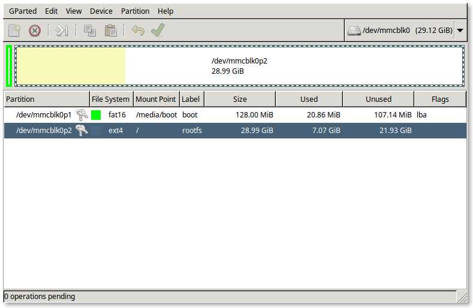

Gibt es auf einem Speichermedium noch keine Partition, so kann eine solche über
das ``Partitionen``-Menü neu erstellt werden; als Standard sollte eine
``GPT``-Partitionierung verwendet werden.

Über das Menü ``Partition`` können dann bestehende Partitionen gelöscht sowie
neue hinzugefügt werden. Als Dateisysteme sind dabei folgende üblich:

* Linux-Partitionen sollten mit dem Dateisystem ``ext4`` formatiert werden.
  Dieses ist ausgesprochen verlässlich und unterstützt auch Dateigrößen von
  mehr als ``4 GB``.

* USB-Sticks und andere Speichermedien, die auch auf auf Windows-Rechnern,
  Kopiergeräten usw. eingesetzt werden sollen, sollten mit ``fat32`` formatiert
  werden. Dieses Dateisystem unterstützt allerdings keine :ref:`Symlinks
  <Symlinks>` und unterscheidet nicht zwischen Groß- und Kleinschreibung.

* Partitionen, die als "erweiterter Arbeitsspeicher" genutzt werden sollen,
  müssen mit dem Dateisystem ``swap`` formatiert werden.

Über das Menü ``Partition -> Manage Flags`` können zudem auch "Markierungen" für
einzelne Partitionen gesetzt werden; beispielsweise muss bei USB-Sticks, auf
denen ein Linux-Live-System installiert ist, die Option ``bootable`` gesetzt
werden, damit ein Booten von diesem Gerät ermöglicht wird.

.. index:: Unetbootin (Programm), USB-Bootstick
.. _unetbootin:

``unetbootin``
^^^^^^^^^^^^^^

Bei `unetbootin <https://wiki.ubuntuusers.de/UNetbootin>`__ handelt es sich um
ein Programm zum Erstellen von bootfähigen Live-USB-Sticks. Das Programm kann
folgendermaßen installiert werden:

.. code-block:: sh

    sudo aptitude install unetbootin

Gestartet werden kann ``unetbootin`` nur mit SuperUser-Rechten, da das Programm
-- wie jedes Partitionierungs-Programm -- bei nicht gewollter Benutzung auch
die Partitionierung der System-Festplatte unbrauchbar machen kann.

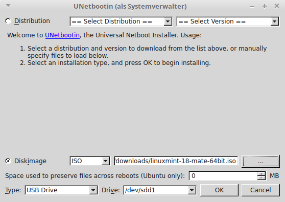

Die Bedienung von ``unetbootin`` ist prinzipiell einfach: Nachdem man eine
ISO-Datei der gewünschten :ref:`Linux-Distribution <Auswahl einer
Linux-Distribution>` heruntergeladen hat, wählt man dieses unter der Rubrik
``Diskimage`` aus, indem man auf den ``...``-Button klickt. Am unteren Rand des
Fensters muss dann noch der Device-Name des Ziel-USB-Sticks angegeben werden
(diesen kann man beispielsweise durch Eingabe von :ref:`lsblk <lsblk>` in einem
Shell-Fenster ermitteln). Anschließend muss man nur noch auf ``Ok`` klicken, die
Einrichtung des Live-USB-Sticks nimmt Unetbootin dann von selbst vor.

.. _Weiterführende Tutorials:
.. _Tipps zu weiteren Open-Source-Programmen:

Weiterführende Tutorials
------------------------

.. only:: html

    An dieser Stelle sind ein paar weitere Tipps für hilfreiche
    Open-Source-Programme mit graphischer Bedienoberfläche aufgelistet.

.. toctree::
    :maxdepth: 1

    inkscape.rst
    freecad.rst

.. raw:: html

    

.. only:: html

    .. rubric:: Anmerkungen::

.. [#] Der Standard-Dateimanager der ebenfalls weit verbreiteten
    Desktop-Umgebung `Cinnamon <https://wiki.ubuntuusers.de/Cinnamon/>`__ heißt
    `nemo <https://wiki.ubuntuusers.de/Nemo/>`__, bei der für alte Hardware
    optimierten Umgebung `LXDE <https://wiki.ubuntuusers.de/LXDE/>`__ heißt der
    Standard-Dateimanager `PCMan <https://wiki.ubuntuusers.de/PCMan_File_Manager>`__. Diese
    sind bezüglich des Aussehens und der Bedienung dem Datei-Manager ``caja``
    sehr ähnlich.

.. [#] Auch wenn das Passwort für ein Benutzerkonto in Pidgin gespeichert wird,
    so ist eine zusätzliche Sicherung des Passworts beispielsweise mittels des
    Passwort-Managers :ref:`Keepassx <keepassx>` sinnvoll, falls man
    beispielsweise den Account einmal mit einem anderen Chat-Programm oder auf
    einem anderen PC nutzen möchte.

.. [#] Für XMPP existiert zudem die Erweiterung `Jingle
    <https://de.wikipedia.org/wiki/Extensible_Messaging_and_Presence_Protocol#Peer-to-Peer-Sitzungen>`__,
    mit der sich auch Audio-Chats (Voice-over-IP) und Video-Konferenzen
    verwirklichen lassen. Hierfür ist wohl `Jitsi
    <https://wiki.ubuntuusers.de/Jitsi/>`__ eines der besten Programme.

.. [#] Je nach Email-Provider muss zunächst über die Online-Bedienoberfläche
    eine Nutzung der IMAP- beziehungsweise POP3-Funktion vorab freigeschaltet
    werden. Bei ``www.gmx.de`` muss man beispielsweise über in der Rubrik
    ``Emails`` zunächst auf den ``Einstellungen``-Button und anschließend auf
    ``POP3/IMAP-Abruf`` klicken; dort kann dann ein Haken bei ``E-mails per
    externem Programm (Outlook, Thunderbird) versenden und empfangen`` gesetzt
    werden. Diese "Umständlichkeit" liegt nicht an Firefox, sondern am
    jeweiligen Email-Provider -- vermutlich entgehen diesem nämlich
    Werbe-Einnahmen, da sich der "Kunde" bei einer Nutzung von Thunderbird kaum
    noch auf der Webseite des Email-Providers aufhält.

.. [#] Persönlich verwende ich einen Raspberry Pi mit einem auf die GPIO-Pins
    aufgesteckten :math:`3,5"`-Display und einer externen USB-Soundkarte als
    portable Wiedergabe-Station für aktive Lautsprecherboxen.

.. [#] Nach der Datei ``alert.wav`` kann in einer Shell auch manuell mittels
    ``locate alert.wav`` gesucht werden.

.. [#] Der physikalische Grund für diesen Effekt ist im Abschnitt
    :ref:`Die Farbwahrnehmung des Menschen <gwp:Die Farbwahrnehmung des
    Menschen>` beziehungsweise den dortigen Unterabschnitt :ref:`Tag- und
    Nachtsehen <Tag- und Nachtsehen>` näher beschrieben.

.. * - `blender <https://wiki.ubuntuusers.de/Blender_3D>`_
.. - ein Programm zur Modellierung und Animation von 3D-Modellen
.. (zusätzlich muss auch das Paket ``trans-de-en`` installiert werden)

.. Firefox als FTP-Browser
.. https://addons.mozilla.org/en-US/firefox/addon/fireftp/

.. https://addons.mozilla.org/en-US/firefox/addon/video-downloader-player/
.. https://addons.mozilla.org/en-us/firefox/addon/turn-off-the-lights/

