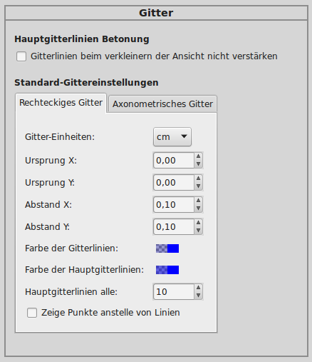

.. index:: Inkscape, Vektorgraphik
.. _Inkscape:

Erstellen von 2D-Graphiken mit ``inkscape``
===========================================

`Inkscape <https://wiki.ubuntuusers.de/Inkscape/>`__ ist ein umfangreicher
Vektorgraphik-Editor, der für Windows wie Linux gleichermaßen als
Open-Source-Tool frei verfügbar ist.

Unter Debian/Ubuntu/LinuxMint lässt sich Inkscape mittels des gleichnamigen
Paketes installieren:

.. code-block:: bash

    sudo aptitude install inkscape fonts-mathjax fonts-mathjax-extras

Inkscape bietet bereits in der Grundversion den Import und Export der
gängigsten Graphik-Formate, darunter auch PNG und PDF.

.. _LaTeX-Formeln:

.. rubric:: LaTeX-Formeln einbinden

Möchte man auch :ref:`LaTeX <gwil:LaTeX>`-Formeln in seine Zeichnungen
integrieren, empfiehlt sich die ``tex text``-Erweiterung. Sie kann von der
`Homepage des Entwicklers <https://pav.iki.fi/software/textext>`_
heruntergeladen werden. Zur Installation muss lediglich das Archiv entpackt und
der Inhalt in den Ordner ``~/.config/inkscape/extensions`` verschoben oder
kopiert werden.

.. code-block:: bash

    # In das Erweiterungs-Verzeichnis wechseln
    cd ~/.config/inkscape/extensions

    # Datei herunterladen
    wget https://pav.iki.fi/_downloads/textext-0.4.4.tar.gz

    # Datei entpacken
    tar xvzf textext-0.4.4.tar.gz

Die Erweiterung benötigt mit ``pdf2svg`` und ``pstoedit`` zwei weitere Pakete,
die -- falls sie nicht verfügbar sind -- über die Paketverwaltung installierbar
sind:

.. code-block:: bash

    sudo aptitude install pdf2svg pstoedit

Anschließend kann die Erweiterung in der Menüzeile über ``Erweiterungen -> Tex
Text`` aufgerufen werden.

Zusätzlich kann mittels den "Mathjax"-Schriften auch normaler Text in einem
LaTeX-ähnlichen Stil gesetzt werden, um ein einheitliches Schriftbild im
Dokument zu erreichen.

.. Inkscape-Aufruf mit Option -l neuer-dateiname: Export als Plain SVG (kleiner!)

.. _Einheiten des Lineals und des Gitters anpassen:

.. rubric:: Einheiten des Lineals und des Gitters anpassen

Die beiden Lineal-Leisten am linken und oberen Rand des Hauptfensters zeigen
Längen standardmäßig in Pixeln an. Um dies zu ändern, muss man in den
Dokument-Eigenschaften (Tastenkürzel ``Ctrl D``) unter der Rubrik "Seite"
als Standard-Einheiten ``cm`` (oder ``mm``) einstellen.

Die Einstellungen des Gitters können im Menü über ``Datei ->
Inkscape-Einstellungen`` unter der Rubrik "Gitter" geändert werden. Ich selbst
verwende folgende Einstellungen:

Bei diesen Einstellungen werden die Gitterlinien (Tastenkürzel ``#``) bei
Vollansicht des gesamten Dokuments (bei mir meist DinA4, Tastenkürzel ``5``)
in ``cm``-Rasterung angezeigt; zoomt man näher in einen Bereich hinein, wechselt
die Rasterung auf ``mm``.

.. _Multilayer-SVG:
.. _Multilayer-SVG-Dateien als PDF exportieren:

.. rubric:: Multilayer-SVG-Dateien als PDF exportieren

Leider unterstützt SVG (noch) keine Multipage-Dokumente. Man kann sich jedoch
damit behelfen, indem man für jede neue Seite eine neue Ebene ("Layer")
erstellt. Hierfür kann man das Menü ``Ebene`` nutzen, oder mit ``Ctrl L`` das
Ebenen-Werkzeug am rechten Bildschirmrand einblenden.

Während in PDF-Dateien die Seiten von vorne nach hinten nummeriert werden (in
Anzeigeprogrammen bzw. Inhaltsverzeichnissen von oben nach unten), so werden in
Inkscape die einzelnen Ebenen von unten nach oben nummeriert. Die zuletzt
hinzugefügte "Schicht" ist somit die oberste. Man kann die einzelnen Ebenen im
Ebenen-Werkzeug leicht nach unten und oben verschieben, sollte aber auf die
passende Reihenfolge achten, wenn man die einzelnen Schichten als jeweils neue
Seiten einer PDF-Datei exportieren möchte.

Ein solcher Export einer mit Inkscape erstellten Multilayer-SVG-Datei in eine
Multipage-PDF-Datei ist dank des Skripts `svglayers2pdfpages.sh
<http://www.grund-wissen.de/_downloads/svglayers2pdfpages.sh>`_ von `Christoph
Haag <http://www.lafkon.net>`_  möglich: Gibt man im Verzeichnis der zu
exportierenden SVG-Datei ``svglayers2pdfpages.sh svgfile.svg`` ein, so wird im
gleichen Verzeichnis eine gleichnamige PDF-Datei erzeugt.

.. _PNG-Dateien aus Shell heraus exportieren:

.. rubric:: PNG-Dateien aus Shell heraus exportieren

Inkscape ermöglicht einen PNG-Export einer SVG-Datei auch aus einer Shell
heraus. Beim Aufruf von ``inkscape`` in einer Shell können hierbei folgende
zusätzliche Optionen genutzt werden:

* ``-z``: Diese Option verhindert eine Starten der graphischen Bedienoberfläche.
* ``-d wert``: Mit dieser Option wird die Auflösung der PNG-Zieldatei
  festgelegt; der Standardwert liegt bei ``96 dpi``.
* ``-D``: Diese Option legt fest, dass nur der Zeichenbereich der SVG-Datei,
  nicht das gesamte Dokument exportiert werden soll. Dies ist empfehlenswert,
  wenn in Inkscape das Standard-DinA4-Format als Dokumenteinstellung belassen
  wird, die erstellte Graphik jedoch deutlich kleiner ist (ohne diese Option
  bekäme eine solche Abbildung einen entsprechend "großen" Rahmen).
* ``-e dateiname``: Gibt den Dateinamen der PNG-Zieldatei an.

Zum Erstellen der Abbildungen auf meiner Grund-Wissen-Seite nutze ich folgendes
Mini-Shell-Skript, um mir aus allen SVG-Dateien eines Verzeichnisses die
zugehörigen PNG-Dateien zu erstellen:

.. code-block:: sh

    for i in *.svg; do inkscape $i -z -d 150 -D -e $(basename $i .svg).png; done

Hierfür habe ich mir, um dies nicht wiederholt eingeben zu müssen, ein eigenes
Alias in der Konfigurationsdatei ``~/.zshrc`` erstellt:

.. code-block:: sh

    INK1='for i in *.svg; do inkscape $i -z -d 150 -D -e $(basename $i .svg).png; done'

Somit genügt es, im jeweiligen Ordner in einer ``INK1`` aufzurufen, um alle
darin enthaltenen SVG-Dateien als PNG zu exportieren.

.. _SVG-Dateigrößen mit ``svgo`` optimieren:

.. rubric:: SVG-Dateigrößen mit ``svgo`` optimieren

Inkscape speichert erstellten SVG-Dateien standardmäßig als
Inkscape-SVG-Dateien, die unter anderem Informationen darüber enthalten, welche
Gitter-Optionen gesetzt wurden, welche Auswahl-Optionen aktiv sind, wo sich
Führungslinien befinden, welche Optionsfenster beim Schließen geöffnet waren
usw. Dies ist zwar bei der Bearbeitung angenehm, macht die resultierenden
SVG-Dateien aber erheblich größer als nötig.

Um schlanke SVG-Dateien beispielsweise auf einer Homepage verlinken zu können,
sollte ein SVG-Optimierer verwendet werden. Persönlich verwende ich inzwischen
`svgo <https://github.com/svg/svgo>`__, ein in Node.js geschriebenes Programm
für die Kommandozeile.

Unter Ubuntu / Linux Mint lässt sich ``svgo`` folgendermaßen installieren:

.. code-block:: sh

    sudo aptitude install npm nodejs-legacy

    git clone https://github.com/svg/svgo

    cd svgo

    sudo npm install -g svgo

Anschließend kann ``svgo`` mittels folgender Syntax genutzt werden:

.. code-block:: sh

    # Eine Einzelne Dateien optimieren:
    svgo -i originaldatei.svg -o neue-datei.svg

    # Verzeichnis mit SVG-Dateien optimieren:
    # (Erst Sicherheitskopie erstellen!!!)
    svgo -f pfadname

Persönlich erstelle ich für jedes Projekt die einzelnem Inkscape-Dateien in
einem strukturell identisch aufgebauten ``Original``-Verzeichnis, und kopiere
von dort die SVG-Dateien ins Zielverzeichnis. Im Zielverzeichnis wiederum, in
dem die Dateien optimiert werden sollen, rufe ich anschließend ``svgo -f .``
auf. Dadurch werden die Inkscape-SVGs meist um 60-80% kleiner -- teilweise liegt
der Kompressionsgrad sogar bei über 90%.. :-)

.. _Inkscape-Links:

.. rubric:: Links

* `Inkscape-Projektseite <https://inkscape.org/en/?lang=de>`_

Am besten lernt man Inkscape -- wie so oft -- mittels "Learning by doing".
Begleitend sind dabei beispielsweise folgende Tutorials hilfreich:

* `Inkscape-Wikibook <https://de.wikibooks.org/wiki/Inkscape>`_
* `Inkscape-Einführung der Universität Göttingen <http://lp.uni-goettingen.de/get/text/6356>`_
* `Offizielles Inkscape-Wiki <https://www.inkscape-forum.de/>`_
* `Inkscape-Crashcourse <http://www.chrishilbig.com/a-crash-course-in-inkscape/>`_
* `Guide to a Vector Drawing Program (en.) <http://tavmjong.free.fr/INKSCAPE/MANUAL/html/index.html>`_
* `Quick Guide to Inkscape (en.) <http://www.microugly.com/inkscape-quickguide/>`_

.. https://inkscape.org/en/doc/tips/tutorial-tips.html
.. https://commons.wikimedia.org/wiki/Help:SVG/de

Einfache bis komplexere Beispiele finden sich als zusätzliche Anregungen auf
folgenden Seiten:

* `Guide to a vector drawing program (en.) <http://tavmjong.free.fr/INKSCAPE/MANUAL/html/index.html>`_
* `35 Tutorials to create vector graphics (en.)
  <https://speckyboy.com/inkscape-tutorials/>`_
* `Drawing Gears (en.) <http://howto.nicubunu.ro/gears/>`_

..  `Inkscape Tutorial List (en.) <http://inkscapetutorials.wordpress.com/suggest-a-tutorial/tutorial-list/>`_
..  rainbow: http://art.vinayraikar.com/2008/01/illustrating-rainbow-with-tiled-clones.html
..  Unbedingt lesen: FUN WITH GLASSES http://howto.nicubunu.ro/glass_shadow_inkscape/
..  shiny buttons | http://howto.nicubunu.ro/shiny_web_buttons_inkscape/
..  hackergochi | http://howto.nicubunu.ro/shiny_web_buttons_inkscape/
..  using brushes | http://howto.nicubunu.ro/inkscape_brushes/
..  photo to jigsaw puzzle | http://howto.nicubunu.ro/gimp_jigsaw_puzzle/
