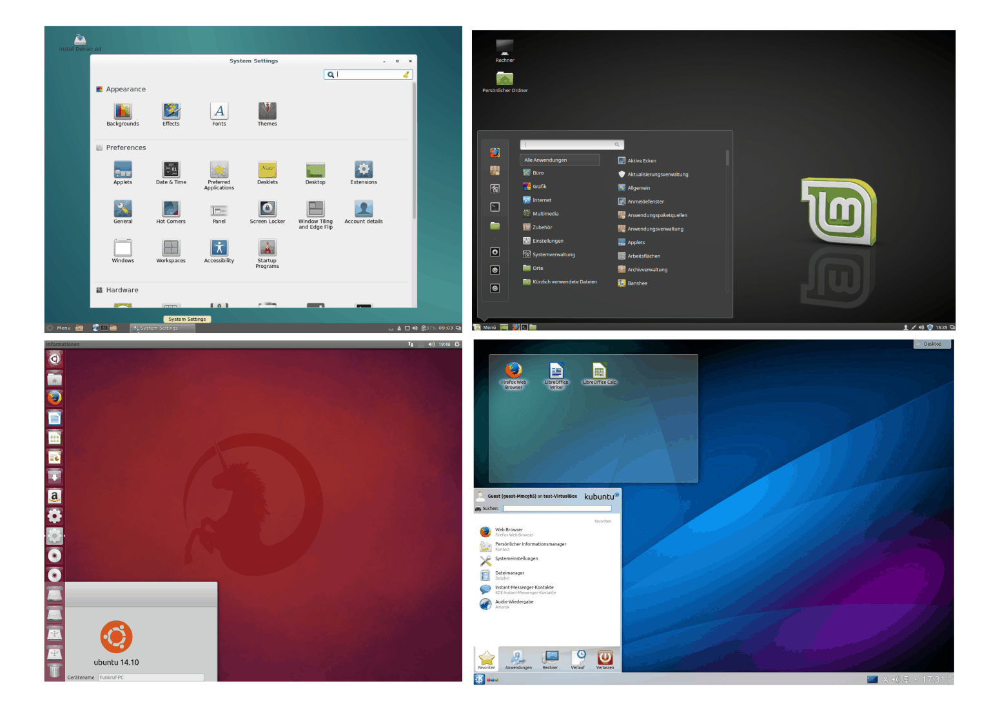

.. _Installation:
.. _Linux-Installation:
.. _Linux installieren:

Linux installieren
==================
.. {{{

Linux ist komfortabel geworden. Das gilt nicht nur für die Vielfalt und
Anwenderfreundlichkeit der Programme, sondern auch für die
Installations-Routinen. Dank gut ausgearbeiteter Dokumentationen (z.B. das
`Ubuntu-Wiki <https://wiki.ubuntuusers.de/Startseite>`_) lässt sich heute in
kurzer Zeit und ohne Grundkenntnisse ein gut funktionierendes Linux-System
einrichten.

.. index:: Distribution
.. _Linux-Distribution:
.. _Linux-Distributionen:
.. _Auswahl einer Linux-Distribution:

.. rubric:: Auswahl einer Linux-Distribution

Als Distribution wird im Software-Bereich eine Zusammenstellung von Software zu
einem gut nutzbaren Gesamtpaket bezeichnet. Die Vielzahl an Linux-Distributionen
unterscheidet sich im Wesentlichen dadurch, welche Programme grundsätzlich
installiert sind, wie häufig Updates erfolgen und wie viel Konfigurationen der
Benutzer gewöhnlich manuell vornehmen möchte. [#LD]_

In Deutschland laufen die meisten Server mit der Distribution `Debian
<https://de.wikipedia.org/wiki/Debian>`_; bei den Privat-PCs zählen die auf
Debian basierenden Distributionen `Ubuntu
<https://de.wikipedia.org/wiki/Ubuntu>`_ und `Linux Mint <https://linuxmint.com>`_
zu den beliebtesten Systemen. Alle Tips dieser Notizen-Sammlung beziehen sich
auf diese einander weitgehend ähnlichen Systeme.

Wie Linux letztendlich "aussieht", hängt nur bedingt von der Distribution ab.
Die graphische Bedienoberfläche und das eigentliche Betriebsystem sind -- anders
als bei Windows -- zweierlei Dinge. Das Betriebsystem Linux unterstützt eine
Vielzahl an Bedienoberflächen ("Desktop-Umgebungen"), die sich auch nach der
Installation jederzeit austauschen lassen. Die wohl bekanntesten
Bedienoberflächen sind `GNOME <https://de.wikipedia.org/wiki/Gnome>`_ und `KDE
<https://de.wikipedia.org/wiki/KDE>`_. Persönlich nutze ich inzwischen seit
Jahren bevorzugt die unter Ubuntu und Linux Mint übliche Oberfläche `Mate
<https://de.wikipedia.org/wiki/MATE_Desktop_Environment>`_.

.. _Basis-Installation:
.. _Die Basis-Installation:

.. }}}

Die Basis-Installation
----------------------
.. {{{

Ein Linux-System zu installieren ist heute dank moderner Hardware-Erkennung und
graphischer Installations-Assistenten denkbar einfach. Das Installations-Schema
ist bei fast allen Distributionen gleich:

1.  Man lädt sich von der jeweiligen Homepage eine ISO-Image-Datei herunter.
    Persönlich bevorzuge ich derzeit `Linux Mint Ubuntu Edition
    <https://www.linuxmint.com/download.php>`_ mit Mate-Desktop. Je nach Hardware
    muss die 32- oder 64-Bit-Variante gewählt werden. [#MC32]_

.. .

2.  Man erstellt aus diesem Image mit einem beliebigen Brennprogramm eine
    bootbare CD beziehungsweise mit `UNetBootin
    <https://wiki.ubuntuusers.de/UNetbootin>`__ einen bootbaren USB-Stick. Eine
    gute Anleitung zur Erstellung eines Ubuntu-USB-Sticks, die mit Linux Mint
    genauso funktioniert, findet sich `hier
    <https://wiki.ubuntuusers.de/Live-USB>`_.

.. .

3.  Man bootet den Rechner mit eingelegter Boot-CD beziehungsweise angestecktem
    Boot-USB-Stick neu.

Die Boot-Reihenfolge wird vom BIOS des Rechners festgelegt. Entsprechende
Einstellungen werden im BIOS-Menü vorgenommen, das sich bei einem Neustart des
Rechners meist mit ``F2`` (manchmal auch mit ``F4``, ``F8`` oder ``F12``) öffnen
lässt.

Je nach ausgewählter Distribution erscheint automatisch ein
Installations-Assistent (Debian), oder es wird ein Live-System gebootet (Ubuntu
und Linux Mint), in dem der Installations-Assistent als Icon auf dem Desktop zu
finden ist.

Zu Beginn der Installationsroutine legt man den Benutzernamen mit dazugehörigem
Passwort und bevorzugte Einstellungen (Tastaturlayout, Zeitzone, etc.) fest.
Nachträgliche Änderungen dieser Einstellungen sind auch später ohne Aufwand
möglich.

Der wichtigste Schritt der Installation besteht anschließend in der Festlegung
der zu nutzenden Festplattenpartitionen. Diese lassen sich wahlweise automatisch
oder von Hand mittels eines integrierten Partitionsprogramms einrichten.
Der Installations-Assistent führt die Grundinstallation daraufhin
vollautomatisch durch.

.. _Partitionen einrichten:

.. rubric:: Empfehlenswert: Partitionen manuell einrichten

Bei einer nicht-automatischen Festlegung der Partitionen ist, sofern genügend
Festplattenspeicher vorhanden ist, folgende Partitionierung sinnvoll:

* Eine mittelgroße Partition (min. 10 GB, max. 30 GB) mit Einhängepunkt ``/``
  für das Basis-System

.. .

* Eine beliebig große Partition (min. 10 GB) mit Einhängepunkt ``/home`` für
  eigene Dokumente, Konfigurationsdateien, usw.

.. .

* Eine eher kleine Partition (meist 2 bis 8 GB) als ``swap`` (Erweiterung des
  Arbeitsspeichers). Die ``swap``-Partition sollte allgemein ebenso groß gewählt
  werden wie der verfügbare Arbeitsspeicher. Eine Swap-Partition ist nicht
  zwingend vorgeschrieben, wird aber beispielsweise benötigt, wenn der Rechner
  in den Ruhezustand versetzt werden soll.

Eine separate ``/home``-Partition  bietet insbesondere den Vorteil, dass das
System jederzeit neu installiert werden kann, ohne dass eigene Daten und
Einstellungen davon berührt werden. Das gilt auch, wenn auf dem System mehrere
Benutzer-Konten eingerichtet wurden.

Als Linux-Anfänger sind diese drei Partitionen vollkommen ausreichend. Wird man
gefragt, ob diese Partitionen "primär" oder "logisch" angelegt werden sollen,
kann man guten Gewissens "primär" wählen. Auf eine bestimmte Nummerierung der
Partitionen (``sda1``, ``sda2``, usw.) muss nicht geachtet werden.

Für jede Linux-Partition, insbesondere für die System-Partition ``/`` und die
Home-Partitin  ``/home``, empfiehlt sich als Dateisystem ``EXT-4``: Es ist sehr
schnell, sehr stabil und quasi wartungsfrei. Swap-Partitionen haben kein eigenes
Dateisystem. Für Daten-Partitionen empfiehlt sich ebenfalls ``EXT-4`` als
Dateisystem, solange man nur mit Linux darauf zugreifen möchte.

Falls man Daten auch unter Windows oder MacOS nutzen mag (beispielsweise auf
einem USB-Stick oder einer externen Festplatte), sollte für die jeweilige
Partition ``FAT32`` als Dateisystem verwendet werden. ``FAT32`` verfügt jedoch
über keine Unterstützung von :ref:`Symlinks <Symlinks>` und unterscheidet nicht
zwischen Groß- und Kleinbuchstaben. Auf externen Datenträgern ist dieses
Dateisystem Standard, da es von nahezu allen Geräten unterstützt wird.

*Hinweis:* Änderungen an Dateisystemen und Partitionierungen können auch später
beispielsweise mit dem Programm :ref:`GParted <gparted>` vorgenommen werden;
wobei ein vorheriger Backup der Daten stets empfehlenswert ist.

Bei Bedarf können bei der Installation auch noch zusätzliche Partitionen
angelegt werden:

* (Optional:) Eine beliebig große Daten-Partition ohne festgelegten
  Einhängepunkt für ein weiteres, später parallel installierbares oder bereits
  installiertes Betriebsystem. [#WI]_

.. .

* (Optional:) Eine beliebig große Daten-Partition ohne festgelegten
  Einhängepunkt für gemeinsam genutzte und/oder verschlüsselte Dateien.

.. _Passwortgeschützte Partition:
.. _Passwortgeschützte Partitionen:

.. rubric:: Optional: Passwortgeschützte Partitionen

Linux ist als Betriebsystem verhältnismäßig sicher. Lässt man jedoch
beispielsweise ein Notebook unbeaufsichtigt liegen, so helfen die besten
Konfigurationen nichts, um vertrauliche Daten vor unbefugtem Fremdzugriff zu
schützen. Eine Festplatte kann einfach ausgebaut und extern an einen anderen PC
angeschlossen werden, und schon sind alle Daten (Passwörter, evtl.
Onlinebanking-Daten, Emails, etc.) frei abrufbar...

Wer private Daten in einem passwortgeschützten ("verschlüsselten") Bereich
ablegen möchte, kann sich unter Linux für eine der folgende Möglichkeiten
entscheiden:

:ref:`Partition-Verschlüsselung <Partitions-Verschlüsselung>`:
    Die Partition kann bereits während der Installation -- ohne Festlegung eines
    Einhängepunktes -- auf einem freien (unformatierten) Bereich eines
    Datenträgers angelegt werden.

    Der Vorteil dieser Methode liegt darin, dass sie verhältnismäßig einfach
    einzurichten und die verschlüsselte Partition unabhängig vom System ist.
    Somit kann der geschützte Bereich auch auf einem laufenden Rechner
    verschlossen bleiben.

    Nachteilig bei dieser Methode ist, dass jeder Unbefugte mit Hardware-Zugriff
    das Betriebsystem ohne Hindernis verändern kann, beispielsweise um Trojaner
    oder Keyboard- beziehungsweise Datenlogger zu installieren.

:ref:`System-Verschlüsselung <System-Verschlüsselung>`:
    Beim Start erscheint eine Passwort-Abfrage. Erst wenn das Passwort richtig
    eingegeben wurde, wird die Systempartition entschlüsselt, und der Rechner
    bootet.

    Der Vorteil dieser Methode liegt darin, dass kein Unbefugter Zugriff auf
    Teile des Systems oder auf persönliche Dateien hat, wenn er den Rechner
    ausgeschaltet vorfindet.

    Nachteilig bei dieser Methode ist, dass sie einem Rechner im laufenden
    Betrieb -- die Systempartition ist dann stets geöffnet -- keinen
    Verschlüsselungs-Schutz bietet. Zudem setzt diese Methode fortgeschrittene
    Linux-Kenntnisse voraus und ist für Anfänger somit kaum geeignet.

Beide Verfahren sind im Abschnitt :ref:`Datensicherung <Datensicherung>` näher
beschrieben.

.. .. _truecrypt:
.. .. index:: truecrypt

.. Darüber hinaus ist es möglich, mittels `Truecrypt
.. <https://wiki.ubuntuusers.de/TrueCrypt>`__ passwortgeschützte Daten-"Container" zu
.. erstellen. Diese können nach der Installation auf einer beliebigen Partition
.. eingerichtet werden und sind auch auf anderen Betriebsystemen nutzbar.

.. Der Vorteil bei der Verwendung von ``truecrypt`` liegt darin, dass -- im
.. Gegensatz zu den obigen Methoden -- auch Windows- und MacOS-Systeme auf den
.. passwortgeschützten Bereich zugreifen können.

.. Als Nachteil ist zu nennen, dass das Erstellen eines Containers -- je nach
.. Größe und Rechnerleistung -- mehrere Stunden dauern kann; ``truecrypt`` wird
.. zudem nicht mehr aktiv weiterentwickelt.

.. _Zusatzpaket:
.. _Zusatzpakete:
.. _Zusatzpakete installieren:

.. }}}

Zusatzpakete installieren
-------------------------
.. {{{

Nach einer erfolgreichen Basis-Installation werden üblicherweise noch weitere
Anpassungen vorgenommen. Im Wesentlichen gibt es dafür zwei Gründe:

* Einerseits mag man als Nutzer zusätzliche Software gemäß den eigenen Vorlieben
  installieren. Die Menge an verfügbarer Software passt in der Regel allerdings
  nicht auf eine CD, eine DVD, oder einen USB-Stick. Die Programme werden
  darüber hinaus beständig weiter entwickelt und sind möglicherweise in der
  Zwischenzeit aktualisiert worden.

* Andererseits werden je nach Linux-Distribution nur Software-Pakete
  mitgeliefert, die bestimmten Kriterien genügen (beispielsweise gewisse
  Lizenzbedingungen aufweisen). Manche wichtigen Pakete müssen daher, selbst
  wenn sie frei verfügbar sind, manuell installiert werden.

.. index:: Paketverwaltung
.. _synaptic:
.. _Paketverwaltung:
.. _Paketverwaltung mittels graphischer Bedienoberfläche:

Paketverwaltung mittels graphischer Bedienoberfläche
^^^^^^^^^^^^^^^^^^^^^^^^^^^^^^^^^^^^^^^^^^^^^^^^^^^^
.. {{{

Je nach Linux-Distribution gibt es unterschiedliche graphische
Verwaltungsprogramme, mit denen Programme installiert, aktualisiert oder auch
wieder entfernt werden können:

* Unter Debian und Ubuntu gibt es  `Synaptic
  <https://wiki.ubuntuusers.de/Synaptic>`__,

* Unter Linux Mint ist zusätzlich das Programm ``mintinstall`` vorinstalliert,
  das auf Synaptic aufbaut und eine sehr komfortable (aber etwas langsame)
  graphische Oberfläche bietet.

Die obigen Programme sind nur nutzbar, wenn der angemeldete Benutzer sich
zeitweise auch SuperUser-Rechte geben darf; gibt es nur einen Benutzer-Account,
den man bei der Installation selbst eingerichtet hat, so ist dies bei diesem
Account stets der Fall. [#]_ Man muss lediglich beim Start der
Anwendungsverwaltung das eigene Benutzerpasswort eingeben, um die Anwendung im
SuperUser-Modus laufen zu lassen.

Die graphischen Anwendungsverwaltungs-Programme sind ohne weitere Einarbeitung
intuitiv mit der Maus bedienbar:

* Man klickt zunächst auf die jeweilige Programm-Kategorie (beispielsweise
  Graphik und Bildbearbeitung), um alle entsprechenden verfügbaren Programme
  aufzulisten.

* Klickt man dann auf gewünschte Programm, so bekommt man eine detailierte
  Ansicht, ob das Programm installiert ist, welche Funktionen das Programm
  bietet, und welche Bewertung es durchschnittlich von Benutzern bekommen hat.

Gleich unter der Hauptüberschrift befindet sich eine Status-Zeile, über die das
jeweilige Programm mit einem Klick installiert oder wieder entfernt werden kann.

.. index:: Paketverwaltung; apt
.. _Paketverwaltung mittels apt:

.. }}}

Paketverwaltung mittels ``apt``
^^^^^^^^^^^^^^^^^^^^^^^^^^^^^^^
.. {{{

Die graphischen Verwaltungs-Programme von Debian/Ubuntu/Linux Mint nutzen
indirekt die Shell-Anwendung :ref:`apt <apt>` ("Advanced Packaging Tool") zur
Verwaltung und Aktualisierung der installierten Programme und Code-Bibliotheken.
In einem Shell-Fenster ("Terminal") kann ``apt`` auch direkt genutzt werden. Es
gibt dabei folgende Möglichkeiten, das Programm aufzurufen:

* Mit ``apt-get update`` kann die Liste der verfügbaren Pakete aktualisiert
  werden. Hierzu prüft ``apt``, ob die

* Mit ``apt-cache search suchbegriff`` ein in Frage kommenden Paket suchen,

* Mit ``apt-get install paketname`` ein verfügbares Paket installieren.

Als einfachere und bessere Alternative kann das Programm :ref:`aptitude
<aptitude>` genutzt werden. Hierbei genügt es, die beiden Aufruf-Varianten
``apt-get`` und ``"apt-cache"`` durch ``aptitude`` zu ersetzen:

.. code-block:: sh

    # Programm suchen:
    aptitude search suchbegriff

    # Programm installieren:
    sudo aptitude install paketname

Wird versucht mittels ``sudo aptitude install paketname`` ein Programm zu
installieren, das bereits installiert ist, so bleibt der Aufruf ohne Wirkung.
Mittels ``sudo aptitude remove paketname`` kann ein Programm wieder
deinstalliert werden. Weitere Infos zu ``aptitude`` gibt es im Abschnitt
:ref:`Administrator-Programme <aptitude>`

.. }}}

.. }}}

.. raw:: html

    

.. only:: html

    .. rubric:: Anmerkungen:

.. [#LD] Je nach Vorliebe und Anwendungszweck bietet sich ein weites Spektrum an
    Distributionen:

    * "Live"-Systeme (beispielsweise `Knoppix <https://de.wikipedia.org/wiki/Knoppix>`_):

      Einige Linux-Varianten sind darauf ausgelegt von einem externen
      Datenträger (CD, USB-Stick) geladen und ohne Installation von diesem aus
      genutzt zu werden. Auch Ubuntu und LinuxMint können bei Bedarf, zum
      Beispiel zu Recovery-Zwecken, als Live-Systeme genutzt werden.

    * Extrem konfigurierbare Distributionen (beispielsweise `Gentoo
      <https://de.wikipedia.org/wiki/Gentoo_Linux>`_, `Arch
      <https://de.wikipedia.org/wiki/Arch_Linux>`_):

      Bei manchen Distributionen ist es normal, den Linux-Kernel und die
      Programme stets selbst aus dem Quellcode zu kompilieren, also in
      ausführbaren Maschinencode zu übersetzen. Dies bietet eine maximale
      Kontrolle über die laufenden Programme und kann erhebliche
      Geschwindigkeitsvorteile im laufenden System mit sich bringen. Um das
      Potential derartiger Distributionen auch ausschöpfen zu können, sollte man
      allerdings ausreichend mit Linux- und Hardware-Grundlagen vertraut sein.

    * Distributionen von kommerziellen Anbietern (beispielsweise `Red Hat
      Enterprise <https://de.wikipedia.org/wiki/Red_Hat_Enterprise_Linux>`_,
      `Fedora <https://de.wikipedia.org/wiki/Fedora_(Linux-Distribution)>`_,
      `Mandrivia <https://de.wikipedia.org/wiki/Mandriva>`_):

      Diese Distributionen werden von Firmen entwickelt und gepflegt und sind
      insbesondere für Geschäftskunden interessant, die darauf angewiesen sind,
      jederzeit einen kommerziellen technischen Support in Anspruch nehmen zu
      können.

.. [#MC32] Ältere Rechner mit einem einzelnen Prozessor (beispielsweise Intel
    Celeron, Intel Core2Duo, Intel Atom) benötigen ein 32-Bit-System, für neuere
    Multi-Core-Prozessoren sind hingegen 64-Bit-Systeme empfehlenswert.

    Ist man sich nicht sicher, welcher Systemtyp der passende ist
    (beispielsweise weil man nicht weiß, was für ein Prozessor eingebaut ist),
    so kann eine entsprechende Suchmaschinen-Anfrage weiterhelfen. Darüber
    hinaus kann auch ein (versehentlicher) Versuch, einen Rechner mit einem
    nicht passenden System zu booten, keinerlei Schaden anrichten, denn er wird
    unmittelbar unterbrochen und eine entsprechende Fehlermeldung ausgegeben.

.. [#WI] Linux lässt sich auch parallel zu einem bestehenden Windows-System
    installieren. Dies halte ich allerdings für nicht empfehlenswert, da Windows
    damit häufig bereits beim Boot-Vorgang nicht zurechtkommt.

    Es ist ebenso prinzipiell möglich, auf einer weiteren Partition ein
    zusätzliches Linux-System zu installieren, beispielsweise für
    Experimentier-Zwecke. Ein solches System sollte allerdings keine separate
    ``/home``-Partition verwenden, damit es nicht zu Konflikten mit den
    persönlichen Einstellungen der einzelnen Benutzer für das Haupt-System
    kommen kann.

    Persönlich halte ich diese Variante für umständlich, da jeweils nur eine
    Version genutzt werden kann: Jeder Wechsel der Arbeitsplattform bedeutet
    also einen Reboot. Bei den heute üblichen Rechner-Leistungen ist es aus
    meiner Sicht vielmehr empfehlenswert, eine Experimentier-Plattform ohne viel
    Aufwand mittels :ref:`Vagrant <Vagrant>` in Form eines virtuellen
    Betriebsystems zu realisieren.

.. Für eine Parallel-Installation man am besten eine eigene Festplatte oder
.. legt mit dem Installations-Assistenten eine neue ``ext4``-Partition an
.. (mindestens 15 GB) und installiert Linux in diesen Bereich; auch *zwei* neue
.. Partitionen mit den Einhängepunkten  ``/`` für das Grundsystem und ``/home``
.. für persönliche Dateien sind für diese Variante möglich. Nach einer üblichen
.. Installation lässt sich anschließend bei jedem Rechnerstart in einem Menü
.. auswählen, welches Betriebsystem gestartet werden soll.

.. Linux kann lesend und schreibend auf alle Windows-Dateisysteme zugreifen;
.. Windows kann jedoch nicht mit Linux-Dateisystemen umgehen, da es
.. beispielsweise nicht zwischen Groß- und Kleinbuchstaben in Dateinamen
.. unterscheidet. Möchte man auf bestimmte Daten mit beiden Systemen zugreifen,
.. so müssen diese folglich auf einer Partition abgelegt werden, die auch
.. Windows lesen kann; die Partition sollte dazu mit FAT32 formatiert werden.

.. *Achtung:* Bei einer Veränderung einer bestehenden Partition --
.. beispielsweise einer Verkleinerung, um Platz für eine neute Partition zu
.. schaffen -- lässt sich ein Datenverlust niemals völlig ausschließen. Eine
.. Sicherheitskopie bestehender Daten ist daher auf alle Fälle empfehlenswert!

.. [#] Fügt man als SuperUser einen weiteren Benutzer-Account hinzu, so kann man
    entscheiden, ob dieser sich ebenfalls SuperUser-Rechte verschaffen darf.

