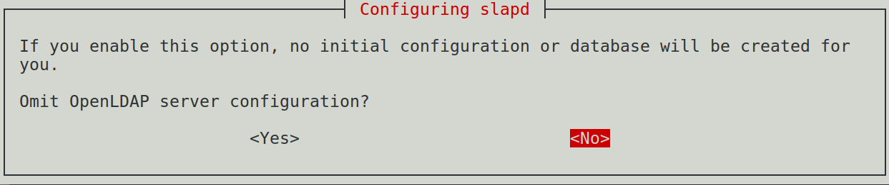
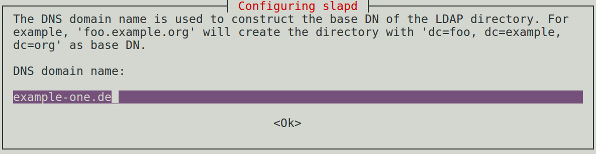
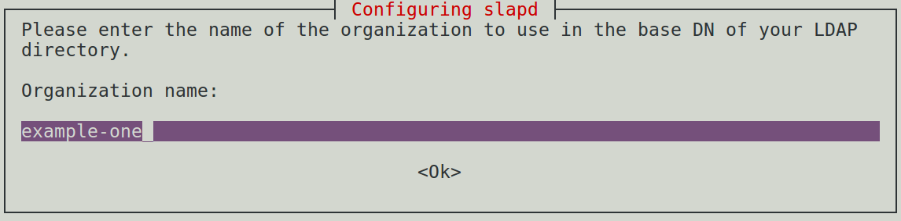
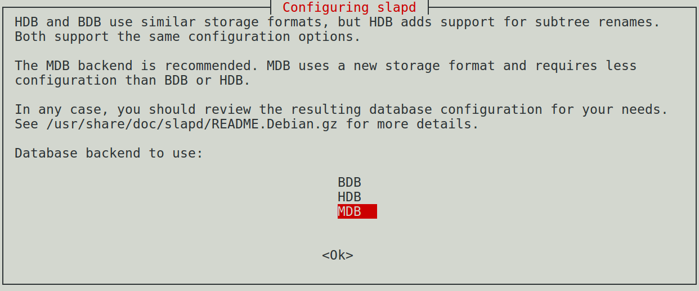
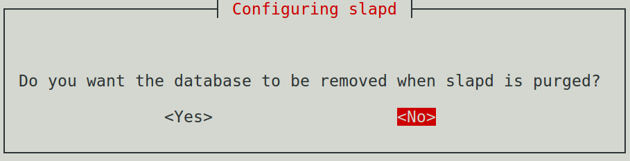
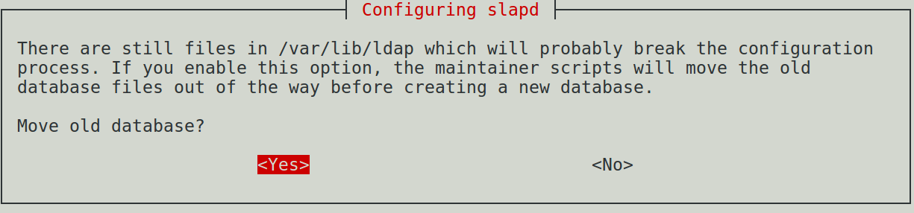
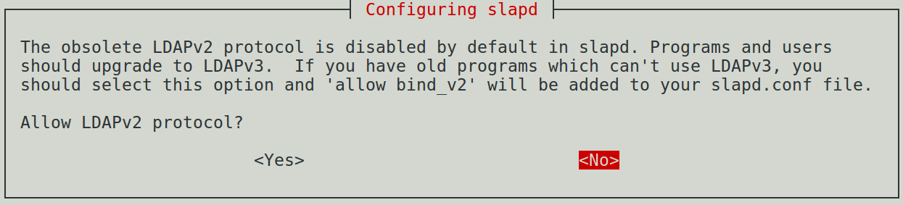

.. index:: LDAP, OpenLDAP, Verzeichnisdienst
.. _LDAP:

Der Verzeichnisdienst ``ldap``
==============================
.. {{{

Mit dem so genannten Verzeichnisdienst LDAP (Lightweight Directory Access
Protocoll) können Informationen in einer baumartigen Struktur gespeichert,
verwaltet und vor allem auch in standardisierter Weise wieder abgerufen werden.

Durch das hohe Maß an Strukturierung bieten viele andere Dienste und Programme
die Nutzung von LDAP an, so dass sich auf diese Weise beispielsweise
Adressbücher, Account-Informationen, Anmelde-Daten usw. zentral verwalten
lassen.

* Die Anmeldung von Benutzern an einem Rechner oder in einem Netzwerksystem kann
  (via PAM) mittels LDAP erfolgen.

* Dienste wie SAMBA oder Anwendungen wie Django bieten bei entsprechender
  Konfiguration auch eine Benutzer-Authentifizierung via LDAP anstelle einer
  Passworteingabe.

LDAP kann ebenso lokal wie über das Netzwerk genutzt werden; zwischen den
Clients und dem LDAP-Server muss lediglich eine TCP/IP-Verbindung aufgebaut
werden können; auf dem eigenen PC kann ``localhost`` als "Ziel" genutzt werden.

.. _LDAP-Installation:

.. }}}

Installation
------------
.. {{{

Um LDAP zu installieren, müssen folgende Pakete installiert werden:

.. code-block:: sh

    sudo aptitude install slapd ldap-utils ldapscripts

Mit diesen beiden Paketen wird sowohl der "Standalone" LDAP-Server installiert,
als auch Client-Programme, die auf diesen zugreifen. Mit "Standalone" ist
gemeint, dass diese Implementierung ohne externe Datenbank-Programme auskommt --
sie nutzt stattdessen binäre ``.bdb``-Dateien ("Berkeley Database")
beziehungsweise bei modernen Versionen ``.mdb``-Dateien ("Memory-Mapped
Database").

Bei der Installation erscheint ein Dialog-Feld, um ein Passwort für den
Administrator-Benutzer einzugeben. 
Optional kann das Dialog-Feld auch zu jedem späteren Zeitpunkt mittels
``dpkg-reconfigure -plow slapd`` erneut gestartet werden.

Der LDAP-Server ``slapd`` wird anschließend automatisch gestartet, wobei der
Dienst unter dem Benutzer- und Gruppennamen ``openldap`` läuft.

.. Bei der Installation von ``slapd`` erscheint ein Frage-Katalog. Die erste Frage
.. ist, ob man eine weitere Konfiguration auslassen möchte. Man kann diese Frage
.. mit ``Ja`` beantworten, um eine Erstkonfiguration unmittelbar anhand der
.. Konfigurationsdatei ``/etc/ldap/slapd.conf`` vorzunehmen.

.. Dies war in lange Zeit der Standard und ist für Einsteiger womöglich weniger
.. gewöhnungsbedürftig als die moderne, "dynamische" Konfigurations-Variante.
.. Letztere nutzt anstelle der Datei ``/etc/ldap/slapd.conf`` das Verzeichnis
.. ``/etc/ldap/slapd.d`` und legt die Einstellungen dort in LDAP-typischen Dateien
.. (im :ref:`LDIF <LDIF>`-Format) ab.

.. }}}

Veraltet: Statische Konfiguration
---------------------------------
.. {{{

Lange war es üblich, LDAP über die Konfigurationsdatei ``/etc/ldap/slapd.conf``
zu konfigurieren (beispielsweise bis inklusive Debian 8). Für Einsteiger ist
diese Variante wohl weniger gewöhnungsbedürftig als die moderne :ref:`dynamische
Konfiguration <Dynamische Konfiguration>`, die ab Debian 9 sowie bei
Ubuntu/LinuxMint zum Einsatz kommt. In künftigen Versionen wird diese
"statische" Form der Konfiguration jedoch gemäß der `OpenLDAP-Webseite
<http://www.openldap.org/doc/admin24/slapdconf2.html>`__ womöglich nicht mehr
unterstützt. Jede statische Konfiguration kann jedoch ohne großen Aufwand in
eine entsprechende dynamische Konfiguration umgewandelt werden (siehe
:ref:`hier <Konvertierung von slapd.conf auf slapd.d>`).

Entscheidet man sich zunächst für eine Konfiguration mittels der
Konfigurations-Datei ``/etc/ldap/slapd.conf``, so muss zunächst folgender
Eintrag in der Datei ``/etc/default/slapd`` angepasst werden:

::

    # Datei: /etc/default/slapd
    SLAPD_CONF=/etc/ldap/slapd.conf

Zudem muss der LDAP-Server ``slapd`` gestoppt werden:

.. code-block:: sh

    # LDAP-Server stoppen:
    sudo systemctl stop slapd

Die Datei ``/etc/ldap/slapd.conf`` existiert bei vielen neuen
Linux-Distributionen standardmäßig nicht. Man kann allerdings eine Vorlage-Datei
dorthin kopieren und anpassen:

.. code-block:: sh

    # Beispiel-Datei kopieren:
    sudo cp /usr/share/doc/slapd/examples/slapd.conf /etc/ldap

Eine eigene Variante dieser Datei kann :download:`hier <sldapd.conf.txt>` als
Beispiel heruntergeladen werden. Entscheidend gegenüber der Vorlage aus dem
``/usr``-Verzeichnis sind folgende Änderungen:

* Die Backend-Datenbank muss festgelegt werden: An allen Stellen, die
  in der offiziellen Beispiel-Datei mit dem Platzhalter ``@BACKEND@`` versehen
  sind, sollte dieser Eintrag durch ``mdb`` ersetzt werden.

* Für die Variable ``loglevel`` ist der Wert ``256`` empfohlen (siehe ``man
  slapd.conf(5)``).

* Das "Suffix", also der Basis-Pfad, auf den sich jedes spätere Objekt bezieht,
  muss ebenfalls festgelegt werden: An allen Stellen, die mit dem Platzhalter
  ``@SUFFIX@`` versehen sind, muss dieser Eintrag durch den Domain-Namen ersetzt
  werden (beispielsweise ``dc=example-one, dc=de``, wie im Abschnitt
  :ref:`Grundlegende Konzepte <Grundlegende Konzepte>` näher beschrieben).

* Die mit ``@ADMIN@`` gekennzeichneten Stellen müssen durch einen Eintrag der
  Art ``cn=admin, dc=example-one, dc=de`` ersetzt werden. Das Kommentar-Zeichen
  vor dem Eintrag ``rootdn`` muss entfernt werden.

* Das Passwort für den Admin-Benutzer muss gesetzt werden. Dies wird allerdings
  nicht im Klartext in der Datei hinterlegt, sondern muss mittels folgender
  Anweisung in einen zum Passwort gehörenden Hash-Wert verwandelt werden:

  .. code-block:: sh

      # Passwort-Hash generieren:
      slappasswd

  Anschließend muss das gewünschte Passwort zweimal eingegeben werden. Der
  resultierende Hash-Wert muss als neuer Eintrag für  ``rootpw`` (am besten im
  Anschluss an den ``rootdn``-Eintrag) eingefügt werden. Damit sehen die
  Einträge etwa folgendermaßen aus:

  ::

      database    mdb

      suffix      "dc=example-one, dc=de"
      rootdn      "cn=admin, dc=example-one, dc=de"
      rootpw      {SSHA}7kACyCfp/vAc4i6vqjmIpgQqbCmgIdHc

Schließlich müssen noch alle bereits existierenden Datenbanken sowie bisherigen
Config-Einträge gelöscht werden. Dies ist mittels der folgenden Anweisungen möglich:

.. code-block:: sh

    # Bestehende Datenbanken löschen:
    sudo rm /var/lib/ldap/[^D]*

    # Bestehende Konfigurationen löschen:
    sudo rm -r /etc/ldap/slapd.d/*

Nun kann der LDAP-Server neu gestartet werden:

.. code-block:: sh

    # LDAP-Server starten:
    sudo systemctl start slapd

Der LDAP-Server ist damit einsatzbereit.

.. _Konvertierung von slapd.conf auf slapd.d:

.. }}}

.. rubric:: Konvertierung von ``slapd.conf`` auf ``slapd.d``
.. {{{

Wurde LDAP zunächst mittels der Konfigurationsdatei ``/etc/ldap/slapd.conf``
statisch konfiguriert, so muss in der Datei ``/etc/default/slapd`` für die
Variable ``SLAPD_CONF=/etc/ldap/slapd.d`` gesetzt werden. Falls das Verzeichnis
``/etc/ldap/slapd.d`` bereits existiert und Dateien enthält, sollten diese in
ein Backup-Verzeichnis verschoben werden. Anschließend kann man den LDAP-Server
stoppen und folgende Anweisungen aufrufen:

.. code-block:: sh

    # LDAP-Server stoppen:
    sudo systemctl stop slapd

    # Konfigurationen übernehmen:
    cd /etc/ldap 
    sudo slaptest -f slapd.conf -F slapd.d

Ruft man ``slaptest`` mit nur *einer* der Optionen ``-f datei`` oder ``-F
verzeichnis`` auf, so wird die aktuelle Konfiguration des LDAP-Servers getestet.
Mit einer zusätzlichen Option ``-v`` ("verbose") erfolgt eine ausführliche
Ausgabe der Test-Ergebnisse. Gibt man allerdings *beide* Optionen ``-f`` und
``-F`` gemeinsam an, so ändert ``slaptest`` die Konfigurationsdatei in ein
Konfigurations-Verzeichnis um.

Die bestehenden Einstellungen aus der Datei ``slapd.conf`` werden also
übernommen und in LDIF-Dateien neu im Konfigurations-Verzeichnis abgelegt.
Anschließend sollte noch die Original-Datei umbenannt werden, da sie ansonsten
bei einem Neustart des LDAP-Servers ebenfalls geladen würde:

.. code-block:: sh

    # Conf-Datei umbenennen:
    sudo mv slapd.conf slapd.conf.backup

Zudem muss sichergestellt werden, dass der LDAP-Server Zugriff auf die neu
erstellten Dateien hat:

.. code-block:: sh

    # Datei-Rechte setzen:
    sudo chown -R openldap:openldap slapd.d

Anschließend kann der LDAP-Server erneut gestartet werden:

.. code-block:: sh

    # LDAP-Server starten:
    sudo systemctl start slapd

.. Test:
.. ldapsearch -x -W -D 'cn=admin,dc=example,dc=net' -b "" -s base -H ldap://localhost

Diese Variante funktioniert nicht nur mit einem neu eingerichteten LDAP-System,
sondern auch mit bereits bestehenden Einträgen.

.. }}}

.. _Dynamische Konfiguration:

Aktuell: Dynamische Konfiguration
---------------------------------
.. {{{

Der Vorteil der modernen Konfigurations-Variante, bei der die Einstellungen als
:ref:`LDIF <LDIF>` -Dateien im Verzeichnis ``/etc/ldap/slapd.d`` ablegt werden,
liegt unter anderem darin, dass spätere Änderungen ohne einen Neustart des
LDAP-Dienstes erfolgen können. Dies ist insbesondere nützlich, wenn es zu
Hochverfügbarkeits-Zwecken mehrere synchronisierte LDAP-Server im Netz geben
soll.

.. Möchte man unmittelbar mit der dynamischen Konfigurations-Variante starten, so
.. sollte man sich zunächst mit den :ref:`grundlegenden Konzepten <Grundlegende
.. Konzepte>` von LDAP vertraut machen.

Bei der dynamischen Konfiguration werden die Einstellungen als eigenständiger
LDAP-Tree mit dem Basis-Eintrag ``cn=config`` gespeichert. Auf diese
Informationen hat der ``root``-Benutzer des Linux-Systems standardmäßig vollen
Zugriff. Wurde LDAP zunächst statisch konfiguriert, so werden bei der
Konvertierung für den dabei eingerichteten Admin-Benutzer automatisch
Zugriffsrechte gesetzt. 

Im Fall einer Neu-Installation empfiehlt es sich, den Server-Dienst ``slapd``
folgendermaßen neu zu konfigurieren:

.. code-block:: sh

    # LDAP-Server neu konfigurieren:
    sudo dpkg-reconfigure slapd

Hierdurch erscheint ein Frage-Dialog. Bei der ersten Frage geht es darum, ob
eine weitere Konfiguration ausgelassen werden soll, was man für weitere
Konfigurationen mit ``Nein`` beantworten muss:

Anschließend wird der Basis-Pfad des LDAP-Trees angegeben. Standardmäßig lautet
dieser ``nodomain``, er sollte allerdings auf einen Eintrag wie
``dc=example-one,dc=de`` o.ä. geändert werden:

Der Organisations-Name sollte aus Kompatibilitätsgründen, abgesehen von der
Domain-Endung, mit dem Domain-Namen identisch sein:

Nach einer Abfrage für das Passwort des Administrator-Benutzers ``admin`` soll
ausgewählt werden, welche Art von Datenbank für die Einträge genutzt werden
soll. Hierbei wird ``mdb`` offiziell empfohlen.

Auch bei den letzten drei Fragen können guten Gewissens die Standard-Werte
beibehalten werden: Wenn ``slapd`` entfernt werden sollte, soll die Datenbank
weiterhin gespeichert bleiben:

Bereits bestehende Datenbanken, die allgemein im Verzeichnis ``/var/lib/ldap``
abgelegt werden, sollen umgesiedelt werden:

Schließlich wird gefragt, ob auch das veraltete Protokoll LDAPv2 noch
unterstützt werden soll. Bei Neu-Installationen ist dies nicht nötig:

Damit ist die dynamische Konfiguration des LDAP-Servers bezüglich der
Haupt-Domain abgeschlossen. Im Verzeichnis ``/etc/ldap/slapd.d`` befindet sich
nun eine "Master"-Datei ``cn=config.ldif`` sowie ein Verzeichnis ``cn=config``
mit weiteren Konfigurations-Dateien im LDIF-Format. Die einzelnen dort
abgelegten Informationen haben grundsätzlich die gleichen Bezeichnungen wie bei
einer statischen Konfiguration; es wird lediglich stets ein ``olc`` (für
"OpenLDAP-Configuration") vorangestellt. 

.. rubric:: Einrichtung eines Admin-Benutzers für ``cn=conf``

Auf den LDAP-Server kann man nicht nur lokal, sondern auch über das Netzwerk
zugreifen. Läuft der Server ohne graphische Bedienoberfläche (X-Server), so kann
diese Variante genutzt werden, um mit einem graphischen LDAP-Bedienwerkzeug wie
:ref:`JXplorer <JXplorer>` auf die Datenbank zugreifen zu können. Um dabei
ebenso Einstellungen an der (dynamischen) Konfiguration vornehmen zu können, ist
es sinnvoll, auch für den Bereich ``cn=config`` einen ``admin``-Benutzer
einzurichten.

Hierfür gibt man zunächst folgende Anweisung auf dem Server ein:

.. code-block:: sh

    # Passwort-Hash generieren:
    slappasswd

Nach einer doppelten Eingabe eines Passworts wird ein zugehöriger Hash-Wert als
Ergebnis zurückgegeben, beispielsweise
``{SSHA}o1cb7UCd6Pql7q3HB6+nvTZZ1OJOsJWV`` für das Passwort ``geheim``. Diesen
kopiert man in die Zwischenablage und fügt ihn an der entsprechenden Stelle in
einer neu anzulegenden Datei ``/etc/ldap/db.ldif`` ein:

::

    dn: olcDatabase={0}config,cn=config
    changetype: modify
    add: olcRootDN
    olcRootDN: cn=admin,cn=config
    -
    add: olcRootPW
    olcRootPW: {SSHA}o1cb7UCd6Pql7q3HB6+nvTZZ1OJOsJWV 

Mit einer Anmeldung als ``cn=admin,cn=config`` kann man künftig Änderungen an
den Einstellungen vornehmen (auch ohne SuperUser-Rechte auf dem LDAP-Server).

.. rubric:: Konfiguration der LDAP-Clients

Zusätzlich können über die Datei ``/etc/ldap/ldap.conf`` weitere Einstellungen
für die LDAP-Clients angegeben werden. Damit sind beispielsweise Programme wie
:ref:`ldapadd <ldapadd>`, :ref:`ldapsearch <ldapsearch>` oder :ref:`ldapmodify
<ldapmodify>`  gemeint, mit denen letztlich auf die LDAP-Datenbank zugegriffen
wird. Standardmäßig befindet sich in dieser Datei ein Pfad für ein zu
verwendendes TLS-Zertifikat. Zudem können beispielsweise folgende Einträge
vorgenommen werden, um künftig Tipp-Arbeit zu sparen:

::

    BASE     dc=example-one,dc=de
    URI      ldap://ldap.example-one.de ldap://localhost

Werden mehrere URIs angegeben, so wird automatisch die erste ansprechbare
Server-Adresse genutzt. Die Angaben können bei Verwendung von ``ldapsearch``,
``ldapmodify`` usw. auch explizit neu gesetzt werden. Um zu testen, ob LDAP
erfolgreich eingerichtet wurde, kann man nun folgendes eingeben:

.. code-block:: sh

    # LDAP-Einrichtung testen:
    ldapsearch -x -LLL

Damit werden alle bestehenden Einträge der Haupt-Domain aufgelistet. Nach einer
neuen Installation existiert einerseits der Basis-Pfad ``dc=example-one,dc=de``,
als auch ein Eintrag ``dc=admin,dc=example-one,dc=net`` für den Admin-Benutzer.
Insgesamt werden in diesem Fall also zwei Einträge aufgelistet.

Eine ausführliche Beschreibungen zu den einzelnen Attributen für den LDAP-Server
gibt erhält man mittels ``man slapd.conf`` beziehungsweise ``man ldap.conf``. In
der offiziellen LDAP-Dokumentation ist die Einrichtung `hier
<http://www.openldap.org/doc/admin24/slapdconf2.html>`__ beschrieben.

.. Test:
.. # Einträge in Haupt-Datenbank auflisten:
.. ldapsearch -x -LLL -H ldap:/// -b "dc=example-one,dc=de" dn

.. # Config-Einträge auflisten:
.. sudo ldapsearch -Q -LLL -Y EXTERNAL -H ldapi:/// -b cn=config dn

.. -Q: Aktiviert Silent SASL-Modus

.. _LDAP-Konzept:
.. _LDAP-Konzepte:
.. _Grundlegende Konzepte:

.. }}}

Grundlegende Konzepte
---------------------
.. {{{

Alle in LDAP gespeicherten Informationen werden als Objekte angesehen, die
jeweils bestimmte Attribute aufweisen.

Unterschieden wird häufig zwischen Container- und Blatt-Objekten: Erstere
enthalten üblicherweise weitere Objekte, und stehen daher im Informations-Baum
tendenziell im "Inneren". Blatt-Objekte hingegen, die sich "außen"
beziehungsweise am Ende des Informations-Baums befinden, sind als eigentliche
Speicherstellen für Informationen gedacht.

Jedes Objekt muss im Informations-Baum, der üblicherweise mit ``DIT``
("Directory Information Tree") abgekürzt wird, einen klar festgelegten Platz
haben. Dies erfordert Sorgsamkeit und etwas zusätzlichen Aufwand bei der Ablage
der Informationen, macht dafür allerdings das Suchen umso einfacher und
ermöglicht folglich anderen Diensten beziehungsweise Anwendungen einen schnellen
Zugriff auf die gespeicherten Informationen.

Jedes Objekt im DIT hat eine eindeutige Bezeichnung, die "Distinguished Name"
beziehungsweise ``dn`` genannt wird. Der wichtigste ``dn`` ist der Name des
Ausgangs-Objekts, der oftmals auch "Wurzel" oder "Basis-Pfad" des Baumes genannt
wird. Dieser erste Eintrag eines DIT wird oftmals in Anlehnung an einen Firmen-
oder Domain-Namen vergeben. Für die Domain ``example-one.de`` könnte dieser
erste Eintrag im ``DIT`` also folgendermaßen aussehen:

::

    # Basis-Eintrag:
    dn: dc=example-one,dc=de

Dieser Eintrag bezeichnet ein Objekt, das über die mit ``dc`` bezeichneten
Domain-Komponenten ``example-one`` und ``de`` eindeutig definiert ist. Diese
Variante, einen Domain-Namen als "Basis-Pfad" zu wählen, wird bevorzugt gewählt,
weil auf diese Weise Einträge ähnlich wie bei einem DNS-System abgefragt
werden können.

Informationen über die Mitwirkenden können mittels weiteren Untergliederungen
abgelegt werden, beispielsweise in mit ``ou`` bezeichneten "Organizational
Units". Die Kategorie "Mitwirkende" hätte für das obige Beispiel dann ``dn:
ou=mitwirkende, dc=example-one, cd=de`` als eindeutige Bezeichnung.

.. _LDAP-Schema:

Die Abkürzungen ``dn``, ``dc``, ``ou``, usw. sind nicht zufällig gewählt:
Informationen können in LDAP allgemein nur über Objekt-Klassen gespeichert
werden, die klar definiert sind. Die einzelnen Objekt-Klassen und ihre Attribute
sind in so genannten "Schema"-Dateien festgelegt. Bei der Standard-Installation
von LDAP werden automatisch einige solcher Schema-Dateien mit den am häufigsten
verwendeten Objekt-Klassen und Attributen im Verzeichnis ``/etc/ldap/schema``
abgelegt.

Beim Einbinden zusätzlicher Schema-Dateien muss die Reihenfolge beachtet werden:
Soll bei einer neuen Definition auf eine bestehende Objektklasse oder ein
bereits anderweitig definiertes Attribut zurückgegriffen werden, so muss dieses
bereits bekannt beziehungsweise eingebunden worden sein. Die allgemeinen
Schema-Dateien müssen somit zuerst eingebunden werden.

Einige wichtige Objekt-Klassen (aus der Datei
``/etc/ldap/schema/core.schema``) sind beispielsweise:

    +---------+-------------------------+-------------------------------------------------------------+
    | ``dn``  | ("Distinguished Name")  | Eindeutiger Name im Informations-Baum                       |
    +---------+-------------------------+-------------------------------------------------------------+
    | ``dc``  | ("Domain Component")    | Teil eines Domain-Namens                                    |
    +---------+-------------------------+-------------------------------------------------------------+
    | ``c``   | ("Country")             | Länder-Abkürzung (DE für Deutschland, US für Amerika, usw.) |
    +---------+-------------------------+-------------------------------------------------------------+
    | ``o``   | ("Organization")        | Organisation (Teil des Baumes)                              |
    +---------+-------------------------+-------------------------------------------------------------+
    | ``ou``  | ("Organizational Unit") | Abteilung einer Organisation                                |
    +---------+-------------------------+-------------------------------------------------------------+
    | ``cn``  | ("Common Name")         | Allgemeiner Name, beispielsweise einer Person               |
    +---------+-------------------------+-------------------------------------------------------------+
    | ``uid`` | ("User-ID")             | Benutzer-Kennung                                            |
    +---------+-------------------------+-------------------------------------------------------------+

.. Zusätzlich sind folgende Attributs-Abkürzungen üblich:

..     +--------+--------------+---------------------------------------+
..     | ``sn`` | ("Surname")  | Nachname (einer Person)               |
..     | ``l``  | ("Location") | Wohnort (Stadt)                       |
..     | ``st`` | ("State")    | (Bundes-)Staat, beispielsweise Bayern |
..     | ``c``  | ("Country")  | Land, beispielsweise Deutschland      |
..     +--------+--------------+---------------------------------------+

Jeder Eintrag in einem ``DIT`` hat nicht nur einen ``dn``, sondern auch weitere
Attribute; insbesondere hat jeder Eintrag (mindestens) ein
``objectClass``-Attribut, mit dem die Objekt-Klasse des Eintrags festgelegt
wird. Je nach Objektklasse können oder müssen auch noch weitere Attribute
angegeben werden. [#]_

.. Schema hinzufügen:
.. ldapadd -Y EXTERNAL -H ldapi:/// -f /etc/ldap/schema/misc.ldif
.. ldapadd -Y EXTERNAL -H ldapi:/// -f /etc/ldap/schema/openldap.ldif
.. Es sind zwar beinahe alle Schemata schon als fertige .ldif-Dateien vorhanden,
.. allerdings gibt es mit den Schemata ldapns und samba kleine Probleme.

.. Mit ou können Drucker, Dokumente, usw. kategorisiert werden.

.. Wenn ein Objekt für die Anmeldung an einem Unix-System verwendet werden soll,
.. muss das Objekt der "objectclass" PossixAccount angehören, da nur in der
.. Objekt-Klasse alle Attribute enthalten sind, die für eine erfolgreiche
.. Anmeldung benötigt werden.

.. _LDIF:
.. _LDIF-Dateien:

.. }}}

LDIF-Dateien
^^^^^^^^^^^^
.. {{{

Sollen Informationen in eine LDAP-Datenbank aufgenommen werden, so werden diese
üblicherweise in eine Datei mit der Endung ``.ldif`` geschrieben. Mittels der
Anweisung ``ldapadd`` können die so hinterlegten Informationen dann in die
(binäre) Datenbank übernommen werden.

Eine LDIF-Datei für die ersten Datenbank-Einträge könnte etwa so aussehen:

::

    # Datei: neu.ldif

    # Erster Eintrag (Basis-Pfad):
    # Nach einer dynamischen Konfiguration existiert 
    # dieser Eintrag bereits!
    dn: dc=example-one, dc=de
    objectClass: dcObject
    objectClass: domain
    dc: example-one

    # Zweiter Eintrag:
    dn: ou=mitwirkende, dc=example-one, dc=de
    objectClass: organizationalUnit
    objectClass: top
    ou: themen

Mit dieser Datei soll der Basispfad sowie ein erstes "Unterverzeichnis" angelegt
werden. In den Zeilen, die an die ``dn``-Definition anschließen, wird das mit
dem Eintrag verbundene Objekt genauer durch einzelne Attribute präzisiert. Eine
Redundanz der angegebenen Informationen ist leider unvermeidbar: Beispielsweise
ist ``ou=mitwirkende`` sowohl Teil der eindeutigen Pfadangabe, andererseits muss
aufgrund der festgelegten Objektklasse ``organizationalUnit`` auch ein Attribut
namens ``ou`` angegeben werden. Diese formale Struktur macht die Eingabe
aufwändiger, den Zugriff hingegen effizienter: LDAP ist nicht für schnell
wechselnde Daten ausgelegt, sondern für sich nur selten ändernde ("statische")
Informationen und dafür hohe Zugriffszahlen.

Jede Zeile eines Eintrags stellt ein ``attribut: wert``-Paar dar, wobei je nach
Attribut nur ein einzelner Wert oder auch Werte-Listen erlaubt sind. Genügt eine
einzelne Zeile nicht zur Angabe eines Wertes beziehungsweise mehrerer durch
Komma-Zeichen getrennter Werte, so kann auch die folgende Zeile genutzt werden,
sofern diese eingerückt wird (also mit einem oder mehreren Leerzeichen beginnt).
Verschiedene Einträge werden in LDIF-Dateien jeweils durch eine leere Zeile
getrennt.

.. Der Doppelpunkt wird für Festlegungen verwendet,
.. Das Istgleich-Zeichen fürs Referenzieren

.. _ldapadd:

.. }}}

ldapadd
^^^^^^^
.. {{{

Die Einträge aus einer ``.ldif``-Datei können mittels der Anweisung ``ldapadd``
in die Datenbank aufgenommen werden. Für das obige Beispiel würde die Anweisung
etwa folgendermaßen aussehen:

.. code-block:: sh

    # Einträge aus LDIF-Datei aufnehmen:
    ldapadd -x -D 'cn=admin,dc=example-one,dc=de' -W -f neu.ldif

.. ldapadd -cxWD cn=admin,dc=example,dc=com -f ~/tree.ldif

Die einzelnen Optionen haben folgende Bedeutungen:

* Die Option ``-x`` bewirkt, dass keine Authentifizierung via SASL durchgeführt
  werden soll.

* Mit ``-D`` wird der Benutzer angegeben, mit dem die Anweisung aufgeführt
  werden soll.

* Mit ``-W`` wird explizit nach einem Passwort gefragt.

  Anstelle ``-W`` kann auch die Option ``-w passwort`` genutzt werden, mit der
  allerdings das Passwort im Klartext in der History ``~/.bash_history``
  beziehungsweise ``~/.zsh_history`` der Shell gespeichert wird.

* Mit ``-f`` wird der Name der LDIF-Datei angegeben, die eingelesen werden soll.

Weitere nützliche Optionen für ``ldapadd`` sind:

* Mit ``-c`` werden mögliche auftretende Fehler beim Einlesen von Einträgen der
  LDIF-Datei zwar angezeigt, die Bearbeitung wird jedoch fortgesetzt.

* Mit ``-S dateiname`` werden die Einträge, die beim Einlesen Fehler verursacht
  haben und somit übersprungen wurden, in die angegebene Datei geschrieben.
  Diese Option wird meist zusammen mit der Option ``-c`` eingesetzt.

* Mit ``-h`` kann der Hostname beziehungsweise die Adresse eines Rechners
  angegeben werden, auf dem der LDAP-Server läuft. Ohne explizite Angabe dieser
  Option wird ``localhost`` verwendet.

* Mit ``-Z`` wird versucht, eine mit TLS gesicherte Verbindung zum mit der
  Option ``-h`` angegebenen Zielrechner aufzubauen. Mit ``-ZZ`` wird TLS
  erzwungen.

Die Programme ``ldapadd`` sowie ``ldapsearch`` sind als Client-Programme
anzusehen, die auf den LDAP-Server zugreifen, um dort Daten hinzuzufügen oder um
Daten abzufragen.

.. _ldapsearch:

.. }}}

ldapsearch
^^^^^^^^^^
.. {{{

Mit ``ldapsearch`` kann man im ``DIT`` nach Objekten suchen, deren Attribute mit
dem angegebenen Suchmuster übereinstimmen. Eine Suche nach allen Einträgen, die
bisher im ``DIT`` festgelegt wurden, kann folgendermaßen aussehen:

.. code-block:: sh

    # Alle Einträge auflisten:
    ldapsearch -x  -LLL -b 'dc=example-one,dc=de' '(objectclass=*)'

Die Optionen ``-x``, ``-h``, ``-D`` und ``-W`` haben für ``ldapsearch`` die
gleiche Bedeutung wie für ``ldapadd``. Weitere wichtige Optionen sind:

* | Mit ``-L`` werden die Ergebnisse im LDIF-Format ausgegeben,
  | Mit ``-LL`` werden Kommentare ausgeblendet,
  | Mit ``-LLL`` werden auch Angaben zur LDIF-Version ausgeblendet, also nur die
  | Suchergebnisse angezeigt

* Mit ``-b pfad`` ("base") wird der Startpunkt der Suche angegeben. Ist in der
  Konfigurations-Datei ``/etc/ldap/ldap.conf`` ein ``BASE``-Eintrag angegeben,
  so kann diese Option entfallen, um die Suche von diesem Standard-Pfad aus
  beginnen zu lassen.

* Mit ``-s``  ("scope") wird die Suchtiefe angegeben:

  | ``-s sub`` durchsucht sämtliche untergeordneten Einträge (Standard),
  | ``-s one`` durchsucht den mit ``-b`` angegebenen ``dn`` sowie die
    unmittelbar darunter liegende Ebene des DIT,
  | ``-s base`` durchsucht nur den mit ``-b`` angegebenen ``dn``.

Der eigentliche Suchausdruck, der in runden Klammern und ohne vorangehendes
Options-Kürzel angegeben wird, sollte wegen der besonderen Bedeutung von
Klammern und Wildcards in der Shell prinzipiell in doppelte oder einfache
Anführungszeichen gesetzt werden.

Die Klammern um das Suchkriterium sind üblich, da sich damit auch mehrere
Suchmuster kombinieren lassen:

* Mit ``(&(bedingung1)(bedingung2))`` werden alle Einträge aufgelistet, die
  beide -- oder gegebenenfalls auch mehrere -- Bedingungen erfüllen (logisches
  UND). Das Und-Zeichen verknüpft also alle Bedingungen, die sich innerhalb der
  äußersten runden Klammern befinden.

* Mit ``(|(bedingung1)(bedingung2))`` werden alle Einträge aufgelistet, die
  zumindest eine der angegebenen Bedingungen erfüllen (logisches ODER). Auch
  hier können optional mehrere Bedingungen angegeben werden.

* Mit ``(!(bedingung))`` wird die unmittelbar folgende Bedingung negiert
  (logisches NICHT). Der Nicht-Operator ``!`` hat eine höhere Priorität als die
  beiden oberen Operatoren, und wird damit zuerst ausgewertet.

Der wohl häufigste Bedingungs-Typ ist der Wertevergleich, der mittels der
Syntax :math:`(attribut=wert)` geprüft wird. Als Wert kann sowohl eine
Zeichenkette als auch eine Zahl angegeben werden. Sofern es sich bei der
Zeichenkette um ein einzelnes Wort handelt, können die Anführungszeichen
entfallen; falls ein Leerzeichen in der Zeichenkette vorkommt, so müssen
hingegen Anführungszeichen gesetzt werden.

Zusätzlich zum gewöhnlichen Wertevergleich kann mit ``(attribut~=wert)`` geprüft
werden, ob der Wert bei einer ungenauen Suche mit dem tatsächlichen Wert
übereinstimmt (beispielsweise würde eine Abfrage der Art ``(cn~=Mair)`` auch
Ergebnisse für "Maier" liefern). Bei numerischen Werten kann auch mit
``(attribut>=wert)`` beziehungsweise ``(attribut<=wert)`` ein
Größer/Kleiner-Vergleich durchgeführt werden.

Ähnlich wie in der Shell kann man bei einer LDAP-Suche auch so genannte
"Wildcards" nutzen. Das wichtigste Zeichen dabei ist ``*``, das als
"Joker-Zeichen" für ein oder beliebig viele Zeichen gesetzt werden kann. So kann
beispielsweise mit ``(cn=Ma*``) nach allen Einträgen gesucht werden, deren
Common Name mit ``Ma`` beginnt.

.. Es ist empfehlensswert, LDAP-Bäume eher "flach" zu halten, also auf eine
.. Vielzahl von Untergliederungen zu verzichten, sondern lieber mehrere
.. nebeneinander existierende Kategorien einzurichten.

.. _ldapmodify:

.. }}}

ldapmodify
^^^^^^^^^^
.. {{{

Mit ``ldapmodify`` kann man die Attribute von Objekten im ``DIT`` abändern.

::

    # Attribut zu Eintrag hinzufügen:
    dn: ou=mitwirkende, dc=example-one, dc=de
    add: description
    description: "Eine Beschreibung für diese Gruppe."
    -
    add: seeAlso
    seeAlso: Siehe README.txt

Auch hier können mit gewohnter LDIF-Syntax Änderungen an mehreren Einträgen auf
einmal vorgenommen werden, indem diese durch leere Zeilen getrennt werden.
Sollen wie im obigen Beispiel mehrere Änderungen an einen einzelnen Eintrag
durchgeführt werden, so werden die einzelnen Änderungen durch eine Zeile mit 
einem einzelnen ``-``-Zeichen getrennt.

Neben der Änderungs-Anweisung ``add`` kann auch mittels ``replace`` der Wert
eines bereits existierenden Attributs geändert werden; mittels ``delete`` können
existierende Attribute wieder entfernt werden. Die Änderungen können wahlweise
interaktiv eingegeben werden, oder in eine LDIF-Datei geschrieben und mit der
Option ``-f dateiname`` an ``ldapmodify`` übergeben werden.

.. _ldapdelete:

Mit ``ldapdelete`` können ganze Einträge wieder aus dem DIT entfernt werden.

.. todo Wichtige Schemata

.. Bei der Definition einer Objektklasse in einem Schema bedeutet ``SUP
.. andereobjektklasse`` Vererbung der Attribute von der anderen Objektklasse.

.. _slapcat:
.. _slapadd:
.. _slapcat und slapadd:

.. }}}

slapcat und slapadd
^^^^^^^^^^^^^^^^^^^
.. {{{

Mittels ``slapcat`` können die Einträge eines LDAP-Trees wiederum als
gewöhnlicher Text im LDIF-Format ausgegeben werden.

Ruft man ``slapcat`` mit der Option ``-n 1`` auf, so wird nur der DIT
mit der Nummer ``1`` ausgegeben. Man kann die Option ``-n`` auch nutzen, um zu
prüfen, wie viele DITs überhaupt existieren. Gibt man beispielsweise ``slapcat
-n 100`` an, so erhält man eine Fehlermeldung, dass die angegebene Zahl
außerhalb des erlaubten Zahlenbereichs ist. Da dieser jedoch explizit angegeben
wird (beispielsweise ``range 0 to 1``), weiß man damit automatisch, wie viele
DITs existieren. Der DIT mit der Nummer ``0`` entspricht bei einer dynamischen
Konfiguration dem DIT ``cn=config``.

.. code-block:: sh

    # Einträge des DIT Nr. 1 ausgeben:
    slapcat -n 1

Die Ausgabe von ``slapcat`` erfolgt gewöhnlich auf dem Bildschirm, kann
allerdings auch mittels des Shell-Operators ``>`` in eine Textdatei umgeleitet
werden. Auf diese Weise lassen sich einfach Backups der LDAP-Einträge erstellen:

.. code-block:: sh

    # Backup des DIT Nr. 1 erstellen:
    slapcat -n 1 > dit-1-backup.ldif

Sinnvollerweise kann ``slapcat`` nur mit SuperUser-Rechten aufgerufen werden. Da
ein DIT normalerweise wichtige Daten enthält, sollte man darauf, dass die
Backup-Datei an einem sicheren Ort abgelegt wird und nur die nötigsten
Benutzerrechte hat.

Um einen Backup wieder einzuspielen, kann man ``slapadd`` verwenden. Bei dieser
Anweisung wird mit der Option :math:`-n` wird wiederum die Nummer des Ziel-DIT
angegeben, die mit der beim Aufruf von ``slapcat`` verwendeten Nummer
übereinstimmen sollte. Mit der Option ``-F /etc/ldap/slapd.d`` kann das
Zielverzeichnis explizit angegeben werden. Schließlich wird mittels der Option
``-l ldif-Datei`` die Backup-Datei angegeben.

.. code-block:: sh

    # LDAP-Server stoppen:
    systemctl stop slapd

    # DIT Nr. 1 wiederherstellen:
    slapadd -n 1 -F /etc/ldap/slapd.d -l dit-1-backup.ldif

Zudem muss mit ``chown -R openldap:openldap`` wiederum sichergestellt
werden, dass die wiederhergestellten Daten vom LDAP-Server gelesen werden
können. Anschließend kann der LDAP-Server wieder gestartet werden:

.. code-block:: sh

    # LDAP-Server starten:
    systemctl start slapd

.. _LDAP-Programme mit graphischer Bedienoberfläche:

.. }}}

LDAP-Programme mit graphischer Bedienoberfläche
^^^^^^^^^^^^^^^^^^^^^^^^^^^^^^^^^^^^^^^^^^^^^^^
.. {{{

Es gibt mehrere Client-Programme mit einer graphischen Bedienoberfläche, die
eine Bearbeitung einzelner LDAP-Einträge einfacher machen können. Sollen
Einträge massenweise hinzugefügt oder verändert werden, wird man um LDIF-Dateien
und die grundlegenden Anweisungen wie ``ldapadd`` oder ``ldapmodify`` nicht
umhin kommen.

.. _JXplorer:

.. rubric:: Jxplorer

Persönlich habe ich mit dem GUI-Programm ``jxplorer`` schnell gute Erfahrungen
machen können, was die Übersicht über LDAP-Einträge, das Hinzufügen neuer
Einträge oder das Ändern bestehender Einträge anbelangt. Das Programm kann über
das gleichnamige Pakete via :ref:`aptitude <aptitude>` installiert werden:

.. code-block:: sh

    sudo aptitude install jxplorer

Startet man das Programm, so muss man sich zunächst eine Verbindung zu einem
LDAP-Tree herstellen. Hierzu muss der Hostname beziehungsweise die URI des
LDAP-Servers angegeben werden (``localhost``, wenn es sich um den eigenen
Rechner handelt), sowie der Basis-Eintrag des LDAP-Trees (beispielsweise
``dc=example-one,dc=net``. Wahlweise kann man sich anonym oder als Benutzer mit
einem anzugebenden Passwort anmelden (beispielsweise als
``cn=admin,dc=example-one,dc=net``). Die Angaben für den Anmelde-Vorgang kann
man optional unter einem Profil-Namen abspeichern, um sie künftig nicht erneut
eingeben zu müssen.

.. rubric:: Apache Directory Studio

Eine gute Alternative zum JXplorer ist das `Apache Directory Studio
<https://directory.apache.org/studio>`. Dieses GUI-Programm ist nicht in den
normalen Paketquellen zu finden, sondern muss von der `Homepage
<https://directory.apache.org/studio/download/download-linux.html>` als
TAR-Archiv heruntergeladen werden; zudem wird eine Java-Runtime-Umgebung auf dem
Rechner benötigt, die im Bedarfsfall folgendermaßen installiert werden kann:

.. code-block:: sh

    sudo aptitude install openjdk-8-jre

Anschließend kann das TAR-Archiv entpackt werden:

.. code-block:: sh

    tar xvzf ApacheDirectoryStudio-2.(...).tar.gz

Hierdurch wird im gleichen Verzeichnis ein neues Unterverzeichnis mit dem Namen 
``ApacheDirectoryStudio`` erstellt. In diesem Verzeichnis befindet sich eine
gleichnamige ausführbare Datei, mit der das Programm gestartet werden kann.

.. }}}

.. TLS-Verschlüsselung

.. Benutzer-Authentifizierung mittels LDAP
.. ---------------------------------------

.. Möchte sich ein Benutzer an einem Linux-System anmelden, so wird zunächst anhand
.. der Datei ``/etc/passwd`` geprüft, ob überhaupt ein Benutzer mit dem angegebenen
.. Namen existiert; anschließend wird das angegebene Passwort mit dem in der Datei
.. ``/etc/shadow`` verschlüsselt hinterlegten Passwort übereinstimmt.

.. .. rubric:: Exkurs: Die Authentifizierungs-Schnittstelle PAM

.. Neben diesem üblichen Anmelde-Vorgang ist es auch möglich, dass sich Benutzer
.. anhand geeigneter LDAP-Einträge authentifizieren können. Grundlegend dafür ist
.. das sogenannte "Pluggable Authentication Module", kurz PAM. Dieses Modul dient
.. als "Zwischenschicht" oder "Kleber" zwischen Authentifizierungs-Anfragen (die
.. beispielsweise auch vom Programm ``passwd`` oder dem Webserver Apache kommen
.. können) und den möglichen Authentifizierungs-Mechanismen. Die einzelnen
.. Programme müssen bei der Verwendung von PAM wiederum gar nicht wissen, *wie* die
.. Authentifizierung stattfindet -- diese Aufgabe wird von PAM übernommen.

.. .. Die PAM-Module befinden sich meist im Verzeichnis ``/lib/security``.
.. .. NIS (Network Information Service) wird als Verzeichnisdienst immer mehr durch
.. .. Kerberos und LDAP ersetzt

.. Für jeden Dienst, der PAM nutzt, gibt es eine eigene Konfigurationsdatei im
.. Verzeichnis ``/etc/pam.d``.

.. Alternative: Apache Directory Studio
.. https://directory.apache.org/studio/downloads.html

.. Guter Test:
.. Base-DN anzeigen:
.. ldapsearch -hlocalhost -x -sbase | grep '^dn:'

.. Eigenes Schema hinzufügen (u.a.):
.. http://acidx.net/wordpress/2014/04/basic-openldap-installation-configuration/

.. LDAP und Apache

.. http://www.webmasterpro.de/server/article/ldap-authentifizierung-mit-apache.html

.. LDAP und Dovecot

.. https://wiki2.dovecot.org/AuthDatabase/LDAP

Links
-----

* `OpenLDAP Administrator's Guide (en.) <http://www.openldap.org/doc/admin24/index.html>`__
* `LDAP Guide and Reference (en.) <http://www.zytrax.com/books/ldap/>`__
* `LDAP verstehen (de.) <http://www.mitlinx.de/ldap/>`__
* `Python LDAP3-Module Tutorial (en.) <http://ldap3.readthedocs.io/tutorial.html>`__

.. LDAP kann Cyrus SASL verwenden

.. https://www.cyrusimap.org/sasl/sasl/options.html#ldapdb

.. http://www.openldap.org/doc/admin24/access-control.html
.. http://www.openldap.org/doc/admin24/sasl.html
.. http://www.openldap.org/doc/admin24/tls.html
.. http://www.openldap.org/doc/admin24/replication.html
.. http://www.openldap.org/doc/admin24/monitoringslapd.html

 
.. raw:: html

    

.. only:: html

    .. rubric:: Anmerkungen:

.. [#] Genau gehört jedes LDAP-Objekt *genau einer* ``STRUCTURAL``-Objektklasse
    an, die das Objekt im Wesentlichen charakterisiert. Zusätzlich können
    weitere ``AUXILIARY``-Objektklassen hinzugefügt werden, um weitere Attribute
    für das Objekt festzulegen.

    Um welchen dieser beiden Typen es sich bei einer Objektklasse handelt, kann
    aus der Definition der Objektklasse in der jeweiligen :ref:`Schema
    <LDAP-Schema>`-Datei entnommen werden.

