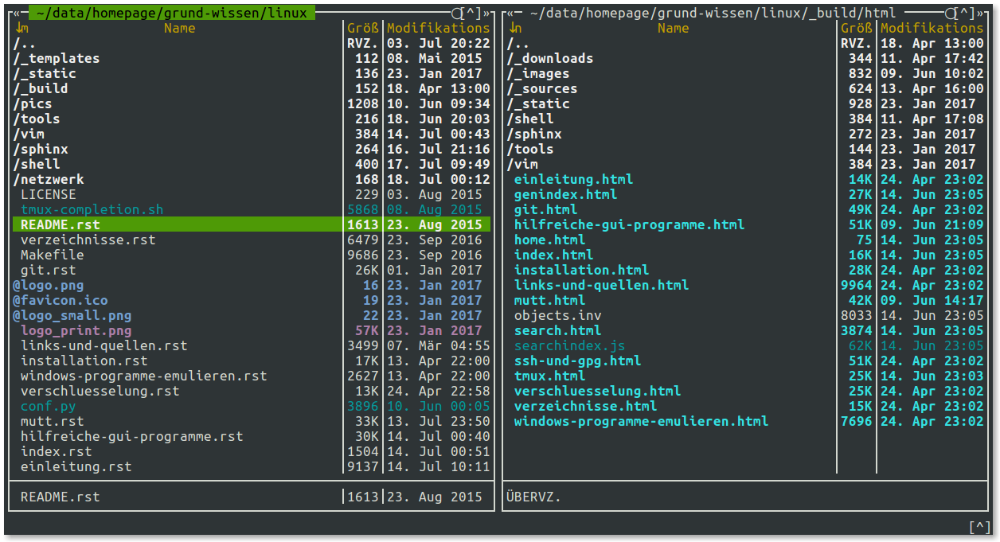

.. _Standard-Programme:

Standard-Programme
==================
.. {{{

Im folgenden werden einige Programme vorgestellt, die für eine Benutzung
innerhalb eines Shell-Fensters vorgesehen sind und daher meist mittels der
Tastatur gesteuert werden. Derartige Programme haben keine graphische
Bedienoberfläche (GUI), sondern sind textbasiert.

Die in der folgenden Auswahl aufgelisteten Programme sind unter
Debian/Ubuntu/LinuxMint entweder bereits standardmäßig installiert, oder sie
lassen sich einfach aus den üblichen Paketquellen nachinstallieren. Nach der
Installation können die Programme von jedem Benutzer des Rechners (ohne
SuperUser-Rechte) genutzt werden.

.. _Datei-Verwaltung (Shell):

.. }}}

Datei-Verwaltung
----------------
.. {{{

.. _Datei-Manager (Shell):

Datei-Manager
^^^^^^^^^^^^^
.. {{{

.. index:: Datei-Manager; mc
.. index:: Midnight Commander, mc
.. _mc:
.. _Midnight Commander:

``mc``
""""""
.. {{{

Der "Midnight Commander" ``mc`` ist ein äußerst praktisches Werkzeug: Er bietet
eine klar strukturierte Bedienoberfläche und ermöglicht es, Dateien mit nur
wenigen Tastendrücken schnell und elegant zu verwalten.

``mc`` ist über die Paketverwaltung mittels des gleichnamigen Pakets
installierbar:

.. code-block:: sh

    sudo aptitude install mc

..  https://www.midnight-commander.org/wiki/doc/filePanels/hotkeys

In der Grundeinstellung sind im Midnight-Commander zwei Ordner-Panele
nebeneinander angeordnet. Zwischen den beiden Panelen (und damit zwischen den
beiden angezeigten Verzeichnissen) kann mittels der ``Tab``-Taste hin- und
hergewechselt werden. In einem Panel lassen sich Dateien folgendermaßen
auswählen:

* Mit den Cursor-Tasten :math:`\uparrow` und :math:`\downarrow` kann in
  Einzelschritten zwischen den Dateien des Panel-Ordners navigiert werden.
* Mit den ``PageUP``- beziehungsweise ``PageDown``-Tasten können umfangreiche Ordner
  seitenweise "durchblättert" werden.
* Mit der ``Home``-Taste gelangt man zum ersten Eintrag eines Verzeichnisses.
  Dieser ist stets ``..`` und ermöglicht durch Bestätigung mit der
  ``Enter``-Taste einen Wechsel in das übergeordnete Verzeichnis.
* Mit der ``End``-Taste gelangt man zum letzten Eintrag eines Verzeichnisses.
* Mit der ``Insert``-Taste können mehrere Dateien ausgewählt oder wieder
  demarkiert werden. Durch einen Wechsel in ein anderes Verzeichnis wird die
  aktuelle Auswahl ebenfalls aufgehoben.

Viele häufig auftretende Aktionen lassen sich mittels der folgenden
Funktionstasten bewerkstelligen:

.. list-table::
    :name: tab-mc-funktionstasten
    :widths: 20 50

    * - ``F3``
      - Ausgewählte Datei(en) mit dem internen Betrachter ("Pager") öffnen.
    * - ``F4``
      - Ausgewählte Datei(en) mit einem Editor öffnen.
    * - ``F5``
      - Ausgewählte Datei(en) vom aktuellen Panel in das gegenüberliegende
        kopieren.
    * - ``F6``
      - Ausgewählte Datei(en) vom aktuellen Panel in das gegenüberliegende
        verschieben.
    * - ``F7``
      - Einen neuen Ordner im Verzeichnis des aktuellen Panels erstellen
    * - ``F8``
      - Ausgewählte Datei(en) und/oder Ordner im aktuellen Panel löschen.
    * - ``F9``
      - Menüzeile anwählen

Über das Menü ``Optionen`` lässt sich der Midnight-Commander bezüglich Aussehen
und Verhalten etwas anpassen. Persönlich halte ich folgende Anpassungen für
sinnvoll beziehungsweise angenehm:

* Im Bereich ``Konfiguration`` die Option "Sicheres Löschen" (mittels der
  Leertaste) aktivieren, um nicht eine Datei versehentlich durch Drücken der
  ``Del``-Taste, sondern nur mittels :math:`F8` löschen zu können.
* Im Bereich ``Layout`` die Menüleiste, Tastenleiste und Informationsleiste
  (mittels der Leertaste) deaktivieren.
* Im Bereich ``Paneloptionen`` (ebenfalls mittels der Leertaste) "Lynx-artige
  Bewegungen erlauben" aktivieren. Dies erlaubt es, mittels der rechten
  Cursortaste in das ausgewählte Verzeichnis zu wechseln beziehungsweise mit der
  linken Cursortaste das übergeordnete Verzeichnis anzuwählen. Dies funktioniert
  übrigens auch auch mit (komprimierten) Archiv-Dateien!
* Im Bereich ``Aussehen`` kann ein anderes Farbschema gewählt werden. Persönlich
  nutze ich am liebsten das zum Standard-Umfang gehörende Theme
  ``modarcon16-efbg-thin``.

Weitere nützliche Tastenkombinationen für die Bedienung des ``mc`` sind:

.. list-table::
    :name: tab-mc-tastenkombinationen
    :widths: 25 50

    * - ``Ins``
      - Datei unter Cursor markieren beziehungsweise demarkieren
    * - ``*``
      - Alle Dateien des aktuellen Verzeichnisses markieren beziehungsweise demarkieren
    * - ``+``
      - Dateien nach bestimmten Kriterien markieren
    * - ``\``
      - Dateien nach bestimmten Kriterien demarkieren
    * - ``Ctrl Leertaste``
      - Größe des ausgewählten Verzeichnisses anzeigen
    * - ``Ctrl s Text``
      - Im Aktuellen Verzeichnis zu einer Datei springen, die mit ``Text``
        beginnt. Funktioniert auch mit Verzeichnisnamen. Groß-/Kleinschreibung
        beachten!
    * - ``Esc ?``
      - Im aktuellen Verzeichnis nach Dateien und/oder Inhalten suchen
    * - ``Esc Tab``
      -  Auto-Vervollständigung der Eingabezeile (wie ``Tab`` in einer Shell)
    * - ``Esc t``
      - Zwischen verschiedenen Dateilisten-Layouts wechseln
    * - ``Esc ,``
      - Zwischen horizontaler und vertikaler Fensterteilung wechseln
    * - ``Esc .``
      - Mit ``.`` beginnende Konfigurationsdateien und -verzeichnisse ein- und
        ausblenden
    * - ``Esc Enter``
      - Name der Datei unter dem Cursor in die Eingabezeile kopieren
    * - ``Ctrl x t``
      - Die Namen aller markierten Dateien in die Eingabezeile kopieren
    * - ``Ctrl x Ctrl t``
      - Die Namen aller markierten Dateien der anderen Fensterhälfte in die
        Eingabezeile kopieren
    * - ``Ctrl x p``
      - Den aktuellen Pfadnamen in die Eingabezeile kopieren
    * - ``Ctrl x Ctrl p``
      - Den Pfadnamen der anderen Fensterhälfte in die Eingabezeile kopieren
    * - ``Ctrl a Ctrl k``
      - Die Eingabezeile säubern (an den Anfang gehen und alles bis zum Ende
        löschen).
    * - ``Ctrl O``
      -  Wechsel zwischen Mitnight-Commander und Shell (mit ``mc`` als Background-Job)
    * - ``Ctrl U``
      -  Beide Fensterhälften vertauschen
    * - ``Ctrl \``
      - Verzeichnis-"Hotlist" anzeigen. Hier lassen sich neben lokalen Pfaden
        auch FTP- beziehungsweise SSH-Zugangsadressen speichern beziehungsweise
        aufrufen
    * - ``Ctrl x Ctrl s``
      - Einen Symlink der ausgewählten Datei (beziehungsweise des ausgewählten
        Ordners) im Pfad der anderen Fensterhälfte erzeugen (anstelle die Datei
        dorthin zu kopieren)
    * - ``Ctrl H``
      - Liste der zuletzt besuchten Verzeichnisse anzeigen. Auswahl mit Pfeiltasten,
        Bestätigen mit ``Enter``
    * - ``Ctrl h``
      - Liste der letzten Eingabezeilen-Befehle anzeigen. Auswahl mit Pfeiltasten,
        Bestätigen mit ``Enter``

Drückt man ``F9`` zum Aktivieren der Menüzeile, anschließend unmittelbar
``Enter`` zum Öffnen der Menüs für das linke beziehungsweise rechte Panel und
anschließend ``l`` für ``Listenmodus``, so kann das Aussehen der Panels etwas
optimieren, indem man eine benutzerdefinierte Ansicht wählt. Persönlich nutze
ich dabei folgende Anzeige:

.. code-block:: sh

    half type name | size:4 | mtime

Die Fensterbreite wird damit vorwiegend für die Anzeige der Dateinamen und
den jeweiligen Endungen genutzt; am rechten Rand des Panels wird das Datum der
letzten Änderung angezeigt (``mtime``); dazwischen wird die Dateigröße
eingeblendet, wobei dafür maximal vier Zeichen genutzt werden dürfen. Dadurch
wird eine Dateigröße von ``3196000`` Bytes in Form von ``3.2M`` dargestellt; es
die Dateigröße wird also gerundet und als Kilo- beziehungsweise Mega- oder
Gigabyte ausgegeben.

Bisweilen ist es auch nützlich, ``F9 Enter s`` einzugeben, um in das Menü für
das jeweilige Panel zu gelangen und dabei die Sortier-Reihenfolge festzulegen.
Meist mag man die Dateien alphabetisch sortiert aufgelistet haben, bisweilen ist
allerdings auch eine Sortierung nach dem Datum der letzten Änderung, nach der
Dateigröße oder den Datei-Endungen hilfreich.

.. Editor

.. editor_tab_spacing=4
.. editor_word_wrap_line_length=80
.. editor_fill_tabs_with_spaces=true
.. editor_return_does_auto_indent=true
.. editor_backspace_through_tabs=false
.. editor_fake_half_tabs=true
.. editor_option_save_mode=0
.. editor_option_save_position=true
.. editor_option_auto_para_formatting=false
.. editor_option_typewriter_wrap=false
.. editor_edit_confirm_save=true
.. editor_syntax_highlighting=true
.. editor_persistent_selections=false
.. editor_drop_selection_on_copy=true
.. editor_cursor_beyond_eol=false
.. editor_cursor_after_inserted_block=false
.. editor_visible_tabs=true
.. editor_visible_spaces=true
.. editor_line_state=true
.. editor_simple_statusbar=false
.. editor_check_new_line=false
.. editor_show_right_margin=false
.. editor_group_undo=true
.. editor_state_full_filename=true
.. editor_ask_filename_before_edit=false

.. ...

.. skin=modarin256

.. Ctrl U macht Undo

.. http://www.softpanorama.org/OFM/MC/Mcedit/mcedit_keymap.shtml
.. https://midnight-commander.org/wiki/doc/editor/hotkeys
.. }}}

.. }}}

Navigation
^^^^^^^^^^
.. {{{

.. index:: cd
.. _cd:

``cd``
""""""
.. {{{

Mit ``cd pfad`` wechselt man zu einem bestimmten Verzeichnis. Die
``pfad``-Angabe kann dabei absolut (ausgehende vom Basis-Verzeichnis ``/``) oder
relativ (ausgehend vom aktuellen Verzeichnis) sein.

* Mit ``cd ..`` gelangt man ins übergeordnete Verzeichnis, mit ``cd ../..`` in
  das nächst höhere usw.
* Mit ``cd`` gelangt man ebenso wie mit ``cd ~`` ins Home-Verzeichnis. Mit ``cd
  ~benutzername`` gelangt man (als Superuser) in das Home-Verzeichnis des
  angegebenen Benutzers.

Als Ergänzung zur ``cd``-Anweisung können :ref:`alias <alias>`-Definitionen
genutzt werden, beispielsweise:

* ``alias ..='cd ..'``,
* ``alias ...='cd ../..'``,
* ``alias cdd='cd ~/downloads'``, usw.

Lange Zeit hatte ich viele derartige Definitionen in der Konfigurationsdatei
``~/.bashrc``) stehen. Seit ich die ``Z-Shell`` als Standard-Shell nutze, verwende
ich anstelle dessen bevorzugt das dort verfügbare Plugin :ref:`wd <wd>`, mit
dessen Hilfe man Bookmarks ("Warp Points") für einzelne Verzeichnisse setzen
kann.

.. index:: ls
.. _ls:

.. }}}

``ls``
""""""
.. {{{

Mit ``ls`` wird der Inhalt des aktuellen Verzeichnisses ausgegeben. Mit weiteren
Parametern lässt sich die Ausgabe nach Bedarf anpassen:

* ``ls -a`` zeigt auch Konfigurationsdateien und -verzeichnisse an, also
  Dateien, deren Name mit einem ``.`` beginnt ("list all").

* ``ls -r`` listet rekursiv die Inhalte des aktuellen Verzeichnisses und der
  darin enthaltenen Unterverzeichnisse auf.

* ``ls -lh`` liefert eine ausführliche Liste, die auch Informationen über
  Dateityp, Dateirechte, Modifikationszeit und Dateigröße beinhaltet ("long
  list"). Der Zusatz ``h`` bewirkt, dass die Dateigröße "human readable", also
  in KB, MB oder GB anstelle von Bytes angeben wird.

  Mit ``ls -lt`` wird ebenfalls eine ausführliche Dateiliste ausgegeben, die
  allerdings nach der Modifikationszeit sortiert ist. Mit ``ls -lS`` erhält man
  eine nach Dateigröße sortierte Liste.

.. - normale Datei
.. d Verzeichnis ( d = directory)
.. p Named Pipe; steht für eine Art Pufferungsdatei, eine Pipe-Datei.
.. c ( c = character oriented) steht für eine zeichenorientierte Gerätedatei.
.. b ( b = block oriented) steht für eine blockorientierte Gerätedatei.
.. s ( s = socket) steht für ein Socket (genauer einen UNIX-Domain-Socket).
.. l symbolische Links

..  ( rwx ) von links nach rechts: Eigentümer, Gruppe und allen anderen.

Mit ``ls pfad`` kann ebenfalls der Inhalt eines anderen Verzeichnisses
ausgegeben werden, ohne dass dabei das aktuelle Verzeichnis verlassen wird. Eine
vollständige Beschreibung aller Optionen findet sich in den Manpages (``man
ls``).

.. index:: pwd
.. _pwd:

.. }}}

``pwd``
"""""""
.. {{{

Mit ``pwd`` ("print working directory") wird der volle Pfad des aktuellen
Verzeichnisses ausgegeben.

Seit meinem Umstieg auf die :ref:`Z-Shell <Z-Shell>`  verwende ich ``pwd``
relativ häufig, da bei dem von mir genutzten Theme nur der aktuelle
Verzeichnis-Name, nicht jedoch der gesamte Pfad vor dem Eingabe-Prompt angezeigt
wird. Ich habe mir daher in der Konfigurationsdatei ``~/.zshrc`` als Abkürzung
``alias p=pwd`` definiert, um bei Bedarf durch eine einfache Eingabe von ``p``
den gesamten Verzeichnis-Pfad angezeigt zu bekommen.

.. index:: tree
.. _tree:

.. }}}

``tree``
""""""""
.. {{{

Mit ``tree`` werden, ähnlich wie mit ``ls -R``, alle Daten des aktuellen
Verzeichnisses sowie aller Unterverzeichnisse ausgegeben. Die Ausgabe erfolgt
allerdings in einer Baum-artigen Struktur. Diese Darstellung ist zwar zur
Weiterverarbeitung mit weiteren Programmen wie :ref:`grep <grep>` weniger gut
geeignet, allerdings für menschliche Betrachter übersichtlicher.

.. }}}

.. }}}

Suchprogramme
^^^^^^^^^^^^^
.. {{{

.. index:: find
.. _find:

``find``
""""""""
.. {{{

Mit ``find`` können Verzeichnisse nach Dateien durchsucht werden. Angezeigt
werden jeweils (nur) die Dateien, die dem vorgegebenen Suchmuster
entsprechen. Die allgemeine Syntax lautet:

.. code-block:: bash

    find basisordner kriterium [weitere kriterien]

Häufig genutzte Kriterien sind beispielsweise:

* ``-name suchmuster``: Zeigt alle Dateien an, die dem Suchmuster entsprechen --
  einem "normalen" Namen, oder einem regulären Ausdruck.
* ``-iname suchmuster``: Zeigt alle Daten an, die dem Suchmuster entsprechen --
  Groß- und Kleinschreibung wird dabei ignoriert.
* ``-mtime -n``: Zeigt alle Dateien an, die im Laufe der letzten :math:`n` Tage
  (``n * 24h``) modifiziert wurden. Um Dateien anzuzeigen, deren letzte Änderung
  *mindestens* ``n * 24h`` zurückliegt, wird das ``-``-Zeichen durch ein
  ``+``-Zeichen ersetzt.
* ``-executeable``: Zeigt nur ausführbare Dateien an.
* ``-size n [kMG]``: Zeigt nur Dateien an, deren Dateigröße über ``n``
  Kilo-/Mega-/Giga-Bytes liegt.
* ``-user name``: Zeigt nur Dateien an, die dem angegebenen Benutzer gehören.
* ``-type [fdl]``: Zeigt Dateien an, die dem angegebenen Dateityp entsprechen
  (``f``: Normale Datei ("file"), ``d``: Verzeichnis ("directory"), ``l``:
  Symbolischer Link).

Mit ``!-kriterium`` können die obigen und weitere Kriterien (siehe ``man find``)
"umgekehrt" werden, so dass sie die genau gegenteiligen Ergebnisse liefern.

``find`` kann auch in Verbindung mit :ref:`grep <grep>` genutzt werden, um
zunächst bestimmte Dateien zu finden, und diese dann nach bestimmten Inhalten
zu durchsuchen. Um beispielsweise die Namen aller Python-Dateien (Endung
``.py``) eines Verzeichnisses und aller Unterverzeichnisse auszugeben, welche
die Zeichenkette ``import sympy`` beinhalten, kann man folgendes eingeben:

.. code-block:: bash

    find ./ -name "*.py" -exec grep -l "import sympy" {} \;

Hierbei werden von ``find``, ausgehend vom aktuellen Verzeichnis ``./``, alle
Dateien mit der Endung ``.py`` gesucht. Mit der Option ``-exec`` werden diese
Dateien an das darauf folgende Programm übergeben, wobei die einzelnen Dateien
an der Stelle eingefügt werden, wo die geschweiften Klammern ``{}`` stehen. Die
``exec``-Anweisung muss am Ende mit ``\;`` abgeschlossen werden.

Noch einfacher ist die Verwendung von :ref:`xargs <xargs>`, um die von ``find``
gefundenen Dateinamen an ``grep`` zu übergeben. Sollen beispielsweise alle
Dateien mit der Endung ``.rst`` nach einem angegebenen Text durchsucht
werden, kann folgendes eingegeben werden:

.. code-block:: bash

    find ./ -name "*.rst" | xargs grep "Suchbegriff"

Nutzt man diese Kombination häufiger, so kann dafür in der Konfigurationsdatei
``~/.bashrc`` ein :ref:`alias <alias>` definiert werden:

.. code-block:: bash

    alias rstgrep='find ./ -name "*.rst" | xargs grep'

Damit kann künftig ``rstgrep`` ebenso wie ``grep`` mit allen dort zur Verfügung
stehenden Optionen aufgerufen werden. Mehr Beispiele zu ``find`` gibt es u.a. `hier
<https://www.binarytides.com/linux-find-command-examples/>`__

..  find / -user benutzername -print 2>/dev/null

..  Findet alle Dateien eines Benutzers, gibt keine Fehlermeldungen aus, da
..  Fehlerausgaben (Kanal 2) nach /dev/null umgeleitet werden und somit nicht
..  auf dem Bildschirm erscheinen.

..  Damit uns im Beispiel hier nicht die Standardausgabe (Kanal 1) auf dem
..  Bildschirm stört, leiten wir diese auch beim Start des Scripts nach /dev/null um
..  (``1>/dev/null``). Und damit uns die Shell für weitere Eingaben zur Verfügung
..  steht, stellen wir die Ausführung des Scripts in den Hintergrund (``&``).

.. index:: grep
.. _grep:

.. }}}

``grep``
""""""""
.. {{{

Mit ``grep`` ("get regular expression") können Eingabedaten, Textdateien oder
Verzeichnisse nach beliebigen Suchbegriffen und regulären Ausdrücken durchsucht
werden. Der allgemeine ``grep``-Befehl hat folgende Syntax:

.. code-block:: bash

    grep [optionen] suchmuster suchpfad

Möchte man beispielsweise das aktuelle Verzeichnis und alle Unterverzeichnisse
rekursiv nach einem Suchbegriff durchsuchen, wobei die Groß- und Kleinschreibung
ignoriert werden soll, so gibt man folgendes ein:

.. code-block:: bash

    grep -lir "suchbegriff" ./

* Mittels der Option ``-l`` werden nur die Dateinamen anstelle der zutreffenden
  Textzeilen ausgegeben, mit ``-i`` ("ignore-case") die Groß-und Kleinschreibung
  ignoriert, und mit ``-r`` ("recursive") die Durchsuchung der
  Unterverzeichnisse aktiviert.

* Mittels der Option ``-c`` zeigt ``grep`` die Anzahl an Treffern an, mit der
  Option ``-v`` werden diejenigen Zeilen als Ergebnis ausgegeben, auf die das
  Suchmuster *nicht* zutrifft.

* Möchte man alle Ergebnisse anzeigen, die auf (mindestens) eines von mehreren
  angegebenen Suchmustern zutreffen, so können die einzelnen Suchmuster jeweils
  mit der Option ``-e`` angegeben werden.

Oftmals wird ``grep`` auch als "Filter" genutzt, um die Ausgaben einer
vorherigen Anweisung gezielt nach bestimmten Begriffen zu durchsuchen.
Beispielsweise kann man sich aus der langen Liste aller laufenden Prozesse, die
man mit ``ps aux`` angezeigt bekommt, mittels ``ps aux | grep firefox`` nur
diejenigen Zeilen anzeigen lassen, in denen das Wort "firefox" vorkommt. Weitere
``grep``-Beispiele gibt es beispielsweise `hier
<https://alvinalexander.com/unix/edu/examples/grep.shtml>`__.

Hinweis für Shell-Programmierer: Als :ref:`Exit-Status <Rückgabewerte und
Verkettung von Programmen>` liefert ``grep`` den Wert ``0``, wenn die Suche
erfolgreich war, ``1``, wenn das Suchmuster nicht gefunden wurde, und ``2``,
wenn bei der Suche ein Fehler aufgetreten ist (beispielsweise eine Datei nicht
lesbar war).

.. Todo: Links auf reguläre Ausdrücke

.. index:: locate
.. _locate:

.. }}}

``locate``
""""""""""
.. {{{

Mit ``locate suchbegriff`` werden alle Dateinamen des Systems nach einem
Suchbegriff durchsucht und die Ergebnisse angezeigt. Mit ``locate -i
suchbegriff`` wird dabei die Groß- und Kleinschreibung ignoriert.

Um auch neueste Änderungen, die sich seit dem letzten Systemstart ergeben haben,
anzuzeigen, kann die Datei-Datenbank mittels ``updatedb`` aktualisiert werden.
Die einzelnen Einträge werden dabei in der Datei ``/var/lib/mlocate/mlocate.db``
gespeichert.

.. }}}

.. }}}

Dateien kopieren, verschieben, erstellen und löschen
^^^^^^^^^^^^^^^^^^^^^^^^^^^^^^^^^^^^^^^^^^^^^^^^^^^^
.. {{{

.. index:: cp
.. _cp:

``cp``
""""""
.. {{{

Mit ``cp datei neuer-pfad`` wird eine Datei (oder ein Verzeichnis) an eine
andere Stelle kopiert. Es können mehrere Dateien auf einmal angeben werden; der
zuletzt angegebene Pfad stellt dann den Zielpfad dar, in den alle zuvor
angegebenen Dateien kopiert werden.

* Mit ``cp -r`` werden auch Unterverzeichnisse rekursiv kopiert (andernfalls
  werden sie weggelassen).

* Mit ``cp -s`` wird anstelle des Kopierens ein symbolischer Link am Zielpfad
  erstellt.

.. index:: dd
.. _dd:

.. }}}

``dd``
""""""
.. {{{

Mit ``dd`` ("data dumper") können Dateien bitweise kopiert werden. Da auch
Verzeichnisse und sogar ganze Partitionen unter Linux ebenfalls als "Dateien"
angesehen werden, kann man mit ``dd`` also beispielsweise auch Image-Dateien von
SD-Karten o.ä. als Backups anfertigen. Ebenso kann man ``dd`` nutzen, um aus
Image-Dateien (meist ISO) bootbare SD-Karten beispielsweise für Raspberry-Pis
oder ähnliche Einplatinen-Computer anzufertigen.

*Warnung:* So mächtig das Programm ``dd`` ist, so gefährlich ist es auch, wenn
man es nicht mit Bedacht anwendet. Würde man beispielsweise mit ``dd`` eine 3 TB
große Festplatte bitweise auf eine 4 TB große Festplatte kopieren, die zwei
jeweils 2 TB großen Partitionen enthält, so würde ``dd`` ohne Warnungen über die
Partititons-Grenzen der ersten Partition hinweg schreiben, und dabei
gegebenenfalls vorhandene Daten auf der zweiten Partition überschreiben.
Bisweilen wird ``dd`` daher auch "disk destroyer" genannt, was ein Hinweis
darauf sein soll, dass man dieses Programm nur wohl überlegt nutzen sollte!

Die grundlegende Syntax von ``dd`` lautet:

.. code-block:: sh

    dd if=datei-1 of=datei-2

Hierbei steht ``if`` für den Namen der zu kopierenden Datei ("Infile") und
``of`` für den Namen der Zieldatei ("Outfile"). Zusätzlich wird oftmals mit dem
zusätzlichen Parameter ``BS`` angegeben, in wie großen Blöcken die
Eingangsdatei kopiert werden soll: Beispielsweise bedeutet ``BS=1M``, dass die
Eingangsdatei in jeweils ein Megabyte große Blöcke zerlegt wird und diese einzeln
kopiert werden.

Um beispielsweise ein ISO-Backup-Image einer DVD zu erstellen, kann man folgende
Anweisung eingeben:

.. code-block:: sh

    dd if=/dev/cdrom of=/tmp/name.iso BS=1M

Auch hier muss vorab unbedingt geprüft werden (beispielsweise mit ``df -h``), ob
auf der Ziel-Partition genügend Speicherplatz zur Verfügung steht.

``dd`` zeigt während des Kopiervorgangs keinerlei Ausgabe auf dem Bildschirm an;
erst wenn der Kopiervorgang abgeschlossen ist, erscheint eine zusammenfassende
Meldung über die Anzahl der kopierten Blöcke, und der Eingabe-Prompt wird wieder
zugänglich. Gerade beim Kopieren ganzer Partitionen muss viel Zeit eingeplant
werden: ``dd`` kopiert in diesem Fall immer die gesamte Partition, egal wie
viele Daten auf dieser gespeichert sind. Ein ISO-Image einer 4-GB-DVD ist somit
ebenfalls stets 4 GB groß, auch wenn darauf womöglich nur 500 MB an Daten
abgelegt sind.

Kopiert man mit ``dd`` umgekehrt eine ISO-Datei beispielsweise eines
Linux-Live-Systems auf eine SD-Karte, so sollte nach einem erfolgreich
abgeschlossenen Kopiervorgang noch mehrfach die Anweisung ``sync`` aufgerufen
werden, um sicher zu stellen, dass auch alle möglichen noch ausstehenden
Schreib-Vorgänge abgeschlossen werden (sollten sich noch Daten im Flash-Speicher
befinden).

.. index:: ln
.. _ln:

.. }}}

``ln``
""""""
.. {{{

Mittels ``ln`` beziehungsweise ``ln -s`` lassen sich die zwei unter Linux
möglichen Arten von Verknüpfungen erzeugen:

.. index:: Hardlink

* Mit ``ln datei1 datei2`` wird zu einer gewöhnlichen Datei ``datei1`` die Datei
  ``datei2`` als so genannter "Hardlink" erzeugt; bei ``datei2`` muss hierbei
  ein absoluter Pfad angegeben werden. Dabei handelt es sich im Grunde um eine
  zusätzliche Bezeichnung für die selbe Speicherstelle auf der Festplatte. Um
  beispielsweise eine mit Hardlinks versehene Datei zu löschen, müssen ebenfalls
  sämtliche Hardlink entfernt werden, um die Speicherstelle freizugeben.
  Handelt es sich bei ``datei1`` um ein Verzeichnis, so kann ein Hardlink
  mittels ``cp -al datei1 datei2`` erstellt werden.

  .. https://wiki.ubuntuusers.de/ln/

  Da sich Hardlinks stets auf der gleichen Partition befinden müssen wie die
  Original-Dateien, werden sie unter Linux vergleichsweise selten verwendet.

.. index:: Symlink
.. _Symlink:
.. _Symlinks:

* Mit ``ln -s datei1 datei2`` wird zu einer existierenden Datei ``datei1`` die
  Datei ``datai2`` als so genannter "Symbolischer Link" erzeugt (auch "Symlink"
  oder "Softlink" genannt). Dabei handelt es sich um eine neue Datei, deren
  einziger Inhalt ein Verweis auf die bestehende Datei ist (Symlinks sind daher
  stets nur wenige Bytes groß).

Wird eine Symlink-Datei geändert und gespeichert, so wird auch die
Originaldatei entsprechend verändert. Wird allerdings der Symlink einer Datei
gelöscht, so bleibt die Originaldatei bestehen. Wird im umgekehrten Fall die
Original-Datei gelöscht oder umbenannt, so bleibt der Symlink als Datei
bestehen, zeigt aber ins Leere ("gebrochener Link"). Der Symlink muss in
diesem Fall entfernt und neu erzeugt werden. [#]_

Wird ein Symlink zu einer ausführbaren Datei erzeugt, so kann diese auch über
den Symlink aufgerufen werden. Wird ein Symlink zu einem Ordner erstellt, so
lassen sich dessen Inhalte auch über den Symlink anzeigen und verändern. Da
Symlinks auch anders benannt sein können als die Originaldateien, können sie
beispielsweise dazu genutzt werden, um aus einer vorhandenen Musiksammlung
individuelle Playlisten in separaten Ordnern anzulegen.

Mit Symlinks verknüpfte Ordner beziehungsweise Dateien müssen nicht zwingend
auf dem gleichen Datenträger beziehungsweise der gleichen Partition liegen. So
ist es beispielsweise möglich auf einen (automatisch ins
``/media``-Verzeichnis eingebundene) USB-Stick oder eine verschlüsselte
Festplattenpartition über einen entsprechenden Symlink im Home-Verzeichnis
zuzugreifen.

.. index:: mkdir
.. _mkdir:

.. }}}

``mkdir``
"""""""""
.. {{{

Mit ``mkdir verzeichnisname`` wird ein neues Verzeichnis angelegt.
``verzeichnisname`` kann auch ein absoluter Pfad sein, dann wird das Verzeichnis
an entsprechender Stelle angelegt.

Möchte man ein neues Verzeichnis mitsamt Unterverzeichnis erstellen, so muss
normalerweise erst das neue Verzeichnis mit ``mkdir`` erstellt werden, und dann
das Unterverzeichnis. Verwendet man allerdings ``mkdir -pv``, so genügt
folgender Aufruf:

.. code-block:: sh

    mkdir -pv neues-verzeichnis/neues-unterverzeichnis

Damit wird das neue Unterverzeichnis erstellt, und bei Bedarf auch automatisch
das übergeordnete Verzeichnis. Persönlich finde ich diese Variante recht
hilfreich, und habe mir dies in meiner Konfigurationsdatei ``~/.zshrc`` mittels
des folgenden :ref:`alias <alias>`-Eintrags als Standard definiert.

.. code-block:: sh

    alias mkdir='mkdir -pv'

.. index:: mv
.. _mv:

.. }}}

``mv``
""""""
.. {{{

Mit ``mv datei neuer-pfad`` wird eine Datei (oder ein Verzeichnis) an eine
andere Stelle verschoben. Es können mehrere Dateien auf einmal angeben werden;
der zuletzt angegebene Pfad stellt dann den Zielpfad dar, in den alle zuvor
angegebenen Dateien verschoben werden.

Mit ``mv alter-dateiname neuer-dateiname`` lässt sich eine Datei umbenennen.

.. index:: rm
.. _rm:

.. }}}

``rm``
""""""
.. {{{

Mit ``rm datei(en)`` lässt sich eine oder mehrere Datei(en) unwiderruflich
löschen.

* Mit ``rm -r verzeichnis/*`` werden rekursiv alle Inhalte, ausgehend von
  ``verzeichnis`` gelöscht.

*Achtung:* Die Shell kennt keinen "Papierkorb", Löschvorgänge sind somit
endgültig. Vor dem Löschen sollte man sich daher stets vergewissern, ob man die
entsprechenden Dateien auch wirklich löschen möchte. Oftmals wird in der
Konfigurationsdatei der Shell deshalb sicherheitshalber ``alias rm=rm -i``
definiert, so dass vor jedem Löschvorgang standardmäßig nochmals eine explizite
Bestätigung des Benutzers verlangt wird. Soll dies umgangen werden, so ist dies
weiterhin mittels ``rm -f``  möglich.

Mit regulären Suchmustern wie ``*`` ist beim Löschen stets besondere Vorsicht
geboten: Während ``rm -r *~`` ausgehend vom aktuellen Verzeichnis alle (von
manchen Editoren angelegten) temporären Dateien löscht, würde ``rm -r ~*``
sämtliche Inhalte des Home-Verzeichnisses unwiderruflich löschen!

.. index:: rmdir
.. _rmdir:

.. }}}

``rmdir``
"""""""""
.. {{{

Mit ``rmdir verzeichnisname`` wird ein Verzeichnis gelöscht, sofern es leer ist.
Möchte man ein nicht-leeres Verzeichnis löschen, so empfiehlt sich das einfach
zu tippende ``rm -r  verzeichnisname*``. Damit werden rekursiv alle Dateien, deren
Pfadname mit ``verzeichnisname`` beginnt, gelöscht. Wiederum sollte allerdings
beachtet werden, dass ``rm`` die Dateien unwiderruflich löscht.

.. index:: rsync
.. _rsync:

.. }}}

``rsync``
"""""""""
.. {{{

Das Programm ``rsync`` ist auf fast jedem Linux-System vorinstalliert; ansonsten
kann es über das gleichnamige Paket via :ref:`apt <aptitude>` installiert werden:

.. code-block:: sh

    sudo aptitude install rsync

Mit ``rsync quelldatei backupdatei`` kann man eine Datei oder ein Verzeichnis
gegenüber einer Backup-Kopie der Datei beziehungsweise des Verzeichnisses
aktualisiert ("synchronisiert") halten. Der Backup findet dabei nur in eine
Richtung statt, ``rsync`` prüft also anhand der letzten Bearbeitungszeit
(``MTIME``) einer Datei, ob sich in der Quelle gegenüber dem Backup eine
Veränderung ergeben hat. Falls ja, werden diese Änderungen übernommen.

Möchte man einen Backup von einem ganzen Verzeichnispfad mitsamt allen
Unterverzeichnissen anlegen oder aktuell halten, so kann folgender
Aufruf von ``rsync`` verwendet werden:

.. code-block:: bash

    rsync -avhz quellverzeichnis zielverzeichnis

Das Zielverzeichnis muss dabei ein bereits bestehendes Verzeichnis sein, kann
sich allerdings auch auf einer anderen Partition, einem externen Datenträger,
oder -- bei Verwendung von :ref:`SSH <SSH>`  -- sogar auf einem anderen Rechner
befinden. Diese und weitere Einsatz-Möglichkeiten von ``rsync`` sind Abschnitt
:ref:`Backups mit rsync <Backups mit rsync>` näher beschrieben. 

Möchte man ``rsync`` zwischen zwei
Rechnern bidirektional (also zur Synchronisierung) nutzen, so kann
beispielsweise die auf ``rsync`` basierende Python-Anwendung :ref:`bsync
<bsync>` verwendet werden.

.. index:: shred
.. _shred:

.. }}}

``shred``
"""""""""
.. {{{

Mit ``shred dateiname`` kann eine Datei sicher gelöscht werden, so dass sie auch
mit Recovery-Programmen nicht wiederhergestellt werden kann. Während beim
"normalen" Löschen lediglich der "Einhängepunkt" der Datei entfernt wird,
überschreibt ``shred`` den belegten Speicherplatz mit zufällig mit Nullen und
Einsen.

Man kann ``shred`` auch verwenden, um ganze Partitionen oder Festplatten zu
"säubern" (beispielsweise, wenn diese weiterverkauft werden sollen); als
Dateiname muss in diesem Fall der Device-Name der Ziel-Partition angegeben
werden.

.. index:: touch
.. _touch:

.. }}}

``touch``
"""""""""
.. {{{

Mit ``touch dateiname`` lässt sich eine neue, leere Datei anlegen --
beispielsweise eine neue Log-Datei oder eine Datei zu Test-Zwecken.

.. }}}

.. }}}

Datei-Eigenschaften
^^^^^^^^^^^^^^^^^^^
.. {{{

.. index:: chmod
.. _chmod:

``chmod``
"""""""""
.. {{{

Mit `chmod <https://wiki.ubuntuusers.de/chmod/>`__ lassen sich die
Zugriffsrechte einer Datei oder eines Verzeichnisses festlegen. Eine Datei kann
lesbar (``r`` für "read"), schreibbar (``w`` für "write") und/oder ausführbar
(``x`` für "executeable") sein; Verzeichnisse sollten stets ausführbar sein.

*Beispiele:*

* Mit ``chmod +x file`` wird eine Datei (beispielsweise ein :ref:`Shell-Skript
  <Shell-Skript>`) im aktuellen Ordner ausführbar gemacht. Sie kann anschließend
  mit ``./file`` aufgerufen werden.

* Mit ``chmod -w file`` werden der Datei die Schreibrechte entzogen.

Die Rechte-Verwaltung unter Linux sieht zudem unterschiedliche Rechte für den
Besitzer einer Datei (``u`` für "user"), die Benutzer-Gruppe (``g`` für "group")
und alle anderen (``o`` für "others") vor. Die vollständige
Rechte-Konfiguration, die für einzelne Dateien vorliegen, kann man
beispielsweise mittels ``ls -l`` anzeigen.

Um die Benutzer-Rechte einer Datei gezielt zu verändern, kann man beispielsweise
folgende Anweisung eingeben:

.. code-block:: sh

    # Dateirechte explizit festlegen:
    chmod u=rwx,g=rx,o=r dateiname

Hierbei hätte der Besitzer der Datei volle Rechte, während Mitglieder der
Benutzer-Gruppe die Datei zwar lesen und ausführen, jedoch nicht verändern oder
löschen dürfen. Die übrigen Benutzer dürfen die Datei lediglich lesen, aber
nicht ausführen oder verändern.

.. _Zahlen-Code:

Als Alternative zu der obigen Syntax kann auch folgender Zahlen-Code verwendet werden:

    +-------------+----------------+
    | Zahlen-Code | Bedeutung      |
    +-------------+----------------+
    | ``4``       | Lese-Rechte    |
    +-------------+----------------+
    | ``2``       | Schreib-Rechte |
    +-------------+----------------+
    | ``1``       | Ausführ-Rechte |
    +-------------+----------------+

Die einzelnen Rechte können miteinander kombiniert werden, so dass beispielsweise
der Wert ``5 = 4 + 1`` für Lese- und Ausführ-Rechte oder der Zahlenwert ``6 = 4
+2`` für Lese- und Schreibrechte steht; der Zahlenwert ``7 = 4 + 2 + 1`` steht
für alle Rechte. Mit dieser Notation können die einzelnen Rechte als
dreistellige Zahl angegeben werden, wobei die erste Stelle für die Rechte des
Eigentümers, die zweite für die Rechte der Benutzergruppe und die dritte für die
Rechte aller anderer Benutzer steht. Die Anweisung aus dem obigen Beispiel kann
also auch kürzer in folgender Form geschrieben werden:

.. code-block:: sh

    # Identisch mit obiger Anweisung:
    chmod 754 dateiname

Als nützliches Anwendungsbeispiel kann man mittels ``chmod`` beispielsweise
konfigurieren, ob bei einem Computer mit mehreren Benutzer-Accounts die einzelnen
Benutzer Zugriff auf die Home-Verzeichnisse der anderen Benutzer haben sollen.
Unter Ubuntu ist dies standardmäßig der Fall. Um dies zu deaktivieren, also das
eigene Home-Verzeichnis vor einem Zugriff eines anderen Benutzers zu schützen,
kann man folgendes eingeben:

.. code-block:: sh

    # Home-Verzeichnis vor Zugriff anderer Benutzer schützen:
    sudo chmod 0700 /home/benutzername

Mit dieser Einstellung kann der Eigentümer des Verzeichnisses die Inhalte seines
Home-Verzeichnisses anzeigen beziehungsweise in dieses wechseln.

*Hinweis:* Für Verzeichnisse existieren die gleichen Benutzerrechte. Eine besondere
Bedeutung hat hierbei lediglich das Ausführungs-Recht (``x``): Ist dieses Recht
gesetzt, so bedeutet dies, dass in dieses Verzeichnis gewechselt werden darf;
man "betritt" dadurch das Verzeichnis und bekommt somit Zugriff auf die sich
darin befindlichen Dateien. Ist dieses Recht nicht gesetzt, das Lese-Recht
hingegen schon, so können zwar beispielsweise mittels ``ls`` die Inhalte des
Verzeichnisses angezeigt werden; man hat allerdings keinen Zugriff darauf, kann
sie also beispielsweise nicht ausführen.

Kopiert man Dateien von einem Windows- oder mit FAT32 partitionierten
Datenträger, so bekommen diese (je nach Kopier-Programm) unter Umständen
standardmäßig Ausführungs-Rechte zugewiesen. Um diese  wieder zu entfernen, kann
folgende Anweisung genutzt werden (siehe `hier
<http://askubuntu.com/questions/685730/change-owner-of-files-recursively-but-not-directories>`__):

.. code-block:: sh

    find . -type f -exec chmod 644 {} +

Hierdurch werden die Ausführungsrechte von allen Dateien entfernt, nicht jedoch
von den (Unter-)Verzeichnissen selbst.

.. index:: file
.. _file:

.. }}}

``file``
""""""""
.. {{{

Mit ``file dateiname`` werden ausführliche Datei-Informationen (Dateityp,
Version, Kodierung) der angegebenen Datei angezeigt.

.. index:: umask
.. _umask:

.. }}}

``umask``
"""""""""

Mit ``umask`` kann für den aktuell angemeldeten Benutzer eingestellt werden,
welche Datei-Rechte der Eigentümer, die Gruppe und die sonstigen Benutzer bei
neu erstellten Dateien und Verzeichnissen erhalten sollen. 

Grundsätzlich erhalten neue Verzeichnisse unter Linux die Rechte ``777``, neue
Dateien ``666``. Für Verzeichnisse haben somit alle Benutzer sämtliche Rechte,
für Dateien fehlt hingegen das Ausführungsrecht. Auf einem System, das auf
mehrere Benutzer ausgelegt ist, ist eine derart freizügige Rechtevergabe nicht
sinnvoll. Mittels ``umask`` kann man die standardmäßig vergebenen Rechte
einschränken, wobei die gleichen :ref:`Zahlen-Codes <Zahlen-Code>` zum Einsatz
kommen wie bei :ref:`chmod <chmod>`; diese werden allerdings von den
Standard-Rechten *abgezogen*.

Gibt man in einer Shell ``umask`` ohne weitere Argumente ein, so bekommt man den
aktuellen ``umask``-Wert angezeigt: 

* Unter Debian hat ``umask`` als Standard den Wert ``002``, so dass neue
  Verzeichnisse die Rechte ``775`` und neue Dateien die Rechte ``664`` erhalten.
* Unter Debian hat ``umask`` als Standard den Wert ``022``, so dass neue
  Verzeichnisse die Rechte ``755`` und neue Dateien die Rechte ``644`` erhalten.

Wie man sieht, ist Debian also bezüglich der Schreib-Rechte für die jeweiligen
Benutzer-Gruppen "restriktiver" als Ubuntu. Mittels ``umask neuerwert`` kann die
Vorgabe für den aktuellen Benutzer neu eingestellt werden.

.. }}}

Archive
^^^^^^^
.. {{{

.. index:: bzip2
.. _bzip2 und bunzip2:

``bzip2``, ``bunzip2``
""""""""""""""""""""""
.. {{{

Mit ``bzip2 dateiname`` kann eine Datei zu einer gleichnamigen Datei im
``bz2``-Format im komprimiert werden. Mit ``bunzip2 dateiname.bz2`` kann die
Datei wieder dekomprimiert werden.

Gibt man mehrere Dateinamen an, so wird jede Datei in ein eigenes Archiv
komprimiert. Um eine einzelne komprimierte Datei zu erhalten, die mehrere
Dateien enthält, so werden diese häufig mittels :ref:`tar <tar>`  zu einem
Archiv gepackt:

.. Man kann ``tar`` also auch in Verbindung mit ``bz2`` anstelle von ``gz`` nutzen;
.. in den Anweisungen muss lediglich das für ``gzip`` stehende ``z`` durch ``j``
.. ersetzt werden. Da ``bzip2`` oftmals die besseren Ergebnisse liefert, ist diese
.. Variante immer häufiger anzutreffen.

* Mittels ``tar -cjvf archivname datei1 datei2`` können zwei (oder mehrere)
  Dateien unmittelbar zu einem komprimierten ``tar``-Archiv zusammengefasst werden.

* Mittels ``tar -xjvf archivname.tar.bz2`` können die Daten eines mit ``bzip2``
  komprimierten Archivs unmittelbar wieder entpackt werden.

.. index:: gzip
.. _gzip:

.. }}}

``gzip``, ``gunzip``
""""""""""""""""""""
.. {{{

Mit ``gzip dateiname`` kann eine Datei komprimiert, mit ``gunzip dateiname.gz``
wieder dekomprimiert werden. Dieses Verfahren ist unter Linux nach wie vor weit
verbreitet, allerdings wird zunehmend das modernere ``bzip2`` anstelle von
``gzip`` verwendet.

Mittels ``zcat dateiname.gz`` kann eine komprimierte Datei auf dem Bildschirm
ausgegeben werden, ohne dass sie dazu auf der Festplatte entpackt wird -- dies
wird beispielsweise von :ref:`man <man>` für die Anzeige von Hilfeseiten
genutzt, die unter ``/usr/share/doc`` in komprimierter Form abgelegt sind.

Meist wird ``gzip`` in Kombination mit :ref:`tar <tar>` genutzt, um
Datei-Archive zu komprimieren.

.. index:: tar
.. _tar:

.. }}}

``tar``
"""""""
.. {{{

Mit ``tar`` können mehrere Dateien zu einem Archiv zusammengefasst werden.

*Beispiel:*

.. code-block:: bash

    tar -cf archiv.tar datei1 datei2 ...

Mittels der Option ``z`` kann das Archiv zusätzlich mit ``gzip`` komprimiert
werden. Mit der Option ``v`` wird der Fortschritt der Archivierung angezeigt
("verbose" = redselig). Für ein komprimiertes Archiv könnte das obige Beispiel
also folgendermaßen aussehen:

.. code-block:: bash

    tar -czvf archiv.tar.gz datei1 datei2 ...

Anstelle der Option ``z`` kann auch ``j`` eingegeben werden, um anstelle der
``gz``-Komprimierung das stärker komprimierende ``bz2``-Format zu nutzen.

Der Inhalt eines ``tar``-Archivs kann mittels ``tar tf archiv.tar`` angezeigt
werden. Mittels der Option ``x`` (extract) kann der Inhalt des Archivs wieder
entpackt werden:

.. code-block:: bash

    tar -xvf archiv.tar          # für  "normale"   Archive
    tar -xvzf archiv.tar.gz      # für komprimierte Archive

Mit ``tar``-Archiven können ebenso einfach wie effizient :ref:`Backups
<Backups>` erstellt werden.

.. index:: zip, unzip
.. _zip:
.. _unzip:
.. _zip und unzip:

.. }}}

``zip``, ``unzip``
""""""""""""""""""
.. {{{

Mit ``zip`` können mehrere Dateien zu einem Datei-Archiv gebündelt, mit
``unzip`` wieder entpackt werden. Die grundlegenden Befehle sehen etwa so aus
(weitere Informationen erhält man mittels ``man zip`` beziehungsweise ``man
unzip``):

* Mit ``zip archivname.zip datei1 datei2 ...`` werden mehrere Dateien zu einem
  (komprimierten) ``zip``-Archiv gebündelt. Mit ``zip -r`` können Dateien
  und/oder Verzeichnisse rekursiv (samt Unterverzeichnissen) gepackt, mit ``zip
  -g`` zu einem bestehenden Archiv hinzugefügt werden.
* Mit ``unzip archivname`` wird ein ``zip``-Archiv wieder entpackt.

.. }}}

.. }}}

Pager und Editoren
^^^^^^^^^^^^^^^^^^
.. {{{

.. index:: antiword, docx2txt
.. _antiword:
.. _docx2txt:
.. _antiword und docx2txt:

``antiword`` und ``docx2txt``
"""""""""""""""""""""""""""""
.. {{{

Mit ``antiword`` lassen sich Word-Dokumente (``.doc``) bequem in einem
Shell-Fenster als Textform anzeigen.
Das Programm kann mittels der Paketverwaltung ``aptitude`` einfach installiert
werden:

.. code-block:: sh

    sudo aptitude install antiword docx2txt

Die Umwandlung eines ``.doc``-Dokuments als gewöhnlichem Text lässt sich damit
folgendermaßen erreichen:

.. code-block:: sh

    # Ausgabe aus dem Bildschirm:
    antiword file.doc

    # Umleitung der Ausgabe in eine Text-Datei:
    antiword file.doc > file.txt

Das erspart oftmals ein Öffnen von :ref:`LibreOffice <LibreOffice>` oder
:ref:`Abiword <Abiword>`. Leider kann ``antiword`` keine neueren
``docx``-Dateien als Text ausgeben. Hierfür kann das Programm ``docx2txt``
genutzt werden kann, das aus der angegebenen Datei automatisch eine
entsprechende ``.txt``-Datei erstellt:

.. code-block:: sh

    docx2txt file.docx
    # Ergebnis: file.txt

.. index:: cat
.. _cat:

.. }}}

``cat``
"""""""
.. {{{

Mit ``cat file`` wird der Inhalt einer Datei auf dem Bildschirm ausgegeben. Bei
der Ausgabe von langen Dateien kann mit ``Shift PageUp`` und ``Shift PageDown``
auf- und abgeblättert werden.

``cat`` kann auch verwendet werden, um zwei Textdateien zu einer einzelnen zu
verbinden ("concatenate"). Um beispielsweise eine Textdatei an eine andere
anzuhängen, lautet die Syntax ``cat datei1 >> datei2``. Um aus zwei Dateien eine
neue Datei zu erstellen, lautet die Syntax ``cat datei1 datei2 >
datei-neu.txt``.

.. index:: head, tail
.. _head:
.. _tail:
.. _head und tail:

.. }}}

``head und tail``
"""""""""""""""""
.. {{{

Möchte man nicht sich nicht den gesamten Inhalt einer Datei ansehen, so kann nur
der Anfang oder nur das Ende einer Datei mit ``head file`` beziehungsweise
``tail file`` angezeigt werden. Standardmäßig werden 10 Zeilen ausgegeben; dies
kann mittels der Option ``-n num`` angepasst werden.

Verwendet man ``tail`` mit der Option ``-f``, so bekommt man das Ende einer
Datei nicht nur einmalig, sondern fortlaufend angezeigt. Dies ist beispielsweise
sehr nützlich, um hinzukommende Einträge in Log-Dateien in einem separaten
Shell-Fenster im Blick zu behalten. Dieser "Newsreader"-Modus kann mit ``Ctrl
c`` wieder beendet werden.

.. index:: less
.. _less:

.. }}}

``less``
""""""""
.. {{{

Mit ``less dateiname`` kann der Inhalt einer Textdatei angezeigt werden. Die
Anzeige beginnt am Anfang der Datei, mit der :math:`\downarrow` beziehungsweise
:math:`\uparrow` kann innerhalb der Datei nach unten beziehungsweise oben
gescrollt werden. Mit ``/`` kann die Datei nach einem Begriff durchsucht werden,
mit ``n`` kann man zum nächsten Suchergebnis springen. Mit ``q`` wird less
wieder beendet.

.. index:: man
.. _man:

.. }}}

``man`` und ``info``
""""""""""""""""""""
.. {{{

Mit ``man programm`` werden die Hilfeseiten ("Manual-Pages", "Manpages") eines
Programms angezeigt. Hier werden sämtliche Programm-Aufruf-Optionen sowie meist
einige nützliche Beispielfälle beschrieben.

*Beispiel:* Mit ``man less`` werden die Hilfe-Seiten zum Pager-Programm "less"
angezeigt.

Um alle Hilfeseiten nach einem bestimmten Begriff zu durchsuchen, kann ``man``
mit der Option ``-k`` ("keyword") aufgerufen werden:

*Beispiel:* Mit ``man -k find`` werden alle Programmnamen und Funktionen
aufgelistet, die den Suchbegriff "find" in ihrer Hilfeseite enthalten.

Mit ``info programm`` erhält man eine ähnliche, bisweilen sogar noch
ausführliche Dokumentation eines Programms.

.. }}}

``nano``
"""""""""
.. {{{

Mit ``nano dateiname`` kann man den Inhalt einer beliebigen Text-Datei
editieren. Der Editor ist auf fast jedem Linux-System standardmäßig installiert
und ohne jedes Vorwissen intuitiv bedienbar.

In den unteren zwei Zeilen zeigt ``nano`` ein kleines Tasten-Menü an.
Beispielsweise bedeutet der Eintrag ``^X``, dass durch Drücken der
Tastenkombination ``Ctrl x`` der Editor wieder beendet werden kann:

* Steht im Tasten-Menü ein ``^``-Zeichen vor einem Buchstaben oder
  Sonderzeichen, so steht dies für ein *gleichzeitiges* Drücken der
  ``Ctrl``-Taste und des zusätzlich angegebenen Buchstabens beziehungsweise
  Zeichens.

.. .

* Steht im Tasten-Menü ein ``M-``-Zeichen vor einem Buchstaben oder
  Sonderzeichen, so steht dies für ein *nacheinander erfolgendes* Drücken der
  ``Esc``-Taste und anschließend des zusätzlich angegebenen Buchstabens
  beziehungsweise Zeichens.

.. }}}

.. }}}

.. }}}

Internet
--------
.. {{{

Netzwerk-Programme
^^^^^^^^^^^^^^^^^^
.. {{{

.. index:: host
.. _host:

``host``
""""""""
.. {{{

Mit ``host URL`` kann die IP-Adresse einer Webseite angezeigt werden. Beispiel:

.. code-block:: bash

    host www.grund-wissen.de
    # www.grund-wissen.de has address 188.40.57.88

Häufig wird ``host`` in Kombination mit dem Zusatz-Programm :ref:`whois <whois>`
verwendet, um zusätzliche Informationen über den Server einer Domain zu
erhalten.

.. }}}

.. index:: hostname
.. _hostname:

``hostname``
""""""""""""
.. {{{

Mit ``hostname`` kann der Netzwerk-Name des Rechners angezeigt werden, auf dem
man aktuell eingeloggt ist. Dies kann beispielsweise nützlich sein, wenn man via
:ref:`ssh <ssh>` auch auf externen Rechnern arbeitet.

Um den Netzwerk-Namen des Computers für die Dauer der aktuellen Sitzung zu
ändern, kann man ``hostname neuer-name`` eingeben; um ihn permanent zu ändern,
muss dieser mittels ``sudo hostnamectl set-hostname`` oder manuell in der Datei
``/etc/hostname`` mit SuperUser-Rechten geändert werden.

.. }}}

.. _ip r:

``ip``
""""""
.. {{{

Mit ``ip r`` kann die lokale Netzwerkadresse (``src 192.168.xxx.xxx``)
angezeigt werden.

Weitere Nutzungsmöglichkeiten des (ziemlich umfangreichen) Programms ``ip`` sind
im Abschnitt :ref:`Netzwerk-Verwaltung mittels iproute2 <Netzwerk-Verwaltung
mittels iproute2>` näher beschrieben.

.. index:: nmap
.. _nmap:

.. }}}

``nmap``
""""""""
.. {{{

Mit ``nmap`` können unter anderem anderem die Rechner innerhalb des lokalen
Netzwerks mitsamt lokaler Netzwerkadresse aufgelistet werden. Die Syntax hierzu
lautet:

.. code-block:: sh

    nmap -sP 192.168.1.0/24

In diesem Fall wird davon ausgegangen, dass die zu durchsuchenden
Netzwerkadressen die Form ``192.168.1.xxx`` haben, wobei ``xxx`` eine laufende
Nummer zwischen ``1`` und ``255`` sein kann. Ebenfalls möglich sind andere
Namensräume, beispielsweise ``192.168.2.xxx``. Welcher bei den lokalen Rechnern
vorliegt, hängt von den Einstellungen des Routers ab; man kann den lokalen
Namensraum mittels Eingabe ``ip r`` abfragen. Durch das ``/24`` wird die
zur IP-Adresse gehörende Subnetz-Maske angegeben.

Mit der Zusatz-Option ``-F`` kann zudem geprüft werden, welche Netzwerk-Ports
bei einem gegebenen Rechner offen sind:

.. code-block:: sh

    # Offene Ports anzeigen:
    nmap -F ip-addresse

Ausführliche Infos zu ``nmap`` und möglichen Anwendungsfällen gibt es
beispielsweise `hier
<https://www.cyberciti.biz/networking/nmap-command-examples-tutorials/>`__.

.. index:: ssh
.. _ssh:

.. }}}

``ssh``
"""""""
.. {{{

Mit ``ssh benutzername@rechneradresse`` kann man sich auf einem anderen
Linux-Rechner im lokalen Netzwerk oder im Internet anmelden. Ist die
Rechneradresse erreichbar, erscheint ein Dialogfeld zur Passwort-Eingabe. Alle
auf dem Fremdrechner verfügbaren Shell-Befehle und -Programme lassen sich somit
"ferngesteuert" ausführen.

Zu einer Verwendung von ``ssh`` im lokalen Netzwerk sollten die folgenden beiden
Pakete installiert werden:

.. code-block:: bash

    sudo aptitude install openssh-client openssh-server

Die Benutzung von ``ssh`` ist im Abschnitt :ref:`SSH -- Arbeiten auf entfernten
Rechnern <Arbeiten auf entfernten Rechnern>` ausführlich beschrieben.

.. index:: whois
.. _whois:

.. }}}

``whois``
"""""""""
.. {{{

Mit ``whois`` können Informationen über den Betreiber, den Standort und das
System des Servers angezeigt werden, der zu einer bestimmten IP-Adresse gehört;
letztere kann zuvor mittels ``host`` ermittelt werden:

.. code-block:: sh

   host grund-wissen.de
   # grund-wissen.de has address 188.40.57.88
   # grund-wissen.de mail is handled by 10 mail.grund-wissen.de.

   whois 188.40.57.88
   # ... viele Infos ...

Üblicherweise befindet sich unter den angezeigten Informationen auch eine
Email-Adresse des Server-Administrators.

.. }}}

.. }}}

.. Chat-Programme
.. ^^^^^^^^^^^^^^
.. .. {{{

.. .. index:: finch
.. .. _finch:

.. ``finch``
.. """""""""
.. .. {{{

.. Bei `finch <https://wiki.ubuntuusers.de/Finch/>`__ handelt es sich um eine
.. Shell-Variante des Chat-Programms :ref:`Pidgin <Pidgin>`. Diese beiden Programme
.. teilen sich die selben Konfigurigurations-Dateien, so dass jederzeit zwischen
.. der Shell- und der GUI-Variante gewechselt werden kann.

.. Unter Debian/Ubuntu/LinuxMint kann ``finch`` folgendermaßen installiert werden:

.. .. code-block:: sh

..     sudo aptitude install finch

.. Anschließend kann ``finch`` über die gleichnamige Anweisung in einer Shell
.. gestartet werden. Für ``finch`` gibt es folgende Tastenkombinationen, über die
.. das Programm gesteuert wird:

.. .. list-table::
..     :name: tab-finch
..     :widths: 50 50

..     * - ``Alt a``
..       - Fenster-Auswahl-Menü öffnen
..     * - ``Alt n``,
..       - Zum nächsten geöffneten Fenster wechseln
..     * - ``Alt p``
..       - Zum vorherigen geöffneten Fenster wechseln
..     * - ``Alt c``
..       - Aktuelles Fenster schließen
..     * - ``Alt q``
..       - Finch beenden

.. Innerhalb der einzelnen Fenster können die Pfeiltasten sowie ``Tab`` und ``Shift
.. Tab`` zur Navigation zwischen den einzelnen Einträgen genutzt werden.

.. Mittels der ``Enter``-Taste kann man Fenster öffnen, beispielsweise wenn man
.. sich nach Drücken von ``Alt a`` im Fenster-Auswahl-Menü befindet. Drückt man in
.. der Buddy-Liste ``Enter``, so wird ein Chat mit der entsprechenden
.. Kontakt-Person begonnen beziehungsweise der entsprechende Chat-Raum betreten.

.. In den Konfigurations-Menüs lassens sich mitels der ``Leertaste`` Häckchen
.. setzen beziehungsweise entfernen: Empfehlenswert ist beispielsweise, zunächst
.. mittels ``Alt a`` das Fenster-Auswahl-Menü öffnen und dort das
.. ``Einstellungen``-Fenster auswählen; dort sollte dann ein Häckchen bei
.. ``Offline-Buddys anzeigen`` gesetzt werden.

.. .. }}}

.. .. }}}

Webbrowser
^^^^^^^^^^

.. index:: lynx, Web-Browser; lynx
.. _lynx:

``lynx``
""""""""
.. {{{

Bei `lynx <https://wiki.ubuntuusers.de/Lynx/>`__ handelt es sich um einen
einfachen Webbrowser, der ohne graphische Bedienoberfläche im Textmodus
funktioniert und ausschließlich über die Tastatur steuerbar ist. Zwar kann
``lynx`` keine Bilder oder Animationen anzeigen, funktioniert dafür aber für
textbasierte Webseiten und Suchanfragen schnell und zuverlässig. Ebenso wird
``lynx`` häufig zum Betrachten von lokalen ``.html``-Dateien in einem
Shell-Fenster genutzt, beispielsweise in Kombination mit :ref:`mutt <mutt>`.

``lynx`` kann über das gleichnamige Paket installiert werden: 

.. code-block:: sh

    sudo aptitude install lynx

Startet man ``lynx`` ohne weitere Argumente, so wird eine allgemeine Startseite
angezeigt; gibt man als Argument eine ``.html``-Datei oder eine URL an, so wird
stattdessen diese Seite geladen.

``lynx`` kennt folgende Tastenkürzel:

    +---------------------------------------+-------------------------------------------+
    | ``g``                                 | URL öffnen ("goto")                       |
    +---------------------------------------+-------------------------------------------+
    | ``PageUP``, ``PageDOWN``              | Seitenweise vor/zurück blättern           |
    +---------------------------------------+-------------------------------------------+
    | :math:`\downarrow`,  :math:`\uparrow` | Nächsten/vorherigen Link auswählen        |
    +---------------------------------------+-------------------------------------------+
    | :math:`\rightarrow`, ``Enter``        | Link folgen                               |
    +---------------------------------------+-------------------------------------------+
    | :math:`\leftarrow`                    | Zurück zur vorherigen Seite               |
    +---------------------------------------+-------------------------------------------+
    | ``Backspace``                         | History anzeigen                          |
    +---------------------------------------+-------------------------------------------+
    | ``/``                                 | Text in aktuellem Dokument suchen         |
    +---------------------------------------+-------------------------------------------+
    | ``n``, ``N``                          | Nächstes/vorheriges Suchergebnis anzeigen |
    +---------------------------------------+-------------------------------------------+
    | ``a``                                 | Lesezeichen hinzufügen                    |
    +---------------------------------------+-------------------------------------------+
    | ``v``                                 | Lesezeichen-Liste anzeigen                |
    +---------------------------------------+-------------------------------------------+
    | ``K``                                 | Übersicht aller Tastenkürzel anzeigen     |
    +---------------------------------------+-------------------------------------------+
    | ``o``                                 | Optionen einstellen                       |
    +---------------------------------------+-------------------------------------------+
    | ``q``                                 | Programm beenden                          |
    +---------------------------------------+-------------------------------------------+

Eingabe-Dialoge (beispielsweise für eine neue URL) können mit mit ``Ctrl g``
wieder abgebrochen werden -- nicht jedoch mit ``Esc``, das ist etwas
gewöhnungsbedürftig. Setzt man im ``o`` angezeigten Options-Menü die Einstellung
:math:`VI_Keys` auf ``On`` und bestätigt am unteren Ende der Seite die
Einstellungen mittels ``Accept``, so ist auch eine :ref:`Vim <Vim>`-artige
Navigation mittels ``hjkl`` möglich.

Ruft man ``lynx`` mit der Option ``-dump`` und einer ``.html``-Datei als
Argument auf, so wird der Inhalt der angegebenen in Textform auf dem Bildschirm
ausgegeben: 

.. code-block:: sh

    # Plaintext einer html-Datei darstellen:
    lynx -dump datei.html

    # Lynx als html-to-text-Konverter nutzen:
    lynx -dump datei.html > datei.txt 

Lesezeichen werden von ``lynx`` in der Datei ``~/.lynx_bookmarks.html``
verwaltet.

.. }}}

Download-Helfer
^^^^^^^^^^^^^^^
.. {{{

.. index:: wget
.. _wget:

``wget``
""""""""
.. {{{

Mit `wget <https://wiki.ubuntuusers.de/wget/>`__ lassen sich mit wenig Aufwand
Downloads von der Shell aus starten. Dabei können ganze Verzeichnisse (falls
gewünscht auch mitsamt Unterverzeichnissen), bestimmte Dateitypen, Dateigrößen
usw. als Auswahlkriterien festgelegt werden.

Um beispielsweise alle Beispiel-Dateien (1000 Stück!) des
Computer-Algebra-Systems Maxima von `dieser Seite
<http://www.lungau-academy.at/wx1/>`__ herunterzuladen, genügt folgender Befehl:

.. code-block:: bash

    # Rekursives Herunterladen von Dateien eines Web-Verzeichnisses:
    wget -r -l1 -np -A wxmx http://www.lungau-academy.at/wxmax1001/

Hierbei steht ``-r`` für ein rekursives Herunterladen, ``-l1`` beschränkt die
Anzahl der durchsuchten Unterverzeichnisse auf 1. Die Option ``-np``
beziehungsweise ``--no-parent`` ist wichtig, um zu verhindern, dass auch
übergeordnete Verzeichnisse durchsucht werden -- dies könnte im Zweifelsfall die
Downloadmenge erheblich vergrößern. Die Option ``-A filetype`` legt anhand der
angegebenen Datei-Endung(en) fest, welche Datentypen akzeptiert werden (im
umgekehrten Fall können mit ``-R filetype`` bestimmte Datentypen zurückgewiesen
werden).

Ein gutes Tutorial (en.) findet sich `hier
<http://www.thegeekstuff.com/2009/09/the-ultimate-wget-download-guide-with-15-awesome-examples>`__.

..  https://www.gnu.org/software/wget/manual/wget.html
..  http://www.delorie.com/gnu/docs/wget/wget.html

.. index:: youtube-dl
.. _youtube-dl:

.. }}}

``youtube-dl``
""""""""""""""
.. {{{

Mit `youtube-dl <https://wiki.ubuntuusers.de/youtube-dl/>`__ können
Youtube-Videos schnell und einfach heruntergeladen werden, um sie beispielsweise
mit dem :ref:`VLC-Player <VLC-Player>` lokal betrachten zu können. Das Programm
kann als Python-Anwendung folgendermaßen installiert werden:

.. code-block:: sh

    sudo aptitude install libav-tools python3-pip3

    sudo pip3 install youtube-dl

Anschließend kann man ``youtube-dl`` mit einer beliebigen Youtube-Film-Adresse
(URL) als einzigem zusätzlichen Argument aufrufen. Die Adresse muss allerdings
in (wahlweise einfache oder doppelte) Anführungszeichen gesetzt werden:

.. code-block:: sh

    youtube-dl 'URL'

Gibt man als URL die Adresse einer Youtube-Playlist an, so werden alle Videos
dieser Playlist einzeln in das aktuelle Verzeichnis heruntergeladen.

.. }}}

.. }}}

.. }}}

Multimedia
----------
.. {{{

PDF-Werkzeuge und Texterkennung
^^^^^^^^^^^^^^^^^^^^^^^^^^^^^^^
.. {{{

.. index:: pdfimages
.. _pdfimages:

``pdfimages``
"""""""""""""
.. {{{

Das ``pdfimages``-Programm ermöglicht es, alle in einer PDF-Datei enthaltenen
Graphiken beziehungsweise Bilder auf einmal zu "extrahieren", also als einzelne
Bilddateien zu speichern.

``pdfimages`` ist Teil des ``poppler-utils``-Pakets, das sich folgendermaßen
installieren lässt:

.. code-block:: sh

    sudo aptitude install poppler-utils

Um alle Bilder zu extrahieren, gibt man im Ordner der PDF-Datei folgendes ein:

.. code-block:: sh

    pdfimages dateiname.pdf dateiname

Die Bilder werden dann als ``dateiname-001.ppm`` usw. gespeichert; mit
``pdfimages -f n`` beziehungsweise ``pdfimages -l n`` können jeweils die erste und/oder die
letzte zu scannende Seitennummer (``n``) festgelegt werden. Die extrahierten
Bilder lassen sich mittels folgendem Skript beispielsweise in PNG-Dateien
umwandeln:

.. code-block:: sh

    for i in *.ppm; do convert $i $(basename $i .ppm).png ; done

.. index:: pdftotext
.. _pdftotext:

.. }}}

``pdftotext``
"""""""""""""
.. {{{

Mit ``pdftotext pdf-datei`` lässt sich der gesamte Text einer PDF-Datei in eine
Textdatei extrahieren. Der Text lässt sich dann oftmals einfach mittels ein paar
:ref:`Vim <Vim>` -Tricks (Einfügen von Restructured-Text-Syntax) und
gegebenenfalls :ref:`Sphinx <Sphinx>`  in ein leicht durchsuchbares Wiki
umwandeln.

Ist ``pdftotext`` auf einem System noch nicht vorhanden, kann es über das Paket
``poppler-utils`` mittels :ref:`aptitude <aptitude>` nachinstalliert werden.

.. index:: pdftk
.. _pdftk:

.. }}}

``pdftk``
"""""""""
.. {{{

Das ``pdftk``-Toolkit ermöglicht eine vielseitige Nachbearbeitung von
``pdf``-Dateien. In den ``man pdftk``-Hilfeseiten finden sich zahlreiche
Beispiele, wie man mittels ``pdftk`` mehrere ``pdf``-Dokumente zusammenfügen,
einzelne Seiten entfernen, rotieren, oder vertauschen kann.

``pdftk`` lässt sich wie üblich aus den Paketquellen installieren:

.. code-block:: sh

    sudo aptitude install pdfk

Der grundsätzliche Aufruf erfolgt dann in folgender Form:

.. code-block:: sh

    pdftk inputdatei(en) cat [seitenzahlen] output outputdatei.pdf

* Um mehrere ``pdf``-Dokumente zu einer Datei zusammenzufügen, genügt folgender
  Aufruf:

.. code-block:: sh

    pdftk datei1.pdf datei2.pdf cat output neue-datei.pdf

* Um einzelne Seiten aus einer ``pdf``-Datei heraus zu kopieren, kann ``pdftk``
  folgendermaßen aufgerufen werden:

.. code-block:: sh

    pdftk datei.pdf cat 5 7 9-13 output ausschnitt.pdf

Mehr Infos zu ``pdftk`` gibt es im `Ubuntuusers-Wiki
<https://wiki.ubuntuusers.de/pdftk>`__.

.. index:: tesseract, Texterkennung (OCR)
.. _tesseract:

.. }}}

``tesseract``
"""""""""""""
.. {{{

Mit ``tesseract`` als Texterkennungs-Software lassen sich im ``.tif``-Format
eingescannte oder photographierte Texte zurück in Textdateien verwandeln.

*Installation:*

``tesseract`` ist über die Paketverwaltung mittels der Pakete ``tesseract-ocr``
beziehungsweise ``tesseract-ocr-deu`` und ``tesseract-ocr-eng`` für deutsche und
englische Sprachunterstützung installierbar.

.. code-block:: sh

    sudo aptitude install tesseract-ocr tesseract-ocr-deu tesseract-ocr-eng

Auch zahlreiche weitere Sprachen sind verfügbar, die entsprechenden Pakete
können mit ``aptitude search tesseract`` angezeigt werden.

*Benutzung:*

``tesseract`` benötigt als Eingabe-Format ``.tif``-Dateien mit maximal acht
Graustufen. Der Aufruf von ``tesseract`` zur Text-Erkennung erfolgt dann für
einen deutschsprachigen Text folgendermaßen:

.. code-block:: sh

    # Texterkennung (OCR) für eine einzelne Bilddatei:
    tesseract input-file.tif output-file  -l deu

Für englischsprachige Dateien wird entsprechend ``-l eng`` angegeben. An die
Ausgabe-Datei wird automatisch die Endung ``.txt`` angefügt.

*Tip: Screenshots nutzen*

Neben der Limitierung auf acht Graustufen hat ``tesseract`` den Nachteil, dass der
Original-Text einspaltig sein sollte -- eine Trennlinie oder Tabulatur zwischen
mehreren Spalten wird schlichtweg ignoriert. Wenn eine mehrspaltiger oder
mehrfarbig gescannte beziehungsweise photographierte Original-Datei vorliegt --
womöglich noch dazu in einem anderen Dateiformat --, so kann man sich, falls man
sich ohnehin nur für bestimmte Ausschnitte interessiert, mit einem
entsprechenden Screenshot-Alias in der ``~/.bashrc`` helfen:

.. code-block:: sh

    # Abkürzung für Screenshots zwecks OCR definieren:
    alias it='import -depth 8 txt_$(date +%Y%m%d_%H%M%S).tif'

Persönlich verwende ich das obige Beispiel zur Aufnahme von Screenshots mittels
des ``import``-Befehls aus dem Imagemagick-Paket. Die Angabe ``-depth 8`` legt
die Anzahl der Graustufen des Screenshots auf acht fest. Die Namen der einzelnen
Screenshots sollen dann einem einheitlichen Namensmuster und schließlich
chronologisch sortiert vorliegen; dies wird durch die Nutzung des
``date``-Befehls erreicht.

Wird die obige Code-Zeile in die Konfigurationsdatei ``~/.bashrc`` kopiert (und
diese im gleichen Shell-Fenster gegebenenfalls mit ``source ~/.bashrc`` neu
geladen), so kann mittels Eingabe von ``it`` stets ein neuer Screenshot im
aktuellen Verzeichnis gespeichert werden -- es muss nur noch mit dem
erscheinenden Fadenkreuz ein Bidschirm-Bereich für den Screenshot festgelegt und
durch einen Mausklick bestätigt werden.

*Tip: Stapelverarbeitung mehrerer .tif-Dateien:*

Mag man mehrere ``.tif``-Dateien auf einmal der Texterkennung zuführen, so kann
dies mit folgendem Einzeiler-Skript erreicht werden:

.. code-block:: sh

    # Texterkennung für alle OCR-Screenshots:
    for i in *.tif; do tesseract $i $i -l deu; done;

Die Ausgabedateien werden in diesem Fall nach den Eingabe-Dateien benannt,
gefolgt von der automatischen Endung ``.txt``.

Um auf diese Weise zusammengehörige Screenshots eines Buchs der Texterkennung
zuzuführen und die erzeugten Dateien wieder zu vereinen, sollten die Screenshots
zum einen in einem separaten Ordner aufgenommen beziehungsweise dorthin kopiert werden. Zum
anderen sollten die Screenshots entlang eines Buches stets "von vorne nach
hinten" aufgenommen werden, da auch die resultierenden Bild- beziehungsweise
Textdateien chronologisch sortiert sind.

Das Zusammenführen aller Textdateien eines Ordners zu einer neuen Zieldatei
gelingt schließlich folgendermaßen:

.. code-block:: sh

    # OCR-Ausgabe-Dateien zusammenfügen:
    for in in *.txt; do cat $i >> new-file.rst ; done

Für die Zieldatei nutze ich gerne die Endung ``.rst``, einerseits, um bei
möglichen späteren Erweiterungen Namenskonflikte zu vermeiden (hierbei würde
eine Zieldatei ``new-file.txt`` bei einem erneuten Aufruf des obigen Befehls mit
auf sich selbst abgebildet werden), andererseits, um den Text gleich für eine
"Informationsverwaltung" oder spätere Publikationen mittels Sphinx bereit zu
halten.

Der letztliche "Workflow" sieht möglicherweise so aus:

* Farbig gescannte PDF-Datei mit ``atril``, ``evince`` oder einem anderen
  Dokumentenbetrachter öffnen.
* In einem Shell-Fenster (beispielsweise :ref:`guake <guake>`) zu einem
  gewünschten Zielordner wechseln.
* Mittels Eingabe von ``it`` und Textauswahl mit der Maus wiederholt Screenshots
  (beliebig viele) erzeugen.
* Die obigen beiden Shell-Einzeiler ausführen. Fertig!

Bei einigermaßen guten Scans und einer brauchbaren Auflösung des Bildschirms
beim Erzeugen der Screenshots -- hierbei genügt eine Vollbild-Darstellung des
Dokuments auf einem 17-Zoll-Monitoren in den allermeisten Fällen, bei kleinen
Schriftgrößen oder kleineren Monitoren notfalls etwas "hineinzoomen" und lieber
mehrere kleinere Bildausschnitte wählen -- sollte das Ergebnis von ``tesseract``
durchaus zufriedenstellend sein.

*Tip: Gescante Tiff-Dateien nachbearbeiten*

Möchte man mehrere ``.tif``-Dateien zu einer Multipage-Tiff-Datei zusammenfügen
oder einzelne Seiten einer Multipage-Tiff-Datei entfernen, bieten sich die
Hilfsprogramme ``tiffcp``, ``tiffsplit`` und ``tiffcrop`` an.

Diese können mittels des ``libtiff-tools``-Paketes installiert werden:

.. code-block:: sh

    sudo aptitude install libtiff-tools

Das gleiche Paket stellt auch den Befehl ``tiff2pdf`` zur Umwandlung einer
Multipage-Tiff-Datei in ein PDF-Dokument bereit.

Schließlich kann auch das Programm ``unpaper`` zur Aufbesserung von Scans
genutzt werden. Infos hierzu gibt es im `Ubuntuuser-Wiki
<https://wiki.ubuntuusers.de/unpaper>`__.

.. }}}

.. }}}

Bildbearbeitungs-Programme
^^^^^^^^^^^^^^^^^^^^^^^^^^
.. {{{

.. index:: feh
.. _feh:

``feh``
"""""""
.. {{{

Feh ist ein kleines, aber feines Bildbetrachtungs-Programm. Es kann über das
gleichnamige Paket mittels der Paketverwaltung installiert werden:

.. code-block:: sh

    sudo aptitude install feh

``feh`` setzt eine aktive graphische Oberfläche voraus, kann also nicht als
"reines" Shell-Programm (ohne X-Server) verwendet werden. (Für derartige
Anwendungen kann jedoch auf das Framebuffer-Image-Programm ``fbi``
zurückgegriffen werden.)

Der grundlegende Aufruf von ``feh`` sieht folgendermaßen aus:

.. code-block:: sh

    feh image-file

Um alle Bilder des aktuellen Verzeichnisses anzusehen, genügt folgender Aufruf:

.. code-block:: sh

    feh *

``feh`` kann auf einfache Weise über die Tastatur gesteuert werden:

* Mittels der Pfeiltasten :math:`\leftarrow` und :math:`\rightarrow` kann,
  sofern mehrere Bilder geöffnet werden, zum vorherigen beziehungsweise nächsten
  Bild gewechselt werden.
* Mittels der Pfeiltasten :math:`\uparrow` und :math:`\downarrow` wird in das
  Bild hinein- beziehungsweise herausgezoomt.
* Mittels ``v`` kann zwischen einer Vollbild- und einer normalen Anzeige
  gewechselt werden.
* Mittels ``<`` und ``>`` kann ein Bild gegen beziehungsweise mit dem
  Uhrzeigersinn um 90° gedreht werden.
* Mittels ``q`` ("quit") wird ``feh`` beendet.

``feh`` kann mit einer Vielzahl an Parametern aufgerufen werden, um
beispielsweise die geöffneten Bilder als Slideshow wiederzugeben. Hilfreich sind
insbesondere die beiden Parameter ``-d`` und ``-F``, mittels derer ``feh``
automatisch im Vollbild-Modus startet (``feh -F``) und den aktuellen Datei-Namen
anzeigt (``feh -d``). Um beide Optionen als Standard zu definieren, bietet sich
in der Konfigurationsdatei ``~/.bashrc`` folgendes Alias an:

.. code-block:: sh

    alias feh='feh -d -F'

Nach einem neuen Laden der Konfigurationsdatei (``source ~/.bashrc``)
beziehungsweise in jedem neu geöffneten Shell-Fenster wird ``feh`` anschließend
automatisch mit den beiden obigen Parametern gestartet.

Weitere Infos finden sich in den ``man``-Pages und im `Ubuntuusers-Wiki
<https://wiki.ubuntuusers.de/Feh>`__.

.. index:: Imagemagick
.. _imagemagick:

.. }}}

``imagemagick``
"""""""""""""""
.. {{{

Bei Imagemagick handelt es sich um eine Sammlung von mehreren kleinen
Bildbearbeitungs-Programmen, mit deren Hilfe einfache Anpassungen von
Graphiken -- beispielsweise Formatumwandlungen, Erzeugung von kleinen Vorschaubildern,
Fotomontagen u.ä. -- stapelweise als Shell-Skript auf eine Vielzahl von
Dateien anwenden lassen.

Sollte ``imagemagick`` nicht bereits installiert sein, lässt es sich einfach
mittels ``aptitute`` nachinstallieren:

.. code-block:: sh

    sudo aptitute install imagemagick

.. index:: convert

Die Imagemagick-Suite umfasst folgende Bildbearbeitungs-Programme:

.. hlist::
    :columns: 2

    * ``import``
    * ``convert``
    * ``montage``
    * ``display``

Diese kleinen Hilfsprogramme sind nützlich, um automatisiert bestimmte
Bildbearbeitungen als Skript auszuführen.

*Beispiele:*

* Umwandeln eines transparenten in einen weißen Hintergrund:

  .. code-block:: bash

      convert image-old.png -background white -flatten -alpha off image-new.png

  ..  http://stackoverflow.com/questions/5280118/convert-png-to-jpg-and-set-transparent-background-to-white-with-imagemagick-and

* Zusammenfügen mehrere Bilder vertikal zu einem "Filmstreifen":

  .. code-block:: bash

      montage -mode concatenate -tile 1x in-*.jpg out.jpg

  ..  http://superuser.com/questions/290656/combine-multiple-images-using-imagemagick

* Verkleinern von Digitalkamera-Fotos auf kleine Formate, beispielsweise Fotos
  von Rezepten für's `Vegan-Kochbuch <http://www.grund-wissen.de/vegan/index.html>`__:

  .. code-block:: bash

      for i in *.jpg; \
          do convert $i -resize 600 -quality 80 $(basename $i .jpg).png; \
          done

Das obige Mini-Skript wandelt alle ``.jpg``-Dateien des aktuellen Verzeichnisses
in ``600 px`` breite PNG-Dateien gleichen Namens um (mittels der :ref:`basename
<basename>`-Anweisung wird die Endung ``.jpg`` abgeschnitten). Die Dateien
können anschließend mit :ref:`pngnq <pngnq>` weiter komprimiert werden.

Mehr Infos zu ``imagemagick`` gibt es im `Ubuntuusers-Wiki
<https://wiki.ubuntuusers.de/ImageMagick>`__.

.. Vegan-Rezept-Bilder komprimieren:
.. for i in *.jpg ; do convert $i -resize 600 -quality 80 $(basename $i .jpg).png ; done

.. -resize '1200x800' auch gut, aber zu groß (ergibt Bildgrößen von >300 kb im
.. Vergleich zu rund 140 kb mit resize 600

.. Inkscape-Graphiken exportieren:

.. for i in *.svg; do inkscape -z -d 150 -D $i -e $(basename $i .svg).png; done

.. Alle Grund-Wissen-Bilder:

.. for f in $(find ./ -name '*.png' | grep -v nq8);  do pngnq -n 256 $f && rm $f ; done
.. for f in $(find ./ -name '*.png');  do mv $f $(dirname $f)/$(basename $f | sed 's/-nq8//') ; done

.. convert -flatten -background white file.png file.jpg

.. To quantize and compress an image, for example image.png, with the compressed output as smallimage.png, I do this:
.. pngnq -n 256 image.png && pngcrush image-nq8.png smallimage.png
.. This usually results in a greater than 50% compression with a small loss of detail.
.. split pdf in png-images: convert image.pdf +adjoin image.png

.. }}}

.. index:: pngnq
.. _pngnq:

``pngnq``
"""""""""
.. {{{

Das Programm ``pngnq`` kann verwendet werden, um die Dateigröße von Bildern im
PNG-Format durch Komprimierung erheblich (teilweise > 50%) zu reduzieren. Dabei
werden von ``pngnq`` Qualitätsverluste in Kauf genommen, die jedoch mit bloßem
Auge (meist) nicht zu erkennen sind -- beispielsweise reicht in vielen Fällen
zur Darstellung eines Bildes eine Farbtiefe von 256 Farben völlig aus. [#]_

Persönlich verwende ich ``pngnq`` beispielsweise, um mit Inkscape erstellte und
als ``png`` exportierte Graphiken zu verkleinern, damit die Webseiten, in denen
die Graphiken vorkommen, schneller und mit weniger Server-Last geladen werden
können. Dazu nutze ich hintereinander folgende zwei Mini-Skripte:

.. only:: html

    .. code-block:: sh

        for f in $(find ./ -name '*.png' | grep -v nq8);  do pngnq -n 256 $f && rm $f ; done

        for f in $(find ./ -name '*.png');  do mv $f $(dirname $f)/$(basename $f | sed 's/-nq8//') ; done

.. only:: latex

    .. code-block:: sh

        for f in $(find ./ -name '*.png' | grep -v nq8); \
            do pngnq -n 256 $f && rm $f ; done

        for f in $(find ./ -name '*.png'); \
            do mv $f $(dirname $f)/$(basename $f | sed 's/-nq8//') ; done

..  for f in $(find ./ -name '*.png' | grep -v nq8); do pngnq -n 256 $f && rm $f ; done
..  for f in $(find ./ -name '*.png'); do mv $f $(dirname $f)/$(basename $f | sed 's/-nq8//') ; done

Mit der ersten Zeile wird ``pngnq`` auf alle ``png``-Dateien angewendet; die
neuen Dateien erhalten automatisch die Endung ``-nq8`` angehängt, die Originale
werden gelöscht. Im zweiten Schritt werden die neuen Dateien umbenannt, so dass
sie wieder mit den ursprünglichen identisch sind (aber im Vergleich zu den
Originalen oft nur noch halb so viel Speicherplatz benötigen).

.. }}}
.. }}}

Audio- und Video-Programme
^^^^^^^^^^^^^^^^^^^^^^^^^^
.. {{{

.. index:: abcde
.. _abcde:

``abcde``
"""""""""
.. {{{

`abcde <https://wiki.ubuntuusers.de/abcde>`__ steht für "A better CD encoder"
und bietet in der Tat eine elegante Möglichkeit, eine Audio-CD automatisch als
``ogg`` oder ``mp3``-Dateien einzulesen. Für eine MP3-Encodierung muss
das Programm ``lame`` installiert werden.

``abcde`` ist über die Paketverwaltung mittels des gleichnamigen Pakets
installierbar:

.. code-block:: sh

    sudo aptitude install abcde lame

Nach dem Einlegen einer Audio-CD und dem Aufruf von ``abcde`` wird eine
CD-Datenbank durchsucht und gegebenenfalls passende Einträge angezeigt. Nach
Wunsch können die Meta-Daten noch bearbeitet werden, ansonsten wird nach
Bestätigung mit ``Enter`` automatisch der Einlese- und Kodierungsprozess
gestartet.

.. index:: cmus
.. _cmus:

.. }}}

``cmus``
""""""""
.. {{{

Der Console-Music-Player `cmus <https://wiki.ubuntuusers.de/cmus/>`__ bietet
eine schlichte und übersichtliche Bedienoberfläche, um alle gängigen
Audio-Formate (``ogg``, ``mp3``, ``wav``, ``flac``, ``aac``) sowie Playlisten
(``m3u`` und ``pls``) innerhalb eines Shell-Fensters abzuspielen. Der Player
bietet nicht so viele Möglichkeiten wie beispielsweise :ref:`audacious
<audacious>`, benötigt dafür allerdings keine graphische Oberfläche.

``cmus`` ist über die Paketverwaltung mittels des gleichnamigen Pakets
installierbar:

.. code-block:: sh

    sudo aptitude install cmus

Anschließend kann der Player durch den Aufruf von ``cmus`` gestartet werden.
Mittels der Tasten ``1`` bis ``7`` kann zwischen verschiedenen Ansichten
gewechselt werden:

.. list-table::
    :name: tab-cmus-ansichten
    :widths: 10 30 120

    * - ``1``
      - Bibliothek
      - Zweispaltige Ansicht: Links werden Künstler und Album aufgelistet,
        rechts die jeweiligen Lieder
    * - ``2``
      - Sortierte Bibliothek
      - (Flache Listenansicht aller Lieder, mit der Möglichkeit, die
        Sortierreihenfolge selbst festzulegen)
    * - ``3``
      - Wiedergabeliste
      - Anzeige der (editier- und speicherbaren) Wiedergabeliste
    * - ``4``
      - Warteliste (Queue)
      - Anzeige der unmittelbar abzuspielenden Lieder
    * - ``5``
      - Datei-Browser
      - Dateisystemansicht mit der Möglichkeit zum Hinzufügen von Liedern zur
        Sammlung, der Wiedergabeliste oder Warteliste
    * - ``6``
      - Datei-Filter
      - Anzeige benutzerdefinierter Filter
    * - ``7``
      - Einstellungen
      - Mit ``d`` kann man Einstellungen löschen, mit ``Enter`` modifizieren
        sowie mit ``Leertaste`` konkrete Variablen ändern.

Beim erstmaligen Starten von ``cmus`` sollte zunächst ein Verzeichnis mit
Audio-Dateien in die Bibliothek geladen werden. Hierfür wechselt man mittels
``:`` auf die Kommandozeile und gibt dort folgende Anweisung ein: [#]_

.. code-block:: sh

    :add ~/Musik

Nachdem die Sammlung eingelesen wurde, werden die Lieder in den
Bibliotheks-Ansichten ``1`` und ``2`` den Namen der Interpreten sortiert
angezeigt.

In den einzelnen Ansichten (``1`` bis ``5``) können mittels der jeweiligen
Tasten folgende Funktionen aufgerufen werden:

.. list-table::
    :name: tab-cmus-tasten
    :widths: 10 50

    * - ``Enter``
      - Datei abspielen beziehungsweise Verzeichnis öffnen
    * - ``c``
      - Pause-Modus an- und ausschalten ("continue")
    * - ``b``
      - Nächsten Titel abspielen
    * - ``/``
      - nach Suchmuster in Dateinamen oder ID-Tags suchen
    * - ``n``
      - zur nächsten Datei gehen, auf die Suchmuster zutrifft
    * - ``N``
      - zur vorherigen Datei gehen, auf die Suchmuster zutrifft
    * - ``y``
      - Datei oder Verzeichnis unter Cursor zur Wiedergabeliste (``3``)
        hinzufügen
    * - ``e``
      - Datei oder Verzeichnis unter Cursor an die Warteliste (``4``) anfügen
    * - ``E``
      - Datei oder Verzeichnis unter Cursor an den Anfang der Warteliste (``4``)
        setzen
    * - ``a``
      - Datei oder Verzeichnis unter Cursor in die Bibliothek (``1``
        beziehungsweise ``2``) aufnehmen
    * - ``-``
      - Lautstärke um 10% herabsetzen
    * - ``+``
      - Lautstärke um 10% erhöhen
    * - ``,``
      - Aktuell abgespielte Datei 1 Minute zurückspulen
    * - ``.``
      - Aktuell abgespielte Datei 1 Minute vorspulen
    * - :math:`\leftarrow`
      - Aktuell abgespielte Datei 5 Sekunden zurückspulen
    * - :math:`\rightarrow`
      - Aktuell abgespielte Datei 5 Sekunden vorspulen

In der Infozeile (vorletzte Zeile auf dem Bildschirm) werden auf der rechten
Seite Infos über die aktuellen Wiedergabe-Optionen (Zufallswiedergabe,
Wiederholung usw.) eingeblendet. Diese können folgendermaßen verändert
werden: [#]_

.. list-table::
    :name: tab-cmus-wiedergabe
    :widths: 10 50

    * - ``s``
      - Zufallswiedergabe aktivieren oder deaktivieren
    * - ``r``
      - Wiedergabe-Modus (der ganzen Playliste beziehungsweise des aktuellen
        Albums) aktivieren oder deaktivieren
    * - ``Ctrl r``
      - Wiederholung des aktuellen Lieds aktivieren oder deaktivieren

Um Dateien innerhalb der Wiedergabeliste oder Warteliste nach oben oder unten zu
verschieben, können die Tasten ``p`` und ``P``  ("push") genutzt werden:

.. list-table::
    :name: tab-cmus-p-tasten
    :widths: 10 50

    * - ``p``
      - Datei unter Cursor in der Ansicht ``3`` oder ``4`` nach unten
        verschieben
    * - ``P``
      - Datei unter Cursor in der Ansicht ``3`` oder ``4`` nach oben
        verschieben

Markiert man hierbei zunächst mehrere Dateien mittels der ``Space``-Taste, so
können diese anschließend mittels ``p`` oder ``P`` hinter beziehungsweise vor
die Datei unter dem Cursor verschoben werden. Mit ``D`` oder ``Del`` können
Dateien wieder aus der Wiedergabe- oder Warteliste entfernt werden.

.. Titel von vorne abpsielen: ``v c``.

..  Um die in der Bibliotheks-Ansicht ``1`` jeweiligen Alben angezeigt zu
..  bekommen, muss man ``Leertaste`` drücken.

.. index:: espeak
.. _espeak:

.. }}}

``espeak``
""""""""""
.. {{{

Mit dem Sprach-Synthesizer-Programm `espeak
<https://wiki.ubuntuusers.de/eSpeak/>`__ kann ein angegebener Text in
gesprochener Form über die Lautsprecher ausgegeben werden.

Das Programm kann über das gleichnamige Paket installiert werden:

.. code-block:: sh

    sudo aptitude install espeak

Anschließend kann es beispielsweise in folgender Form genutzt werden:

.. code-block:: sh

    # Englischsprachige Ausgabe:
    espeak "hello world"

Damit gibt eine Synthesizer-Stimme den Angegebenen Text über die Lautsprecher
aus. 

Mittels der Option ``-v`` können können zusätzliche Sprach-Einstellungen
vorgenommen werden. Beispielsweise kann die Ausgabe auch in deutscher Sprache
erfolgen:

.. code-block:: sh

    # Deutschsprachige Ausgabe:
    espeak -vde "hallo welt"

Zusätzlich kann, ebenfalls über die Option ``-v``, eine von sieben männlichen
und vier weiblichen Synchronstimmen ausgewählt werden. Hierzu fügt man an die
``-v``-Option ``+m1``, ``+m2``, ... beziehungsweise  ``+f1``, ``+f2``, ... für 
eine männliche beziehungsweise weibliche Stimmausgabe an:

.. code-block:: sh

    # Deutschsprachige Ausgabe mit weiblicher Stimme:
    espeak -vde+f2 "hallo welt"

Der zu sprechende Text kann mittels der Option ``-f`` auch aus einer Textdatei
augelesen werden:

.. code-block:: sh

    # Deutschsprachige Ausgabe, Text aus Datei lesen:
    espeak -vde -f textdatei

Mittels der Option ``-w ausgabedatei.wav`` kann die Ausgabe optional auch in
eine ``.wav``-Datei geschrieben werden. Zusätzlich kann mittels der Option ``-p
wert`` die Tonhöhe (mit ``wert`` zwischen ``0`` und ``99``, Standard: ``50``)
und mit ``-s wert`` die Sprech-Geschwindigkeit in Wörtern je Minute (mit
``wert`` zwischen ``80`` und ``455``, Standard: ``175``) angepasst werden.

.. index:: mencoder
.. _mencoder:

.. }}}

``mencoder``
""""""""""""
.. {{{

Das Programm ``mencoder`` kann für vielerlei Arten von Video-Format-Umwandlungen
genutzt werden. Beispielsweise lassen sich damit mehrere Teil-Videos
(beispielsweise ``.flv``- oder ``.mp4``-Dateien von Youtube) folgendermaßen zu
einer einzigen Datei zusammenfügen:

.. code-block:: sh

    mencoder -ovc copy -oac copy -o complete-movie.mp4 part1.mp4 part2.mp4

Mehr Infos zu ``mencoder`` gibt es im `Ubuntuusers-Wiki
<https://wiki.ubuntuusers.de/MEncoder>`__.

.. }}}

.. }}}

.. }}}

Systemverwaltung
----------------
.. {{{

Konfigurationen
^^^^^^^^^^^^^^^
.. {{{

.. index:: alias
.. _alias:

``alias``
"""""""""
.. {{{

Mit ``alias kurzname='langer befehl'`` lassen sich Abkürzungen für längere
und/oder oft genutzte Anweisungen definieren. Gibt man eine ``alias``-Definition
in der Shell ein, so bleibt sie nur bestehen, bis die Shell wieder beendet wird.
Um sie auch in einer neuen Shell wieder nutzen zu können, fügt man
die Definition (jeweils eine je Zeile) in die Konfigurationsdatei ``~/.bashrc``
beziehungsweise ``~/.zshrc`` ein.

Steht dort in einer Zeile beispielsweise ``alias q='exit'``, so lässt sich ein
neues Shell-Fenster damit wahlweise mit ``q`` oder mit ``exit`` schließen. Ist
ein ``alias ll='ls -lh'`` definiert, so lässt sich künftig eine ausführliche
Liste des aktuellen Verzeichnisses mit ``ll`` aufrufen. Sollen die Änderungen
auch für schon laufende Shell-Fenster aktiv werden, so muss dort die
Konfigurationsdatei mittels ``source ~/.bashrc`` beziehungsweise ``source
~/.zshrc`` neu geladen werden.

.. index:: passwd
.. _passwd:

.. }}}

``passwd``
""""""""""
.. {{{

Mit ``passwd`` kann man das zum eigenen Account gehörende Passwort ändern. Man
wird nach einem neuen Passwort gefragt, wobei dieses sicherheitshalber zwei mal
eingegeben werden muss.

.. }}}

.. }}}

Monitoring, Prozess- und Paketverwaltung
^^^^^^^^^^^^^^^^^^^^^^^^^^^^^^^^^^^^^^^^
.. {{{

.. _apt und aptitude:

``apt``, ``aptitude``
"""""""""""""""""""""
.. {{{

Mit ``apt-cache search suchbegriff`` beziehungsweise ``aptitude search
suchbegriff`` kann das System nach Paketen durchsucht werden, deren Name oder
Beschreibung dem Suchbegriff entspricht. Die Ausgabe von ``aptitude`` gibt
zusätzlich an, ob die entsprechenden Pakete installiert sind (``i`` für
"installed") oder nicht (``p`` für "purged").

Zum (De-)Installieren von Paketen sind Superuser-Rechte erforderlich; auf die
Paket-Verwaltung mittels ``apt`` beziehungsweise ``aptitude`` wird daher im
Abschnitt :ref:`Administrations-Programme <aptitude>` ausführlich eingegangen.

.. index:: df, Device-Name, Einhängepunkt, Mount-Point
.. _df:

.. }}}

``df``
""""""
.. {{{

Mit ``df`` wird angezeigt, wie viel Speicherplatz im Augenblick auf den
eingehängten Laufwerken verfügbar ist ("disk free"); ``df`` kann auch eine
allgemeine Übersicht über eingehängte Laufwerke ausgeben

* Mit ``df -h`` wird die Ausgabe "human readable" gestaltet, die Größen
  werden also in KB, MB oder GB anstelle von Bytes angegeben.

* Mit ``df -aTh`` erhält man eine ausführliche, aber gut lesbare Übersicht über
  alle eingehängten Dateisysteme und ihre Partitionen inklusive ihrer
  Device-Namen und Einhänge-Punkte (eine ähnliche Ausgabe erhält man mittels
  ``mount | column -t``).

.. index:: du
.. _du:

.. }}}

``du``
""""""
.. {{{

Mit ``du`` wird angezeigt, wie viel Festplattenspeicher durch das aktuelle
Verzeichnis und seiner Unterverzeichnisse belegt wird.

* Mit ``du -h`` wird die Ausgabe "human readable" gestaltet, die Größen
  werden in also KB, MB oder GB anstelle von Bytes angegeben. * Mit ``du -c`` wird
  die Gesamtgröße jedes Unterverzeichnisses sowie des aktuellen Verzeichnisses
  ausgegeben. ``du -S`` bewirkt im Prinzip das gleiche, allerdings wird hierbei
  die Größe der Unterverzeichnisse nicht zur Berechnung einer Verzeichnisgröße
  einbezogen.

* Mit ``du -s`` wird nur die Gesamtsumme der Dateigrößen ausgegeben.

* Mit ``du -L`` wird statt der Größe von Symlinks die Größe der verlinkten
  Dateien berücksichtigt.

.. index:: exit
.. _exit:

.. }}}

``exit``
""""""""
.. {{{

Mit ``exit`` wird der aktuelle Benutzer abgemeldet die aktuelle Sitzung
(beispielsweise eine :ref:`SSH <ssh>`-Verbindung) beendet. Ist nur eine Sitzung
geöffnet, wird das Shell-Fenster geschlossen.

.. index:: fdupes
.. _fdupes:

.. }}}

``fdupes``
""""""""""
.. {{{

Mit ``fdupes`` kann man ein Verzeichnis nach doppelten Dateien durchsuchen und
diese gegebenenfalls auflisten.

Das Programm kann mittels ``apt`` über das gleichnamige Paket installiert
werden:

.. code-block:: sh

    sudo aptitude install fdupes

Aufgerufen wird ``fdupes`` mit folgender Syntax:

.. code-block:: sh

    fdupes verzeichnis

Verglichen werden die Dateien des Verzeichnisses dabei zunächst anhand ihrer
Größe, anschließend anhand eines Byte-für-Byte-Vergleichs; ``fdupes`` erkennt
damit auch identische, aber unterschiedlich benannte Dateien (unabhängig vom
Dateiformat). Mit ``fdupes -r verzeichnis`` werden auch die Unterverzeichnisse
rekursiv mit durchsucht, mit der Option ``-s`` können zusätzlich auch Symlinks
zu Verzeichnissen berücksichtigt werden.

.. index:: free
.. _free:

.. }}}

``free``
""""""""
.. {{{

Mit ``free -h`` bekommt man eine kurze Übersicht angezeigt, wie viel
Arbeitsspeicher (RAM) und Auslagerungsspeicher (Swap) aktuell belegt
beziehungsweise noch frei ist.

.. index:: groups
.. _groups:

.. }}}

``groups`` und ``id``
"""""""""""""""""""""
.. {{{

Mit ``groups`` wird angezeigt, in welchen Benutzer-Gruppen der aktuell
angemeldete Benutzer Mitglied ist. Die gleichen Informationen, nur etwas
ausführlicher, erhält man mittels der Anweisung ``id``: Hier werden zusätzlich
die ID-Nummern des Benutzers sowie der einzelnen Gruppen mit ausgegeben.

Möchte man im umgekehrten Fall wissen, welche Benutzer Mitglied in einer Gruppe
sind, so kann man ``getent group`` eingeben: Hierbei werden alle Gruppen mit der
jeweiligen Gruppen-ID (GID) und den jeweiligen Mitgliedern aufgelistet. Ist man
nur an den Mitgliedern einer einzelnen Gruppe interessiert, so kann man ``getent
group | grep gruppenname`` eingeben.

.. index:: inxi
.. _inxi:

.. }}}

``inxi``
""""""""
.. {{{

Mit ``inxi`` kann man sich Informationen über das aktuell installierte
Betriebsystem sowie einige Hardware-Informationen anzeigen lassen. Ruft man
``inxi -Fx`` auf, so erhält man eine detailierte, aber gut lesbare Liste.

.. .. image:: ../pics/inxi.png
..     :align: center
..     :width: 60%

Die wohl umfangreichste Liste mit Hardware-Informationen liefert wohl
``dmidecode``; da die Ausgabe recht lang ist, empfiehlt es sich, diese mittels
``dmidecode | less`` im Pager :ref:`less <less>` zu betrachten.

.. lsb_release -a liefert Infos über das aktuell installierte System

.. index:: lsblk, lsusb, lscpu, CPU
.. _lsblk:
.. _lsusb:
.. _lscpu:
.. _lsblk, lsusb und lscpu:

.. }}}

``lsblk``, ``lsusb`` und ``lscpu``
""""""""""""""""""""""""""""""""""
.. {{{

Mit ``lsblk`` werden alle "Block-Devices", also Datenträger aufgelistet, die vom
System erkannt werden. Zu jedem Device (beispielsweise ``sda``, ``sdb`` usw.)
werden zudem die einzelnen Partitionsnamen, die Größe der Partitionen sowie
gegebenenfalls die Einhänge-Punkte ("Mountpoints") ausgegeben.

Mit ``lsusb`` werden Informationen über alle verfügbaren USB-Ports
beziehungsweise dort angeschlossene Geräte ausgegeben.

Mit ``lscpu`` werden Informationen über die CPU ausgegeben; unter anderem kann
man daran ablesen, ob es sich beim aktuellen Rechner um einen 32bit- oder
64bit-System handelt.

Das ähnliche Programm :ref:`lshw <lshw>`, das allgemeine Hardware-Informationen
anzeigt, sollte nur mit Root-Rechten aufgerufen werden.

.. index:: kill, killall
.. _kill:
.. _killall:
.. _kill und killall:

.. }}}

``kill``, ``killall``
"""""""""""""""""""""
.. {{{

Mit ``kill prozessID`` beziehungsweise mit ``killall programmname`` lässt sich
ein (eventuell außer Kontrolle geratenes) Programm beenden. Die ID eines
Prozesses lässt sich beispielsweise mit ``ps -aux programm``, ``pgrep
programmname`` oder mittels des Systemmonitors :ref:`top <top>` anzeigen.
Innerhalb von ``top`` lässt sich der ``kill``-Befehl mittels ``k`` starten.

* Mit ``kill -15 prozessID`` beziehungsweise mit ``killall -15 programmname``
  kann ein Programm abgebrochen werden. Diese Variante sollte bei einem
  abgestürzten Programm bevorzugt verwendet werden, da das Programm dadurch die
  Möglichkeit hat, noch End-Routinen ablaufen zu lassen (Datenbanken schließen,
  temporäre Dateien löschen, u.ä.).

* Mit ``kill -9 prozessID`` beziehungsweise mit ``killall -9 programmname`` wird
  ein Prozess abrupt unterbrochen, egal welchen Signalwert er gerade ausgibt.
  Ein derartiger Aufruf ist die stärkste Form, einen unerwünschten Prozess zum
  erliegen zu bringen; man sollte diesen allerdings auch erst als letztes Mittel
  wählen.

.. index:: ncdu
.. _ncdu:

.. }}}

``ncdu``
""""""""
.. {{{

Das Programm ``ncdu`` ("ncurses-disk-usage") ermöglicht es zu sehen, welche
Ordner beziehungsweise Dateien am meisten Platz auf der Festplatte benötigen.
Ausgehend von dem Pfad, aus dem heraus ``ncdu`` aufgerufen wird, analysiert es
den Speicherbedarf und gibt eine sortierte, navigierbare Verzeichnisliste
zurück.

``ncdu`` ist über die Paketverwaltung mittels des gleichnamigen Pakets
installierbar:

.. code-block:: sh

    sudo aptitude install ncdu

Gibt man nach der Installation ``ncdu`` ein, so wird vom aktuellen Verzeichnis
aus die Größe aller sich darin befindenden Dateien bestimmt; die Größe von
Unterverzeichnissen wird schrittweise anhand der darin enthaltenen Dateien
beziehungsweise Verzeichnisse bestimmt. Als Ergebnis wird der Inhalt des
aktuellen Verzeichnisses nach absteigender Größe sortiert aufgelistet.

Eine Navigation innerhalb dieser Übersicht ist mittels den Pfeiltasten oder, wie
bei :ref:`Vim <Vim>`, mittels ``hjkl`` möglich. Drückt man ``?``, so wird eine
Kurzübersicht der möglichen Eingabetasten eingeblendet, mit ``d`` kann die Datei
unter dem Cursor (nach einer manuellen Bestätigung) gelöscht werden.
Mit ``q`` wird ``ncdu`` wieder beendet.

.. index:: top
.. _top:

.. }}}

``top``
"""""""
.. {{{

Mit ``top`` werden aktuell laufende Prozesse, geordnet nach CPU-Auslastung,
angezeigt. Auf diese Weise kann die Prozess-ID (PID) eines außer Kontrolle
geratenen Programms oder "Speicherfressers" schnell ausfindig gemacht und der
entsprechende Prozess abgebrochen werden.

* Mit ``P`` werden die Prozesse nach CPU-Auslastung sortiert, mit ``M`` nach
  Memory-Auslastung, mit ``N`` nach Prozess-ID. Mit

* Mit ``k`` wird nach Eingabe einer PID-Nummer der entsprechende Prozess
  abgebrochen. Die Nachfrage, mit welchem Signal der Prozess unterbrochen werden
  soll (Vorgabewert: ``15``), kann in den meisten Fällen mit ``Enter`` bestätigt
  werden. Bei hartnäckigen Prozessen kann, wenn dies nicht Funktioniert, als
  Wert ``9`` angegeben werden, um den Prozess unabhängig von dessen Signalwert
  abzubrechen (siehe :ref:`kill <kill>`).

* Mit ``q`` wird ``top`` wieder beendet.

.. https://www.cyberciti.biz/tips/top-linux-monitoring-tools.html

.. A	Sorts the display by top consumers of various system resources. Useful for quick identification of performance-hungry tasks on a system.
.. f	Enters an interactive configuration screen for top. Helpful for setting up top for a specific task.
.. r	Issues renice command.

.. index:: uname
.. _uname:

.. }}}

``uname``
"""""""""
.. {{{

Mit ``uname -a`` kann angezeigt werden, ob es sich bei dem laufenden System um
ein 32- oder ein 64-bit System handelt. Dies muss bisweilen berücksichtigt
werden, wenn Zusatzpakete nicht via :ref:`aptitude <aptitude>` installiert
werden, sondern beispielsweise als fertige Debian-Pakete von einer Webseite
heruntergeladen werden sollen.

Mit ``uname -mrs`` bekommt man die aktuelle Version des Kernels angezeigt.

.. index:: which
.. _which:

.. }}}

``which``
"""""""""
.. {{{

Mit ``which programm`` wird angezeigt, unter welchem Systempfad die
auszuführende Datei des angegebenen Programms zu finden ist.

Um zusätzlich festzustellen, zu welchem Paket eine Anwendung gehört, kann man
``dpkg -S programmname`` eingeben.

.. }}}

.. }}}

Hilfsprogramme
^^^^^^^^^^^^^^
.. {{{

.. index:: basename, dirname
.. _basename:
.. _dirname:
.. _basename und dirname:

``basename`` und ``dirname``
""""""""""""""""""""""""""""
.. {{{

Mit ``basename dateiname`` wird der Dateiname (ohne den Verzeichnispfad)
angezeigt. Mit ``basename dateiname endung`` wird zusätzlich zum Verzeichnispfad
auch die angegebene Endung der Datei "abgeschnitten" (nützlich für
Konvertierungs-Skripte, automatische Umbenennungen, etc.).

Mit ``dirname dateiname`` wird der Verzeichnisname einer Datei (ohne den
eigentlichen Dateinamen) angezeigt.

.. index:: bc, Taschenrechner; bc
.. _bc:

.. }}}

``bc``
""""""
.. {{{

Mit ``bc`` steht ein simpler Taschenrechner auf der Kommandozeile zur Verfügung.
Zahlen und Rechenzeichen können nach dem Aufruf direkt eingegeben werden; bei
Bedarf können auch Klammern gesetzt werden. Nach Bestätigung mit der
``Enter``-Taste wird das Ergebnis berechnet und angezeigt. Frühere Berechnungen
können mit der :math:`\uparrow`-Taste wieder angezeigt beziehungsweise
als Vorlage für eine neue Eingabe genutzt werden.

Ruft man ``bc`` mit der Option ``-l`` auf, so wird automatisch eine
Standard-Bibliothek mit einigen wichtigen mathematischen Funktionen geladen.
Beispielsweise kann so mittels ``s(num)`` der :ref:`Sinus <gwm:Winkelfunktionen
am Einheitskreis>` der Zahl ``num`` ausgegeben werden, mittels ``c(num)`` der
Cosinus und mit ``a(num)`` der :ref:`Arcus-Tangens <gwm:Arcus-Funktionen>`; die
übergebenen Werte ``num`` müssen dabei in :ref:`Radiant <gwm:Gradmaß und Bogenmaß>`
angegeben werden. Mit ``l(num)`` kann der :ref:`natürliche Logarithmus
<gwm:Logarithmusfunktionen>` der Zahl ``num`` berechnet werden, mit ``e(num)``
wird der Wert der :ref:`natürlichen Exponentialfunktion <Exponentialfunktionen>`
von ``num`` ausgegeben.

Man kann ``bc`` auch innerhalb von :ref:`Shell-Skripten <Shell-Scripting>`
verwenden, um numerische Berechnungen auszuführen und die Ergebnisse
gegebenenfalls in :ref:`Variablen <Zuweisung von Variablen>` zu speichern. Dazu
wird der auszuwertende Ausdruck mittels ``echo`` und einem :ref:`Pipe-Zeichen
<Pipelines>` an ``bc`` übergeben:

.. code-block:: bash

    echo '8/3' | bc
    # Ergebnis: 2.66666666666666666666

    pi=$( echo 'a(1)*4' | bc -l )
    echo $pi
    # Ergebnis: 3.14159265358979323844

.. _Benchmark:

Beim letzten Beispiel als Trick genutzt, dass der Arcus-Tangens von :math:`1`
exakt den Wert :math:`\frac{\pi}{4}` ergibt; das Vierfache davon entspricht
somit der Kreiszahl :math:`\pi`. Dies kann auch genutzt werden, um (ohne
Installation zusätzlicher Programme) einen einfachen CPU-Benchmark
durchzuführen. Hierzu gibt man folgendes ein:

.. Durch den Aufruf von ``bc -l`` wird beim Start
.. von ``bc`` automatisch die Mathe-Funktions-Bibliothek geladen; in dieser ist
.. beispielsweise die Arkus-Tangens-Funktion als ``a()`` definiert.

.. code-block:: sh

   time echo "scale=5000; 4*a(1)" | bc -l

Über die ``time``-Anweisung wird die Zeit ermittelt, die zum Ausführen eines
Prozesses benötigt wird. Im konkreten Fall wird über ``scale=5000`` die Anzahl
der zu ermittelnden Nachkomma-Stellen auf ``5000`` festgelegt und anschließend
mittels ``4*a(1)`` der vierfache Wert der Arcus-Tangens-Funktion für den Wert
``1`` berechnet, was wiederum den Wert :math:`\pi` liefert. Bei modernen
Rechnern kann die Rechenzeit bei unter zwanzig Sekunden liegen, bei schwächeren
Geräten kann die Rechenzeit auch rund hundert Sekunden betragen.

.. index:: clear
.. _clear:

.. }}}

``clear``
"""""""""
.. {{{

Mit ``clear`` wird der Bildschirm "geleert" -- lediglich der aktuelle
Eingabe-Prompt bleibt bestehen. Die Shell-History (mit :math:`\uparrow`
beziehungsweise  :math:`\downarrow` abrufbar) bleibt unverändert.

Persönlich habe ich oftmals gerne ein "leeres" Shell-Fenster vor mir, bei dem
die Ausgaben der einzelnen Anweisungen wieder von ganz oben beginnen (und keine
womöglich nicht länger relevanten Informationen mehr "auf dem Schirm" sind); ich
habe mir daher die Abkürzung ``alias c='clear'`` in meine Konfigurationsdatei
``~/.bashrc`` (beziehungsweise ``~/.zshrc``) aufgenommen.

Eine Alternative zur ``clear``-Anweisung ist die Tastenkombination ``Ctrl l``,
die in den meisten Shells standardmäßig die gleiche Wirkung erzielt.

.. index:: date
.. _date:

.. }}}

``date``
""""""""
.. {{{

Mit ``date`` wird das aktuelle Datum und die aktuelle Uhrzeit angezeigt.

Die Ausgabe von ``date`` kann mittels verschiedener Aufrufparameter beliebig
angepasst werden. Dies kann u.a. in Skripten hilfreich sein, um "Zeitstempel" in
Dateinamen aufzunehmen. Der Aufruf von ``date +%Y%m%d_%H%M%S`` gibt
beispielsweise eine Zeitangabe im Format ``YYYYMMDD_hhmmss`` aus. Beispielsweise
entspricht dem Datum "30.08.2012, 9:21:03 Uhr" damit die Zeichenfolge
"20120830_092103".

.. index:: echo
.. _echo:

.. }}}

``echo``
"""""""""
.. {{{

Mit ``echo variable`` kann der Inhalt einer Variablen angezeigt werden.
Beispielsweise liefert ``echo $PATH`` die Namen aller Verzeichnisse, in denen
nach ausführbaren Shell-Programmen gesucht wird.

Möchte man ``echo`` verwenden, um einen Text mittels einer :ref:`Pipe
<Pipelines>` an ein anderes Programm zu übergeben, so muss beachtet werden, dass
dabei beispielsweise das Newline-Zeichen ``\n`` nicht ausgewertet wird. Um dies
zu erreichen, muss ``echo`` mit der Option ``-e`` aufgerufen werden.

.. _gpg:

.. }}}

``gpg``
"""""""
.. {{{

GPG (GNU Privacy Guard) ist ein freies Verschlüsselungssystem, welches
beispielsweise für die Verschlüsselung von Emails oder für die Signierung von
Paket-Quellen benutzt wird. GPG gehört zum Standard aller Linux-Distributionen
und ist auch auf einer Vielzahl anderer Systeme lauffähig.

Das Programm ``gpg`` ist im Abschnitt :ref:`gpg -- Signieren und Verschlüsseln
von Dateien <Signieren und Verschlüsseln von Dateien>` ausführlich beschrieben.

.. index:: pass
.. _pass:

.. }}}

``pass``
""""""""
.. {{{

Mit ``pass`` können Passwörter sehr einfach und übersichtlich und sicher
verwaltet werden. Das Programm kann via :ref:`aptitude <aptitude>` über das
gleichnamige Paket installiert werden:

.. code-block:: sh

    sudo aptitude install pass xclip

Das Programm ``pass`` legt für jeden Passwort-Eintrag eine eigene Datei im
Verzeichnis ``~/.password-store`` an. Um zu gewährleisten, dass
kein Unbefugter darauf Zugriff hat, werden diese mittels :ref:`gpg <GnuPG>`
verschlüsselt. Dies bringt neben der hohen Sicherheit des GPG-Verfahrens zwei
weitere Vorteile mit sich:

* Die Passwörter können in einer übersichtlichen Baum-Struktur abgelegt werden.
  Für verschiedene Zwecke oder Kategorien können einfach unterschiedlichen
  Verzeichnisse angelegt werden.

* Man muss sich nur ein Passwort für den GPG-Schlüssel merken, um beliebig viele
  und beliebig lange Passwörter verwalten zu können.

Um eine neue Passwort-Sammlung anzulegen, muss man diese einmalig initiieren:

.. code-block:: sh

    pass init SCHLUESSEL-ID

Als ``SCHLUESSEL-ID`` genügt es, eine Email-Adresse anzugeben, für die man einen
GPG-Schlüssel erstellt hat (siehe :ref:`gpg <GnuPG>`).
Anschließend kann das Programm ``pass`` in Kombination mit einer weiteren
Sub-Anweisung aufgerufen werden. Die wichtigsten Sub-Anweisungen sind:

* Mit ``pass add`` wird ein neuer Eintrag in die Passwort-Sammlung hinzugefügt.
  Als erstes Argument wird hierbei angegeben, unter welcher Bezeichnung das
  Passwort abgelegt werden soll. Um beispielsweise das Passwort für das
  Online-Portal eines Email-Accounts abzuspeichern, könnte dies etwa so
  aussehen:

  .. code-block:: sh

      pass add webadresse/emailadresse

  Anschließend wird man um ein zweimaliges Eingeben des zu speichernden
  Passworts aufgefordert. Stimmen beide Eingaben überein, wird das Passwort in
  der Datei ``~/.password-store/webadresse/emailadresse`` abgelegt; die
  Verzeichnisstruktur wird dabei automatisch erzeugt.

  Man kann bei der Angabe des Speicher-Pfads optional auch eine tiefere
  Verschachtelung wählen, beispielsweise ``servername/dienstname/benutzername``.

* Mit ``pass generate`` wird, ebenso wie mit ``pass add``, ein neuer Eintrag in
  die Password-Sammlung hinzugefügt. Allerdings wird hierbei ein neues Passwort
  automatisch generiert, dessen Länge als letztes Argument angegeben wird.

  .. code-block:: sh

      pass generate webadresse/emailadresse 20

  Mit der obigen Anweisung wird ein ``20`` Zeichen langes Passwort auf dem
  Bildschirm ausgegeben. Standardmäßig enthält dieses Klein- und Großbuchstaben,
  Zahlen und Sonderzeichen. Sollen keine Sonderzeichen im Passwort vorkommen, so
  kann man zusätzlich die Option ``-n`` für ein alphanumerisches Passwort
  angeben.

  Soll das Passwort nicht im Shellfenster angezeigt, sondern stattdessen in die
  Zwischenablage kopiert werden, so kann zusätzlich die Option ``-c`` angegeben
  werden; hierfür muss das Paket ``xclip`` installiert sein.

* Mitt ``pass show eintrag`` oder einfach nur ``pass eintrag`` (beispielsweise
  ``pass webadresse/emailadresse``) wird das zu einem Eintrag gehörende Passwort
  ausgegeben. Wiederum kann man mittels der Option ``-c`` erreichen, dass das
  Passwort direkt in die Zwischenablage kopiert wird.

  Ruft man ``pass`` ohne einen eindeutigen Eintrag auf, so werden anstelle des
  Passworts alle in Frage kommenden Einträge aufgelistet.

* Mit ``pass ls`` oder ``pass list`` werden alle Passwort-Einträge der
  Schlüssel-Sammlung aufgelistet (ohne die zugehörigen Passwörter). Gibt man
  hinter ``pass list`` eine Kategorie an, so werden nur diejenigen Passwörter
  ausgegeben, die im jeweiligen Verzeichnisnamen abgelegt sind.

* Mit ``pass find suchbegriff`` kann gezielt nach Passwort-Einträgen gesucht
  werden, die den angegebenen Suchbegriff beinhalten.

* Mit ``pass mv alter-eintrag neuer-eintrag`` kann ein Passwort-Eintrag in ein
  anderes Verzeichnis verschoben beziehungsweise umbenannt werden.

* Mit ``pass rm eintrag`` kann ein Passwort-Eintrag wieder entfernt werden.

Die ``pass``-Anweisungen sind offensichtlich den üblichen Shell-Anweisungen sehr
ähnlich, das Programm ist also sehr intuitiv bedienbar; zudem kann bei der
Eingabe wie gewohnt eine Tab-Vervollständigung genutzt werden.

Eine sichere und wohl geordnete Passwort-Verwaltung, wie sie ``pass`` bietet,
sollte meiner Meinung nach für jeden Shell-Anwender zum Standard-Repertoire
gehören.

.. index:: tee
.. _tee:

.. }}}

``tee``
"""""""
.. {{{

Das Programm ``tee`` liest Text von der Standardeingabe ein und schreibt diesen
sowohl auf die Standardausgabe als auch in eine Datei. Dies kann beispielsweise
genutzt werden, um eine Fehlermeldung einerseits auf dem Bildschirm auszugeben,
andererseits gleichzeitig aber auch einen Eintrag in einer Logdatei zu
erstellen. Meistens wird dazu ein Text mittels ``echo`` ausgegeben und mittels
des :ref:`Pipe-Operators <Pipelines>` ``|`` an ``tee`` weitergereicht,
beispielsweise ``echo "Hallo!" | tee dateiname``.

.. index:: wc
.. _wc:

.. }}}

``wc``
""""""
.. {{{

Mit ``wc dateiname`` wird die Anzahl der Zeilen, Worte und Zeichen ausgegeben,
die in der angegebenen Datei vorkommen ("word count").

Oftmals wird ``wc`` in Kombination mit ``find`` oder ``grep`` verwendet, um
die Anzahl von Treffern bei einer bestimmten Suche anzuzeigen;
um beispielsweise die Anzahl aller regulären Dateien des aktuellen
Verzeichnisses mitsamt aller Unterverzeichnisse (ohne die Verzeichnisnamen
selbst) anzuzeigen, kann man ``find ./ -type f | wc`` eingeben.

.. index:: xargs
.. _xargs:

.. }}}

``xargs``
"""""""""
.. {{{

Mit ``xargs`` können die Ergebnisse eines Shell-Programms als Argumente eines
anderen Shell-Programms verwendet werden. Dies ist beispielsweise bei der
Kombination von :ref:`find <find>` und :ref:`grep <grep>` nützlich, um die von
``find`` gefundenen Dateinamen nicht unmittelbar als (Eingabe-)Text, sondern als
Zieldateien nach bestimmten Mustern zu durchsuchen.

Sollen beispielsweise alle ``.tex``-Dateien nach einem bestimmten Begriff
durchsucht werden, kann man folgendes eingeben:

.. code-block:: bash

    find ./ -name "*.tex" | xargs grep

Ohne die Verwendung von ``xargs`` würden hier nur die Namen der Dateien, jedoch
nicht deren Inhalt durchsucht.

.. }}}

.. }}}

.. }}}

.. raw:: html

    

.. only:: html

    .. rubric:: Anmerkungen:

.. [#] Beispielsweise bietet der Dateimanager :ref:`Midnight Commander <mc>` die
    Tastenkombination ``Ctrl x Ctrl s`` zur schnellen Erzeugung von Symlinks an.
    Mit dem Midnight Commander oder mittels ``cp -L`` kann man darüber hinaus
    beim Kopieren von Symlinks optional wieder auf die Originaldateien
    zurückgreifen und deren Inhalte kopieren.

    Wird ein Symlink kopiert, so zeigt auch die Kopie auf den gleichen
    (absoluten) Pfad wie der ursprüngliche Symlink.

.. .. [#] Bei Verzeichnissen bewirkt das Ausführ-Recht (``x``), dass das
..     Verzeichnis (beispielsweise mit einem Datei-Manager) geöffnet werden kann,
..     man also Zugriff auf die darin enthaltenen Dateien erhält. Ohne das
..     Ausführ-Recht können die Dateien des Verzeichnisses zwar mittels ``ls``
..     aufgelistet, jedoch nicht geöffnet oder ausgeführt werden (siehe Abschnitt
..     :ref:`Datei-Rechte <Datei-Rechte>`).

.. [#] Möchte man keinerlei Qualitätsverlust hinnehmen, so kann das Programm
    ``optipng`` genutzt werden, das via :ref:`aptitude <aptitude>`  als
    gleichnamiges Paket installierbar ist. Um beispielsweise alle
    ``png``-Dateien eines Verzeichnisses mit ``optipng`` zu optimieren, kann
    folgender Aufruf genutzt werden:

    ``for file in *.png ; do optipng -o9 $file ; done``

    Der Kompressionsgrad von ``optipng`` ist allerdings erheblich geringer als
    von ``pngnq``. Speziell für Webseiten sollte daher vergleichsweise auch
    ``pngnq`` getestet werden, wobei es ratsam ist, von den Originaldateien
    zunächst eine Backup-Kopie anzufertigen.

.. [#] ``cmus`` speichert alle Angaben zu den eingelesenen Dateien in der Datei
    ``~/.cmus/cache``. Um das Programm schlank und schnell zu halten, wird diese
    Datei nicht kontinuierlich aktualisiert. Dies hat zur Folge, dass ``cmus``
    nicht erkennt, wenn die Metadaten eines Stücks von einem anderen Programm
    (wie beispielsweise ``EasyTAG``) verändert wurden. Damit die Änderungen in
    ``cmus`` angezeigt werden, muss zunächst die Bibliothek mit ``:clear -l``
    gelöscht und die Cache-Datei mit ``u`` aktualisiert werden. Anschließend
    kann man die Bibliothek neu einlesen.

.. [#] Zudem kann mit ``M`` festgelegt werden, ob nach dem Abspielen aller Titel
    der Warteliste weitere Titel der Bibliothek wiedergegeben werden sollen.
    Persönlich habe ich diese Option grundsätzlich abgeschaltet, so dass in
    der Infozeile rechts nicht "album from library", sondern "playlist" steht.

