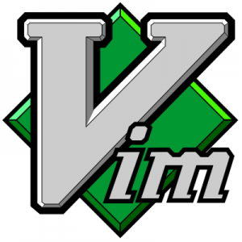

.. index:: Text-Editor; vim, Vim (Editor)
.. _Vim:
.. _Texteditor Vim:
.. _Der Texteditor Vim:

Der Texteditor ``vim``
======================

.. {{{

`Vim <http://www.vim.org/>`__ ist einer der vielseitigsten Text-Editoren aller
Zeiten. Man kann damit auf sehr effiziente Weise nicht nur Programme schreiben,
sondern auch Emails, Briefe, Webseiten, Bücher, kurz: Textdateien aller Art
bearbeiten.

Durch Tastenkombinationen (insbesondere durch :ref:`Snippets <Snippets>`) kann
die die zum Schreiben von Texten nötige Tipparbeit ist erheblich reduziert
werden; nach einer gewissen Einarbeitungszeit ist das Arbeitstempo spürbar
höher. Bei häufiger Benutzung laufen einzelne Eingaben mitunter so schnell und
"automatisch" ab, dass man kaum noch über das Text-Editieren nachdenken muss und
die Konzentration stattdessen den eigentlichen Themen widmen kann.

.. _Vim-Installation:

.. rubric:: Installation

Auf fast allen Linux-System ist ``vi``, der "kleine Bruder" von Vim, bereits in
der Grundversion enthalten. Für eine komfortablere Bedienung ist es allerdings
empfehlenswert, eine umfangreichere Version des Vim zu installieren: [#]_

.. code-block:: bash

    sudo aptitude install vim-nox vim-gnome vim-scripts vimhelp-de

Mit den obigen Paketen wird die Basis-Version von Vim installiert, die in einer
Shell mittels ``vim`` gestartet werden kann, auch auf Servern ohne laufenden
Desktop-Manager (X-Server). Zudem wird eine graphische Bedienoberfläche namens
``gvim`` installiert, die als eigenständiges GUI-Programm aufgerufen werden
kann.

.. rubric:: Vim-Schnellstart

Bei der im letzten Abschnitt beschriebenen Installation wird automatisch das
Vim-Lern-Programm ``vimtutor`` mit installiert, das in einer Shell gestartet
werden kann:

.. code-block:: bash

    vimtutor

Hierbei wird Vim in einer Basis-Version gestartet und eine Tutorial-Datei
aufgerufen, in der interaktiv in mehreren Lektionen die wichtigsten Vim-Tasten
erlernt werden können. Für das Durchlaufen dieses Tutorials sollte man etwa 30
Minuten einplanen.

.. }}}

.. only:: html

    Die folgende Vim-Anleitung umfasst folgende Themen:

.. toctree::
    :maxdepth: 2

    bedienung.rst
    konfiguration.rst
    plugins.rst
    links.rst

.. raw:: html

    

.. only:: html

    .. rubric:: Anmerkungen:

.. [#] Vim läuft auch unter Windows- und Apple-Systemen. Hierfür finden sich auf
    der `Vim-Projektseite <http://www.vim.org>`_ unter der Rubrik "Downloads"
    entsprechende Pakete bzw. selbst entpackende Installationsdateien.

    Ein minimalistischer und möglichst originalgetreuer Nachbau des
    ursprünglichen Vi-Programms kann über das Paket ``nvi`` installiert werden.

